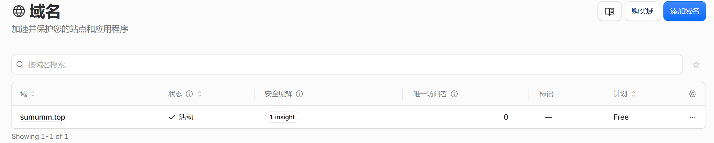
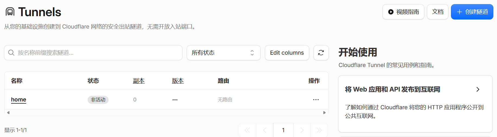

<!-- more -->

> 本文回答 [MCP-CNB云环境访问Windows本地MCP方案](./MCP-CNB云环境访问Windows本地MCP方案.md) 五、1 节留下的运维缺口：**Quick Tunnel 每次重启都换域名**，而远端 `~/.ssh/config` 里写死了域名。解法是把"匿名临时隧道"升级为"**命名隧道（Named Tunnel）**"，绑定一个自有、且 NS 托管在 Cloudflare 的域名，让地址固定不变。本文以真实域名 `sumumm.top` 为例，给出从迁移 NS 到 Windows、CNB 两侧配置落地的完整过程。
>
> 核心问题是三件事：**这个域名还能不能继续托管网页？隧道该用哪个名字？为什么非要把 DNS 从腾讯云搬到 Cloudflare？**

## 一、 背景

### 1. 要解决的问题

（1）**Quick Tunnel 的域名漂移**。两端只做出站 443 连接，绕开了 CNB 容器的全部限制，是当前唯一零外援可跑的路线，代价是域名由 Cloudflare 随机分配（形如 `xxxx-xxxx-xxxx.trycloudflare.com`），每次重启都变。

（2）**漂移带来的耦合点很具体**。远端 `~/.ssh/config` 的 `ProxyCommand`、`~/.codebuddy/mcp.json` 的桥接命令、`host_info` 给出的 scp 端点，都直接或间接引用这个域名，每重启一次就要同步一轮。

（3）**目标**：让域名固定下来，把这一整类维护成本归零 —— 要的不是"能访问"，而是"地址不变"。

### 2. 那是否可行呢？

（1）**可行，但必须把整个根域名 `sumumm.top` 的 NS 交给 Cloudflare**。然后在同一个 Zone 里用不同主机名区分两条链路：网页链路（`sumumm.top` / `www.sumumm.top`）继续指向 EdgeOne Pages 且保持仅 DNS，隧道链路（`home.sumumm.top`）指向命名隧道并开启代理。

（2）**隧道用的是子域名**。推荐 `home.sumumm.top`，取值规则与可选名字见 二、2。

（3）**"只把子域名交给 Cloudflare"走不通**。免费版 / Pro 版没有子域名独立成 Zone 的入口，原理见 二、3。

（4）**网页链路大概率不受影响**。是否受影响取决于 EdgeOne 校验的是解析结果还是 NS 归属，见 二、5。

### 3. 当前现状

#### 3.1 域名与用途

我之前申请了一个域名`sumumm.top`：

| 项目 | 内容 |
| --- | --- |
| 域名 | `sumumm.top` |
| 注册 | 腾讯云（域名注册） |
| 原解析 | 腾讯云 DNS 解析 DNSPod |
| 原用途 | 绑定 EdgeOne Pages 静态托管网页（`sumumm.top` 与 `www.sumumm.top`） |

即迁移前是"**注册在腾讯云、解析在 DNSPod、内容托管在 EdgeOne Pages**"的三段结构，本方案只动中间那一段的归属。

#### 3.2 已经完成的迁移

NS 已从 DNSPod 迁至 Cloudflare，域名列表状态为 **✓ 活动**，解析权已归 Cloudflare。当前 Cloudflare 侧 DNS 记录共 2 条，均为「仅 DNS」（灰云）：

| 主机名 | 类型 | 目标 | 代理状态 |
| --- | --- | --- | --- |
| `sumumm.top` | CNAME | `d9a45a19.www.sumumm.top.dnsoe2.com` | 仅 DNS |
| `www.sumumm.top` | CNAME | `d9a45a19.www.sumumm.top.dnsoe2.com` | 仅 DNS |

这两条就是 EdgeOne Pages 的接入目标，形态与 二、4.3 的规划完全一致，**不需要改动**。

#### 3.3 尚缺的一条记录

规划中的第三条 —— `home.sumumm.top` → `<隧道 UUID>.cfargotunnel.com`（已代理）—— **目前还没有**，说明命名隧道尚未建立。

补齐它有三条路径：**最省事的是 `cloudflared config init`**（本项目 CLI 已把这条记录与配置文件一起封装成幂等动作，记录已存在时直接跳过，见 四、1.7）；其次是 四、1.4 的 `cloudflared tunnel route dns`；不想用命令行、或命令报错时，按 四、1.5 在 Cloudflare 面板手工添加。三条路径的判定标准相同 —— 记录列表里出现一条「已代理」（橙云）的 `home.sumumm.top` → `<隧道 UUID>.cfargotunnel.com`。

### 4. 与既有文档的关系

| 文档 | 隧道形态 | 域名 | 与本文的关系 |
| --- | --- | --- | --- |
| [MCP-CNB云环境访问Windows本地MCP方案](./MCP-CNB云环境访问Windows本地MCP方案.md) | Quick Tunnel | 随机、每次重启变 | 本文是其次节"域名漂移"应对方案的完整落地 |
| 本文 | Named Tunnel | `home.sumumm.top`、固定 | 复用前者的全部配置，只替换域名来源 |

两者的**拓扑、SSH 会话性质、`SSH_CONNECTION` 场景判定完全一致**，差别只在隧道注册到哪里、域名从哪来。因此前者的 Windows sshd 准备与 CNB 侧配置思路可直接沿用。

## 二、 方案设计：一个域名承载两条链路

### 1. 总体拓扑

```text
                    ┌────────────────────────────────────┐
   访问网页 ───────► │  sumumm.top / www.sumumm.top       │  DNS 记录：CNAME → EdgeOne 目标
                    │  【仅 DNS】灰云，不经过 CF 代理        │  → 回源 EdgeOne Pages
                    └────────────────────────────────────┘
       Cloudflare   │
         边缘       │
                    └────────────────────────────────────┐
   AI 客户端 ─────►  │  home.sumumm.top                   │  DNS 记录：CNAME → <UUID>.cfargotunnel.com
   (CNB / Linux)    │  【已代理】橙云，由 CF 终结 TLS        │  → 隧道 → Windows cloudflared
                    └────────────────────────────────────┘         → 127.0.0.1:22（Windows sshd）
                                                                   → remote-start-mcp.bat（MCP Server）
```

关键点：**隧道那条链路是"Windows 主动出站"建立的**，与 Quick Tunnel 的机制完全相同，只是把"注册到随机域名"换成"注册到你自己的域名"。Windows 侧依旧不需要公网 IP、不需要端口映射。图中两种代理状态（【仅 DNS】与【已代理】）的含义与取舍见 4.1。

### 2. 子域名的选择与 DNS 基础

#### 2.1 什么是子域名

（1）**域名是从右往左读的层级结构**。`sumumm.top` 由两部分组成：最右边的 `top` 是顶级域（TLD），不可自定义；左边紧邻的 `sumumm` 是你注册下来的根域名，也是一个 Zone 的边界。

（2）**在根域名左边再挂一段，就是子域名**（也叫主机名、记录名）。`www.sumumm.top` 里的 `www` 是子域名标签，`home.sumumm.top` 里的 `home` 也是。

```text
        home   .   sumumm   .   top
         │           │          │
         │           │          └── 顶级域（TLD），不可自定义
         │           └───────────── 已注册的根域名，Zone 的边界（迁 NS 迁的是它）
         └───────────────────────── 子域名标签，任取、免费、无需单独注册
```

（3）**子域名不需要单独购买或备案**，它只是 Zone 内部的一条记录名 —— 在 Cloudflare 加一条记录，这个名字就存在；删掉记录，它随之消失。一个根域名下可以挂任意多个子域名。

（4）**子域名与网页路径是两回事**。`home.sumumm.top` 是一个独立的名字，与 `sumumm.top/home` 这种路径毫无关系，改路径不影响解析，改解析也不影响路径。

（5）**层级可以有很多段**。`a.b.sumumm.top` 同样是合法子域名，但段数越多，证书覆盖与配置成本越高，所以 2.3 建议只用一级。

#### 2.2 为什么必须用子域名

一条 DNS 记录名只能有一条 CNAME，而 `sumumm.top` 与 `www.sumumm.top` 已经被 EdgeOne Pages 占用；同时两条链路的**代理状态要求恰好相反**（网页必须灰云、隧道必须橙云）。因此只能用**不同的主机名**把两条链路分开 —— 也就是 2.1 所说的两条子域名记录，成本为零。

若网页用途可以放弃，理论上也能把根域直接 CNAME 到 `<隧道 UUID>.cfargotunnel.com` 并开橙云，但那样网页就没了，不推荐。

#### 2.3 子域名取什么名字

（1）**推荐 `home.sumumm.top`**。语义清楚，与本文档、代码注释中的示例一致，后文全篇用它。

（2）**其他可用名字**：`mcp`、`win`、`ssh`、`tunnel` 等任意未被占用的主机名，改名字只需同步改 四、1.3 的 `hostname`、四、1.4 的命令参数与 四、2 的 CNB 侧两处配置。

（3）**不可用**：`@`（根域，已用于网页）、`www`（已用于网页）、已被其他记录占用的名字。

（4）**层级只用一级**。Cloudflare 免费版的通用证书只覆盖 `sumumm.top` 与 `*.sumumm.top`，`a.b.sumumm.top` 这类二级子域不在覆盖范围内，需要额外申请 Advanced Certificate。

（5）**字符只用小写字母、数字与连字符**，不要大写、下划线或中文。

#### 2.4 DNS 与 NS 是什么

（1）**DNS** 是把域名翻译成地址的分布式数据库，库里的每条记录都是一条"名字 → 目标"的映射，常见类型有 `A`、`CNAME`、`NS`、`TXT`。

（2）**NS（Name Server）记录**决定"谁有权为这个域名作答"。`sumumm.top` 的 NS 指向谁，全球递归解析器就去找谁要答案；你在别处建的记录，只要不在那个 NS 所在的 Zone 里，就不会被采用。

（3）**域名注册与域名解析是两件事**。注册商（腾讯云）只持有"把 NS 指向谁"这一个开关以及域名所有权；解析记录的维护权在 NS 指向的那家。

（4）**所以"迁移 DNS"= 在注册商处把 NS 从 DNSPod 改成 Cloudflare**。此后所有记录的增删改都在 Cloudflare 控制台完成，DNSPod 侧不再生效，但域名所有权与续费仍在腾讯云。

### 3. 为什么必须把 NS 迁到 Cloudflare

#### 3.1 NS 只能指向一家

NS 是**权威解析权的唯一归属**，一个域名要么由 DNSPod 解析，要么由 Cloudflare 解析，不存在"两套 NS 同时生效"。

这条约束直接决定方案形状：**想让 Cloudflare 为某个名字做解析（包括为命名隧道自动建记录），就必须把根域名的 NS 交给 Cloudflare。**

#### 3.2 子域名不能独立成为 Zone

"不动根域名，只把 `home.sumumm.top` 交给 Cloudflare 管"这个想法在免费版 / Pro 版**没有任何入口**：

（1）在 Cloudflare 添加站点时输入子域名会被直接拒绝，报 `Please ensure you are providing the root domain and not any subdomains`。

（2）子域名独立成 Zone（以及配套的 CNAME Setup / Partial Setup）已收归 **Enterprise 合同与白名单能力**，个人账号无自助路径。

所以"用子域名"和"根域名迁 NS"不是两个可选方案，而是**同一件事的两面**：子域名是 Zone 内部的记录名，Zone 本身必须是根域名。

#### 3.3 不迁 NS 的替代做法

| 做法 | 是否可行 | 原因 |
| --- | --- | --- |
| 根域名迁 NS 到 Cloudflare，一域名两用 | ✅ 可行 | 本文方案 |
| 另买一个便宜域名专供隧道 | ✅ 零风险 | 现有域名完全不动，`.top` / `.xyz` 首年成本极低 |
| DNSPod 子域名 NS 委派给 Cloudflare | ❌ | 免费版 / Pro 无入口，见 3.2 |
| 保留 DNSPod，仅借 Cloudflare 代理加速 | ❌ | 需 Enterprise 的 CNAME Setup / Cloudflare for SaaS |
| 橙云 CNAME 到 EdgeOne | ⚠️ 不推荐 | 形成双层回源，易出 Host 校验与证书问题，收益为零 |

### 4. 记录规划

#### 4.1 橙云与灰云是什么

Cloudflare 的每条 DNS 记录后面都有一个云朵图标，它表示这条记录的**代理状态**，只有两个取值：

（1）**已代理（橙云 / Proxied）**：解析答案指向 Cloudflare 边缘节点，流量先到 Cloudflare 再被转发到记录里写的真实目标。CF 在这一跳终结 TLS，因而能提供缓存、WAF、DDoS 防护、隐藏源站等能力；代价是多了一跳，且可用的对外端口受限。

（2）**仅 DNS（灰云 / DNS only）**：Cloudflare 只当权威 DNS 服务器用，直接把记录里写的目标返回给查询者，流量直连目标 —— 不经 CF 中转、不缓存、不做防护。

| 对比项 | 已代理（橙云） | 仅 DNS（灰云） |
| --- | --- | --- |
| Cloudflare 的角色 | 反向代理，流量经其转发 | 仅权威 DNS |
| 解析结果 | CF 边缘地址（`104.x` / `172.67.x` / `188.114.x` 等） | 记录目标的真实解析结果 |
| TLS 终结位置 | Cloudflare 边缘 | 目标服务器自身 |
| 缓存 / WAF / 隐藏源站 | 有 | 无 |
| 面板显示 | 云图标橙色，代理状态列为「已代理」 | 云图标灰色，代理状态列为「仅 DNS」 |

（3）**面板上怎么切换**：【**Cloudflare 控制台**】→ 站点 →【**DNS**】→【**记录**】→ 点击某条记录后方的云朵图标即可切换，橙色为已代理、灰色为仅 DNS。

（4）**命令行怎么区分**：橙云记录用 `nslookup` 查会返回 Cloudflare 段地址，`curl -sI` 的响应头会带 `server: cloudflare` 与 `cf-ray`；灰云记录返回的是目标本身的解析结果，响应头不会出现 `cf-ray`。

（5）**本方案要求隧道记录橙云**：只有 Cloudflare 边缘能终结 TLS 并把请求交给隧道，而 `cloudflared tunnel route dns` 建出来的记录默认就是橙云。

（6）**本方案要求网页记录灰云**：它的目标已经是另一家 CDN（EdgeOne），再套一层 CF 代理零收益，只会形成双层回源。

#### 4.2 同一主机名只能有一条 CNAME

`www.sumumm.top` 不能同时 CNAME 到 EdgeOne 目标与隧道的 `<隧道 UUID>.cfargotunnel.com` —— DNS 层面同名 CNAME 互斥。

这条约束不构成障碍，**命名为不同主机名即可**。真正要留意的是 4.1 所说的「代理状态」这个隐变量，它决定流量是否经过 Cloudflare 边缘。

#### 4.3 记录清单

| 主机名 | 记录类型 | 目标 | 代理状态 | 用途 |
| --- | --- | --- | --- | --- |
| `sumumm.top` | CNAME | EdgeOne Pages 给出的接入目标 | **仅 DNS（灰云）** | 展示网页 |
| `www.sumumm.top` | CNAME | 同上 | **仅 DNS（灰云）** | 展示网页 |
| `home.sumumm.top` | CNAME | `<隧道 UUID>.cfargotunnel.com` | **已代理（橙云）** | 本地主机固定域名 |

（1）前两条已经存在（见 一、3.2），**保持不动**。

（2）第三条**不需要手工建** —— 四、1.4 的 `cloudflared tunnel route dns` 会自动写入，且默认带上橙云；若要手工添加，步骤见 四、1.5。本项目 CLI 把这一步封装成了幂等动作：`cloudflared config init` 会先查 DNS，记录已存在就跳过，见 四、1.7。

【**注意**】指向 EdgeOne 的记录必须留在**仅 DNS（灰云）**（原因见 4.1（6））。一旦开成橙云，就会形成"Cloudflare 代理 → EdgeOne 回源"的双层结构，容易出现 Host 校验失败与证书链问题，收益为零。

### 5. 对 EdgeOne Pages 网页链路的影响

Cloudflare 迁移对 EdgeOne 的实质影响，取决于它校验的是**解析结果**还是 **NS 归属**：

（1）**若 EdgeOne 只校验 CNAME 解析结果**（多数 Pages 类接入如此）：NS 迁到 Cloudflare 后，只要在 Zone 里保留指向同一目标的 CNAME，EdgeOne 侧校验依旧通过，网页继续生效，**无需在 EdgeOne 做任何改动**。

（2）**若 EdgeOne 强制要求域名 NS 托管在腾讯云**：则两条链路不能共存，只能二选一 —— 要么换用一个新域名给 Cloudflare，要么把网页迁到 Cloudflare Pages 后从 EdgeOne 解绑。

【**前置风险**】迁移动工前，请先在 EdgeOne 控制台确认该域名当前的接入方式（CNAME 接入还是 NS 接入），这是本方案唯一的风险点。

### 6. 与 Quick Tunnel 的取舍

| 对比项 | Quick Tunnel | Named Tunnel |
| --- | --- | --- |
| 域名 | 随机、重启即换 | `home.sumumm.top`、固定 |
| 域名前提 | 无，零配置 | 需自有域名且 NS 托管于 Cloudflare |
| 远端 `~/.ssh/config` | 每次重启需同步 | 写一次，长期有效 |
| `host_info` / MCP 配置 | 随域名变化 | 写死后不再变动 |
| 适用场景 | 临时调试 | 长期使用、团队共用 |

【**结论**】把 Named Tunnel 作为长期方案，Quick Tunnel 保留为"没有域名时的备用通道"。

## 三、 迁移操作与生效验证

本章只讲**域名层面的搬迁**：腾讯云的记录备份、Cloudflare 的站点接入、改 NS、验证生效。隧道相关的配置留到 四 章。

### 1. 迁移前：备份 DNSPod 记录

【**腾讯云控制台**】→【**DNS 解析 DNSPod**】→【**我的域名**】→ 点击 `sumumm.top` →【**记录管理**】→ 查看全部记录并【**导出**】留档。

当前应只有 2 条 CNAME（根域与 `www`）。清单在手，Cloudflare 自动导入后才有据可核，出现漏导入时也能凭它手工补建、逐条比对。

### 2. Cloudflare 侧操作

#### 2.1 添加站点并导入记录

【**Cloudflare 控制台**】→ 登录 `dash.cloudflare.com` →【**添加域 / Add a site**】→ 输入 `sumumm.top`（**必须根域名，不能带子域名**）→ 选择 **Free** 计划 →【**继续**】。

Cloudflare 会自动扫描根域名并从 DNSPod 拉取现网记录，导入到新 Zone。

#### 2.2 核对自动导入的记录

【**Cloudflare 控制台**】→ 站点 `sumumm.top` →【**DNS**】→【**记录**】，逐条核对主机名、类型、目标。

（1）两条 CNAME 的目标应仍为 `d9a45a19.www.sumumm.top.dnsoe2.com`。

（2）代理状态应保持「仅 DNS」（灰云）—— 若导入时变成了橙云，点一下云图标改回灰色（两种状态的含义见 二、4.1）。

（3）若某条没导入进来，手工补建：【**添加记录**】→ 类型选 `CNAME` → 名称填 `@`（根域）或 `www` → 目标照抄 EdgeOne 给出的接入目标 → 点灰云图标使其显示「仅 DNS」→【**保存**】。

【**注意**】`@` 这类根域 CNAME 由 Cloudflare 做 CNAME Flattening 处理，对外呈现为 A 记录，属于正常行为。

#### 2.3 取得分配的名称服务器

【**Cloudflare 控制台**】→ 站点 `sumummtop` →【**DNS**】→【**设置**】→ 找到「Cloudflare 名称服务器」区域，记下分配的两台 NS（形如 `xxx.ns.cloudflare.com` 与 `yyy.ns.cloudflare.com`）。

这两台地址下一步要填进腾讯云，务必完整复制，不要漏后缀、不要把两台写重。

### 3. 腾讯云侧操作

#### 3.1 修改 DNS 服务器

【**腾讯云控制台**】&rarr;【**我的资源**】&rarr;【**域名注册**】→【**[我的域名](https://console.cloud.tencent.com/domain/all-domain/all)**】→ 找到 `sumumm.top` → 点击【**DNS 修改**】→ 选择【**自定义 DNS**】→ 依次填入 2.3 记下的两台 Cloudflare NS →【**确定**】保存。

若该入口不显示或不可用，改走域名注册侧：【**腾讯云控制台**】→【**域名注册**】→【**我的域名**】→ `sumumm.top` →【**管理**】→【**DNS 服务器**】→【**修改 DNS 服务器**】→ 填入同样的两台 NS。

【**易错点**】这里改的是"域名的域名服务器"（NS 委托权），**不是**在 DNSPod 里新建一条类型为 `NS` 的解析记录 —— 后者只是在旧 Zone 内部加记录，对解析权的归属毫无影响。

#### 3.2 DNSSEC 处理

（1）**若 DNSPod 侧此前开启过 DNSSEC**，必须先在注册商侧删除原有的 DS 记录，否则 NS 切换后全球解析会持续 `SERVFAIL`。

（2）**若要在 Cloudflare 侧开启 DNSSEC**：【**Cloudflare 控制台**】→ 站点 →【**DNS**】→【**设置**】→【**DNSSEC**】→【**启用 DNSSEC**】，再把 Cloudflare 生成的 DS 参数（Key Tag / Algorithm / Digest Type / Digest）提交到腾讯云域名注册侧。提交完成前不要在 Cloudflare 侧开启。

（3）**最省事的做法**：本次迁移先不启用 DNSSEC，等迁移稳定后单独处理。

### 4. 生效验证

#### 4.1 面板应有的样子

（1）【**Cloudflare 控制台**】→ 顶部域名列表 → `sumumm.top` 的「状态」列显示 **✓ 活动**。若显示「待更改域名服务器 / Pending Nameserver Update」，说明 NS 尚未生效，回到 3.1 检查。



（2）【**Cloudflare 控制台**】→ 站点 →【**DNS**】→【**记录**】→ 与 二、4.3 的记录清单一致：共 2 条，均为「仅 DNS」。

（3）域名列表的「唯一访问者」显示 0 属正常 —— 统计数据自 Zone 生效后才开始累积。

#### 4.2 命令行验证

在 Windows PowerShell 或 CMD 中执行：

```powershell
# NS 应返回两台 *.ns.cloudflare.com
nslookup -type=NS sumumm.top 8.8.8.8

# 网页记录应能正常解析
nslookup www.sumumm.top 1.1.1.1
```

（1）第一条返回 `xxx.ns.cloudflare.com` 与 `yyy.ns.cloudflare.com`，说明委托已生效。

（2）第二条能返回 CNAME 链并最终给出地址，说明网页记录正常。

（3）想看全球各地是否一致，打开 `https://dnschecker.org`，输入 `sumumm.top`，类型选 `NS`，各节点均应显示 Cloudflare 的两台 NS。

#### 4.3 网页链路回归

浏览器访问 `https://sumumm.top` 与 `https://www.sumumm.top`，静态页面应正常显示、证书有效（证书由 EdgeOne 侧提供）。若报 502 / 522 / 证书错误，见 5.1。

### 5. 风险与排查

#### 5.1 失败现象对照

| 现象 | 可能原因 | 处理 |
| --- | --- | --- |
| 面板长期「待更改域名服务器」 | 注册商侧 NS 未保存成功、拼写错误、误填了子域名 | 回 3.1 重新保存正确 NS |
| 全球解析 `SERVFAIL` | 注册商侧残留旧 DNSSEC 的 DS 记录 | 删除 DS，见 3.2 |
| 网页打不开、证书报错 | EdgeOne 校验 NS 归属 | 按 二、5 确认接入方式，必要时解绑或回退 |
| 部分节点仍解析到旧地址 | 各级 DNS 缓存未过期 | 等待，通常几分钟到 24 小时 |

#### 5.2 备案与国内访问的变化

（1）**备案**：域名仍注册在腾讯云，ICP 备案不受 NS 变更影响；Cloudflare 国际版自身不要求备案，但若 EdgeOne 原来走大陆节点，接入商会变。

（2）**国内访问质量**：Cloudflare 免费版无大陆节点，网页侧国内访问速度会低于 EdgeOne 大陆节点，属预期内的代价。

（3）**若网页侧不能降速**：说明该域名不适合整体迁移，改选 四、4 的替代方案。

## 四、 配置落地：Windows 与 CNB 两侧

### 1. Windows 侧：以固定域名启动隧道

#### 1.1 安装 cloudflared

```powershell
# 方式一：winget（推荐）
winget install --id Cloudflare.cloudflared

# 方式二：scoop
scoop install cloudflared
```

或用项目内已有的安装通道（自带便携版落点与探测）：

```powershell
node bin\embedded-mcp-toolkit-cli.js cloudflared install
```

便携版会被放到 `.embedded/bin/cloudflared.exe`，探测优先级高于系统安装路径（见 [`tunnel-detect.ts`](../src/cli/commands/cloudflared/tunnel-detect.ts#L39-L66)）。

#### 1.2 授权并建立命名隧道

```powershell
# 浏览器授权，选中要托管的根域名 sumumm.top
cloudflared tunnel login

# 创建命名隧道，名字自取（本文取 home）
cloudflared tunnel create home
```

`tunnel login` 会在 `%USERPROFILE%\.cloudflared\` 下拉取 `cert.pem`；`tunnel create` 在同目录生成 `<隧道 UUID>.json` 凭据文件，同时输出 UUID，下一步要用。创建成功的话，网页上【控制台】&rarr;【联网】&rarr;【Tunnels】会出现home这个Tunnels：



【**注意**】`login` 的浏览器授权步骤无法通过命令行代做，必须在有图形界面的 Windows 上手工完成一次。

#### 1.3 编写隧道配置

编辑 `%USERPROFILE%\.cloudflared\config.yml`：

```yaml
# %USERPROFILE%\.cloudflared\config.yml
tunnel: <隧道 UUID>
credentials-file: C:\Users\<win_user>\.cloudflared\<隧道 UUID>.json

ingress:
  # 暴露本机 sshd，供 MCP 的 stdio 桥接使用
  - hostname: home.sumumm.top
    service: ssh://127.0.0.1:22
  # 兜底规则，必须存在且必须放最后
  - service: http_status:404
```

【**重要**】`service` 必须写**显式 IPv4** `ssh://127.0.0.1:22`，禁止写 `localhost`。Windows 上 `cloudflared` 会把 `localhost` 解析为 IPv6 回环 `::1`，导致 sshd 注入的 `SSH_CONNECTION` 中 `server-ip` 变为 `::1`，[`host-endpoint.ts`](../src/sdk/host/host-endpoint.ts#L82-L94) 的 IPv4 端点解析失败，`host_info` 输出 `Endpoint: (unavailable)`。该结论来自 CNB 方案文档实测，项目内已固化为常量 [`DEFAULT_TUNNEL_URL`](../src/cli/commands/cloudflared/constants.ts#L70)。

配置写完后校验一次语法：

```powershell
cloudflared tunnel ingress validate
```

#### 1.4 绑定域名并启动验证

```powershell
# 自动在 Cloudflare 建好 home.sumumm.top → <隧道 UUID>.cfargotunnel.com 的 CNAME（橙云）
cloudflared tunnel route dns home home.sumumm.top

# 前台运行，观察是否连接成功
cloudflared tunnel run home
```

这一步就是补齐 一、3.3 那条缺失记录的动作（不想用命令行时，等价的手工路径见 1.5）。执行后回 Cloudflare 核对：

【**Cloudflare 控制台**】→ 站点 `sumumm.top` →【**DNS**】→【**记录**】→ 应新增一条 `home.sumumm.top` → `<隧道 UUID>.cfargotunnel.com`，代理状态为「已代理」（橙云），记录总数由 2 变为 3。

命令行核对（橙云记录返回的是 Cloudflare 段地址，两种状态的含义见 二、4.1）：

```powershell
nslookup home.sumumm.top 1.1.1.1
```

前台运行正常后，再从远端验证端到端可达，命令见 四、2.4。

【**实测提示**】从远端 ssh 会话里触发启动的进程可能随会话结束被回收（排障中已遇到该现象）；建议在**本机终端**执行，或用 四、1.7 的 CLI 启动（同样以 spawn detached 常驻）。

【**CLI 等价路径**】上述 1.2–1.4 全部可以合成两条命令：`cloudflared config init`（补齐配置与记录）+ `cloudflared start --mode named`（校验后启动），见 四、1.7。

#### 1.5 备选：直接在面板手工添加

若不想用命令行建记录，或 `route dns` 报错，也可以手工建。前提是 1.2 的隧道已经创建（已经拿到 UUID）——随时可用 `cloudflared tunnel list` 查回 UUID。

【**Cloudflare 控制台**】→ 站点 `sumumm.top` →【**DNS**】→【**记录**】→【**添加记录**】，按下表填写：

| 字段 | 填什么 |
| --- | --- |
| 类型 | `CNAME` |
| 名称 | 只填 `home` |
| 目标 | `<隧道 UUID>.cfargotunnel.com` |
| 代理状态 | **必须点成橙色「已代理」** |
| TTL | 保持「自动」 |

填完【**保存**】，记录列表应出现第 3 条，代理状态列为「已代理」。

（1）**名称只填左侧标签**。填 `home` 即可，面板会自动补成 `home.sumumm.top`；若把整串 `home.sumumm.top` 填进去，保存后务必核对一眼列表，确认没有变成 `home.sumumm.top.sumumm.top`。

（2）**目标必须是 `<隧道 UUID>.cfargotunnel.com`**。这是隧道在 Cloudflare 内部的入口地址，填源站 IP 或 EdgeOne 的接入目标都不会通。

（3）**代理状态必须是橙云**。`cfargotunnel` 记录依赖 Cloudflare 边缘转发流量，点成灰云隧道就收不到请求，页面表现为超时。

（4）**手工建的记录与 1.4 命令建的完全等价**，区别只是命令会顺带把 UUID 填好、不会填错。

#### 1.6 常驻自启

【**本节为可选**】若不需要开机自动拉起可整节跳过：日常用 `cloudflared start --mode named` 手动启动即可，本项目 CLI **不注册任何计划任务或服务**（见 四、1.7）。需要"重启电脑后自动恢复"时才做本节。

**方案一：计划任务（推荐，与 Quick Tunnel 的做法一致）**

```powershell
Register-ScheduledTask -TaskName "CloudflaredSSH" `
  -Action (New-ScheduledTaskAction -Execute "cloudflared" -Argument "tunnel run home") `
  -Trigger (New-ScheduledTaskTrigger -AtStartup) `
  -RunLevel Highest
```

**方案二：官方系统服务（坑较多，仅在需要服务级管理时使用）**

```powershell
cloudflared service install
```

服务以 **SYSTEM 账户**运行，因此它读取的不是你的用户目录，而是：

```text
C:\Windows\System32\config\systemprofile\.cloudflared\config.yml
```

这意味着必须把 `cert.pem`、`<隧道 UUID>.json` 与 `config.yml` 一并复制到该目录，并修改注册表 `HKLM\SYSTEM\CurrentControlSet\Services\Cloudflared` 的 `ImagePath`，让它显式带上配置路径：

```text
C:\Cloudflared\bin\cloudflared.exe --config=C:\Windows\System32\config\systemprofile\.cloudflared\config.yml tunnel run
```

【**易错点**】`ImagePath` 中不能有多余空格或字符，否则服务无法启动；改动配置后需 `sc stop cloudflared` 再 `sc start cloudflared` 才会重新加载。

### 2. CNB 侧：接入固定域名

#### 2.1 前置条件

（1）**容器内需具备 `cloudflared` 可执行文件** —— `cloudflared access ssh` 由它提供。改用固定域名不改变出站拓扑，仍只需出站 443 连接。

（2）**Windows 侧隧道已在运行**，且 1.4 的 `home.sumumm.top` 记录已建立并处于橙云。

本章 2.2～2.4 讲的是"把域名收敛进 `~/.ssh/config`"的长期写法；若只想临时验证、完全不动配置文件，直接看 2.5 的完整命令。

#### 2.2 ssh config 要怎么改

与 Quick Tunnel 的唯一差别是**域名固定**，因此配置写一次即可长期有效。需要留意的是"客户端连哪个地址"：

（1）`host_info` 输出的端点取自 sshd 看到的 `SSH_CONNECTION` 的 `server-ip`；经隧道从本机回环进入时该值恒为 `127.0.0.1`（[`host-endpoint.ts`](../src/sdk/host/host-endpoint.ts#L82-L94)），所以 AI 后续执行的 `ssh` / `scp` 会去连 `127.0.0.1`，config 里**必须有一段能匹配 `127.0.0.1`**。

（2）`cnb` 命令的 push-key 步骤写入的正是 `Host 127.0.0.1` 一段，前后以 `# >>> embedded-mcp-toolkit cnb tunnel >>>` 与 `# <<< embedded-mcp-toolkit cnb tunnel <<<` 为标记（见 [`constants.ts`](../src/cli/commands/cnb/constants.ts#L105-L108)）。它的域名来源**已支持模式感知**：`cnb --tunnel named` 取固定主机名（隧道未运行时以 named 模式拉起，含启动前硬校验），因此写入容器的是**固定域名段，可安全重复执行**；只有 `--tunnel quick`（缺省）时才会写成随机域名。

推荐做法：在标记段落内把 `--hostname` 写死为固定域名，并把 `home.sumumm.top` 作为同一段的别名，兼顾自动写入与手工登录：

```bash
# ~/.ssh/config（CNB 容器 / Linux 侧）
# >>> embedded-mcp-toolkit cnb tunnel >>>
Host 127.0.0.1 home.sumumm.top
  HostName 127.0.0.1
  User <win_user>
  IdentityFile ~/.ssh/id_mcp_cnb_server
  ProxyCommand cloudflared access ssh --hostname home.sumumm.top
  StrictHostKeyChecking accept-new
  ServerAliveInterval 60
  ServerAliveCountMax 3
# <<< embedded-mcp-toolkit cnb tunnel <<<
```

【**收益**】这段配置里的域名此后不再随隧道重启而变化，`ProxyCommand` 写死一次即可长期有效 —— 这正是相比 Quick Tunnel 的核心收益。

【**注意**】私钥文件名随来源而变：`cnb` 命令推送的是 `id_mcp_cnb_server`（见 [`constants.ts`](../src/cli/commands/cnb/constants.ts#L38)），而 `sshd-config` 菜单用的是 `id_mcp_server`，两者不可混填。

#### 2.3 MCP 客户端配置

`~/.codebuddy/mcp.json`（用户级、**文件名不带点**）中的桥接定义与 [CNB 方案文档](./MCP-CNB云环境访问Windows本地MCP方案.md) 三、4 节完全相同，只是端点从随机域名换成固定域名：

```json
{
  "mcpServers": {
    "win-embedded-board": {
      "command": "ssh",
      "args": [
        "-i", "~/.ssh/id_mcp_cnb_server",
        "-o", "StrictHostKeyChecking=accept-new",
        "-o", "ServerAliveInterval=60",
        "-o", "ServerAliveCountMax=3",
        "<win_user>@home.sumumm.top",
        "C:/Users/<win_user>/<项目根>/remote-start-mcp.bat"
      ]
    }
  }
}
```

【**提示**】此处不必重复写 `-o ProxyCommand` —— 它由 2.2 的 `~/.ssh/config` 统一提供，域名只维护一处。端点主机名只要与 config 里该段 `Host` 的别名之一一致即可。

#### 2.4 端到端验证

从远端（CNB 容器 / Linux）执行：

```bash
ssh -o StrictHostKeyChecking=accept-new \
    <win_user>@home.sumumm.top "hostname"
```

返回 Windows 主机名即表示隧道、域名、sshd 三段全通。随后在 MCP 客户端检查：

| 检查项 | 期望结果 |
| --- | --- |
| `instructions` | 正常注入 scp 引导 |
| `host_info` | 返回 `remote-ssh started`，`Endpoint: <win_user>@127.0.0.1` |
| `power_shell_*` | 正常注册 |
| `ssh_build` | 不注册（`remote-ssh launch`） |

唯一前置条件仍是 1.3 的**显式 IPv4 写法** —— 它决定 `server-ip` 是 `127.0.0.1` 还是 `::1`。本节的命令依赖 2.2 的 `~/.ssh/config` 提供 `ProxyCommand`；完全不动 config 的一次性写法见 2.5。

#### 2.5 不写 ssh config 的完整命令

只要 Windows 侧隧道已跑起来（1.4 或 1.6 任一路径），容器侧**不写任何配置文件**也能免密登录 —— 把隧道参数全部内联在命令行里即可：

```bash
ssh -i ~/.ssh/id_mcp_cnb_server \
    -o ProxyCommand="cloudflared access ssh --hostname home.sumumm.top" \
    -o StrictHostKeyChecking=accept-new \
    -o ServerAliveInterval=60 \
    -o ServerAliveCountMax=3 \
    <win_user>@home.sumumm.top
```

（1）**免密的前提是公钥已就位**：容器内 `~/.ssh/id_mcp_cnb_server` 对应的**公钥**必须已在 Windows 的 `authorized_keys` 里（由 `cnb` 命令的密钥步骤或 `sshd-config` 菜单写入）。否则这条命令会退化为密码登录；而按 四、3（1）关闭了密码认证时，则直接拒绝。

（2）**密钥不存在时先造一对**：容器内执行 `ssh-keygen -t ed25519 -f ~/.ssh/id_mcp_cnb_server -N ""`，再把 `~/.ssh/id_mcp_cnb_server.pub` 的内容追加到 Windows 的 `C:\Users\<win_user>\.ssh\authorized_keys`。

（3）**scp 同理**，把同样的选项递给 `scp`：

```bash
scp -i ~/.ssh/id_mcp_cnb_server \
    -o ProxyCommand="cloudflared access ssh --hostname home.sumumm.top" \
    ./foo.txt <win_user>@home.sumumm.top:C:/Users/<win_user>/
```

（4）**目标主机名写 `home.sumumm.top` 或 `127.0.0.1` 都可以**：传输层由 `ProxyCommand` 提供，这个名字只决定主机密钥记到 `known_hosts` 的哪个条目下，两种写法都能连通。

（5）**MCP 客户端也可以完全内联**：若连 `~/.ssh/config` 都不想写，把 `ProxyCommand` 直接塞进 `~/.codebuddy/mcp.json` 的 `args`：

```json
{
  "mcpServers": {
    "win-embedded-board": {
      "command": "ssh",
      "args": [
        "-i", "~/.ssh/id_mcp_cnb_server",
        "-o", "ProxyCommand=cloudflared access ssh --hostname home.sumumm.top",
        "-o", "StrictHostKeyChecking=accept-new",
        "-o", "ServerAliveInterval=60",
        "-o", "ServerAliveCountMax=3",
        "<win_user>@home.sumumm.top",
        "C:/Users/<win_user>/<项目根>/remote-start-mcp.bat"
      ]
    }
  }
}
```

（6）**注意后果**：不写 config 时，`host_info` 输出的端点仍是 `<win_user>@127.0.0.1`，但容器内没有任何 config 段匹配这个地址，AI 后续自动执行的 `ssh` / `scp` 会**直连本机 `127.0.0.1:22` 而失败**。所以"只登录、不写 config"适合人工排查或一次性验证；要让 AI 的后续命令也走隧道，仍需 2.2 的 config，或按（5）把内联参数交给 MCP 客户端。

（7）**取舍**：内联写法零配置、可随时丢弃，代价是域名要在每条命令里重复；2.2 的 config 写法把域名收敛到一处，适合长期使用。日常用 2.2，排查与临时连接用本节。

### 3. 安全边界

（1）**域名即入口**：命名隧道的域名等于把 `ssh://127.0.0.1:22` 暴露给"知道域名的人"，**必须关闭密码认证、只留公钥**（`sshd-config` 菜单 `[4]` 开启 `PubkeyAuthentication`，并建议在 `sshd_config` 中设 `PasswordAuthentication no`）。

（2）**只让 sshd 监听回环**：`cloudflared` 从本机 `127.0.0.1:22` 连入即可，无需把 Windows sshd 监听在 `0.0.0.0`。

（3）**可选加固**：在 Cloudflare Zero Trust 为 `home.sumumm.top` 建一条 Access 策略（并以 Service Token 供客户端携带），把访问面从"知道域名的人"收窄到"持有令牌的客户端"。

（4）**凭据文件不入仓库**：`<隧道 UUID>.json` 与 `cert.pem` 等同于隧道控制权，只应留在 Windows 本机 `.cloudflared` 目录。

### 4. 替代方案

| 方案 | 是否可行 | 说明 |
| --- | --- | --- |
| 根域名迁 NS 到 Cloudflare，一域名两用 | ✅ 推荐 | 本文方案 |
| 另买一个便宜域名专供隧道 | ✅ 零风险 | 现有域名完全不动，`.top` / `.xyz` 首年成本极低 |
| DNSPod 子域名 NS 委派给 Cloudflare | ❌ | 免费版 / Pro 无入口（二、3.2） |
| 保留 DNSPod，仅用 Cloudflare 代理加速 | ❌ | 需 Enterprise 的 CNAME Setup / Cloudflare for SaaS |
| 橙云 CNAME 到 EdgeOne（双层回源） | ⚠️ 不推荐 | 易出 Host 校验与证书问题 |

【**推荐**】若网页侧对国内速度有要求、或不愿承担 NS 迁移风险，直接选"另挂一个域名" —— 它是唯一零风险且同样能拿到固定域名的路径。

---
*本文档由 markdowncli 技能辅助生成*
