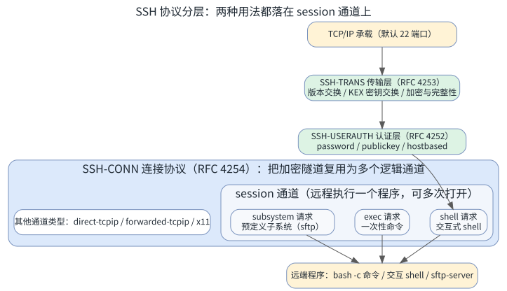
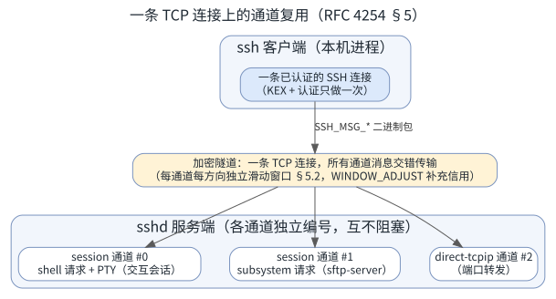
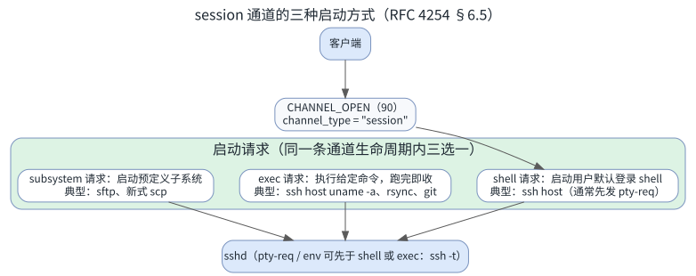
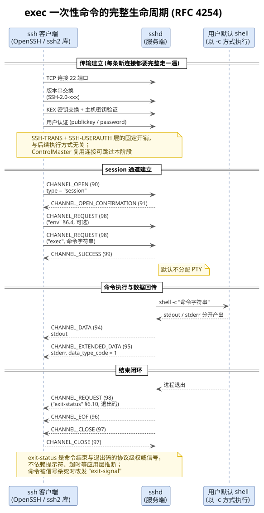
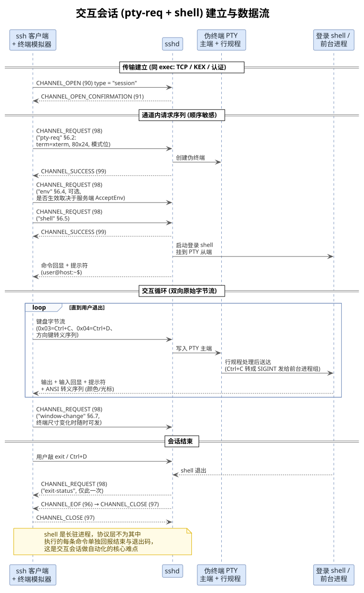
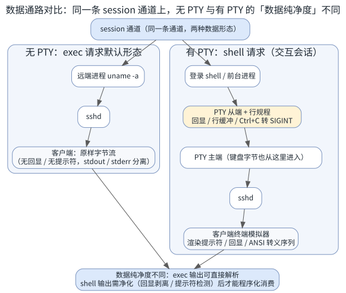
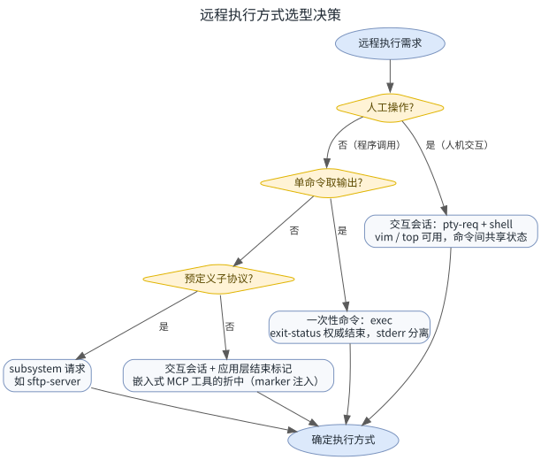

<!-- more -->

## 一、 概念澄清：官方术语到底叫什么

日常说的「一次性命令通道」与「交互会话」，在 SSH 官方协议里**并不是两种通道类型**：它们跑在同一种名为 `session` 的通道上，区别只在于在这条通道上发起的**启动请求**不同——`exec` 请求（一次性执行命令）与 `shell` 请求（启动交互式 shell），外加第三种 `subsystem` 请求（启动预定义子系统，如 sftp）。

### 1. 日常说法与官方概念的对应

| 日常说法 | 官方概念 | 协议依据 |
| --- | --- | --- |
| 一次性命令通道 | `session` 通道 + `exec` 请求 | RFC 4254 §6.5 |
| 交互会话 / 交互式 shell | `session` 通道 + `pty-req`（§6.2）+ `shell` 请求 | RFC 4254 §6.2 / §6.5 |
| SFTP 文件传输 | `session` 通道 + `subsystem` 请求（`sftp`） | RFC 4254 §6.5 |
| 端口转发 | `direct-tcpip` / `forwarded-tcpip` 通道 | RFC 4254 §7 |

【**注意**】

「通道（channel）」是连接协议层面的多路复用单位，其类型由打开通道时的 `channel_type` 字段决定（`session` / `x11` / `direct-tcpip` / `forwarded-tcpip`）。shell 与 exec 的区别发生在通道**内部**的请求层，而不在通道类型层——所以说两者「不是两种通道，而是同一种通道的两种用法」。

### 2. RFC 协议体系

SSH-2 的核心规范由四份 RFC 组成，自下而上分层：

- RFC 4251《SSH Protocol Architecture》：总体架构与术语
- RFC 4253《SSH Transport Layer Protocol》：二进制包协议、版本交换、KEX 密钥交换、加密与完整性保护
- RFC 4252《SSH Authentication Protocol》：password / publickey 等用户认证
- RFC 4254《SSH Connection Protocol》：把加密隧道复用为若干逻辑通道，其摘要明确写道连接协议 "multiplexes the encrypted tunnel into several logical channels"（把加密隧道复用为多个逻辑通道），交互式会话正是这些通道的标准用途之一

对本文主题最关键的是 RFC 4254 §6.5《Starting a Shell or a Command》，它定义了 session 通道的三种启动方式：

- `shell`："This message will request that the user's default shell (typically defined in /etc/passwd in UNIX systems) be started at the other end."——请求对端启动用户默认 shell
- `exec`："This message will request that the server start the execution of the given command."——请求服务器开始执行给定命令，命令由用户默认 shell 解释执行（OpenSSH 实现等价于 `bash -c "命令"`）
- `subsystem`："This last form executes a predefined subsystem."——执行预定义子系统，服务端把子系统名（如 `sftp`）映射为具体程序（如 `sftp-server`）

### 3. 常见工具与库的 API 映射

同一个概念在各家工具与库里以不同 API 暴露：

| 工具 / 库 | 一次性命令（exec） | 交互会话（shell） | 子系统（subsystem） |
| --- | --- | --- | --- |
| OpenSSH CLI | `ssh host "uname -a"` | `ssh host` | `sftp host`；`scp` 自 OpenSSH 9.0 起默认走 SFTP |
| OpenSSH CLI 变体 | `ssh -t host "cmd"`（PTY + exec 组合） | `ssh -tt`（强制远端 PTY） | `ssh -s host sftp` |
| paramiko（Python） | `exec_command()` | `invoke_shell()` | `open_sftp()` |
| ssh2（Node，本仓库所用） | `conn.exec()` | `conn.shell()`（传 `term` 即先发 pty-req） | `conn.sftp()` |
| x/crypto/ssh（Go） | `session.CombinedOutput()` | `session.RequestPty()` + `session.Shell()` | `pkg/sftp` 客户端 |

延伸一个反直觉的事实：`rsync`、`git push/pull`、老版 `scp` 这类「看起来不是敲命令」的工具，底层其实都是 exec 请求——它们在远端执行 `rsync --server ...`、`git-upload-pack ...`、`scp -f/-t` 进程，再把协议数据通过通道搬运。

## 二、 协议架构与通道机制

### 1. 协议分层

传输层与认证层建立的是一条安全隧道；连接协议（RFC 4254）在这条隧道上复用通道。`session` 通道的职责是「远程执行一个程序」——这个程序可以是 shell、应用程序或系统命令。本文讨论的两种用法，就是在同一类通道上选择不同的启动请求；如果连「执行什么程序」都要自定义协议（文件传输），那就用 `subsystem`。

### 2. 一条连接多个通道：复用与流控

通道机制的几个要点：

- 通道在打开时由双方各自分配编号（如 0、1、2），后续所有消息携带「收件人通道号」，各通道的数据在同一条加密隧道内交错传输、互不阻塞
- 每个通道每个方向有独立的滑动窗口（RFC 4254 §5.2，OpenSSH 默认初始 2 MB），接收方消费数据后用 `WINDOW_ADJUST`（93）补充「信用」，防止单个通道的洪泛输出饿死其他通道
- 同一条已认证连接可以同时承载 session（交互 shell）+ session（sftp 子系统）+ direct-tcpip（端口转发）——本仓库 [src/sdk/transports/ssh.ts](../src/sdk/transports/ssh.ts) 正是这么用的：shell 通道与懒加载的 SFTP 子系统并存
- OpenSSH 的 ControlMaster 连接复用也基于此：后续每次 `ssh host cmd` 不再重新握手认证，只在已有连接上开一条新的 session 通道

### 3. session 通道的三种启动方式

同一条 session 通道的生命周期内，启动方式一般只选一种；`pty-req` / `env` 请求可以先行，且不仅限于 shell——`ssh -t host "cmd"` 就是「PTY + exec」的组合，让一次性命令也能获得终端语义。

## 三、 一次性命令（exec）的原理与流程

### 1. 基本原理

- 客户端在 session 通道上发 `exec` 请求，请求体是一条完整的命令字符串；服务端用「用户默认登录 shell + `-c`」的方式解释执行
- 默认**不分配 PTY**：没有回显、没有提示符、没有终端转义序列，客户端收到的是命令进程的原始输出
- stderr 与 stdout 在协议层天然分离：stdout 走 `SSH_MSG_CHANNEL_DATA`（94），stderr 走 `SSH_MSG_CHANNEL_EXTENDED_DATA`（95，`data_type_code = 1`）
- 命令进程退出即通道生命周期终结：服务端先发 `exit-status` 请求（被信号杀死时发 `exit-signal`，RFC 4254 §6.10），再发 EOF（96）、CLOSE（97）——**命令结束与退出码都有协议级权威信号**，不需要应用层推断
- 环境变量有限：这是非交互、非登录 shell，登录配置（`.profile` 等）不会读取；bash 有一个 sshd 检测的特例会读一次 `~/.bashrc`，但其中交互式配置通常被文件开头的非交互守卫直接 `return` 跳过。实际可用的只有 sshd 注入的少量变量（`SSH_CLIENT`、`SSH_CONNECTION` 等）与服务端策略允许的部分（`AcceptEnv`、`PermitUserEnvironment`）
- 多条命令只能作为一个字符串传入（内部用 `;`、`&&` 拼接），共享同一个 `sh -c` 进程；命令结束后一切状态消失——无状态、幂等、可安全并发

### 2. 协议时序

从时序可以直观看到：传输建立（KEX + 认证）是每条新连接的固定开销，占了流程的大头；通道部分本身很轻。这正是 ControlMaster 连接复用能显著加速 `ssh host cmd` 的原因——跳过第一阶段，只重做第二、三阶段。

### 3. 语义特征与适用边界

「命令即通道生命周期」的闭环带来一组鲜明特征：

- **结束判定零歧义**：`exit-status` 就是权威答案，脚本、CI、MCP 工具都依赖这一点
- **输出纯净**：无 PTY 意味着输出即数据，可直接按行解析、按约定分隔
- **无法对话**：exec 请求发出后客户端通常不再送数据，是「管道式」的一次性执行
- **交互程序失效**：无终端时 `vim`、`top` 要么立即报错要么行为异常，`sudo` 会直接拒绝（no tty present）；中断也没有终端信号语义——发送 0x03 只是普通数据字节，想发 SIGINT 得靠 §6.9 的 `signal` 请求（客户端支持有限）或干脆关闭通道
- **长任务需自理**：超时、流控窗口、部分输出都要客户端自己管理

## 四、 交互会话（shell + PTY）的原理与流程

### 1. 基本原理

- 客户端在 session 通道上**先发 `pty-req`**（§6.2，携带终端类型如 `xterm`、行列尺寸、终端模式位），服务端据此创建伪终端；可选地发 `env` 请求设置环境变量；**再发 `shell` 请求**启动用户默认登录 shell，并把它挂到 PTY 从端
- 此后通道退化成一条**双向原始字节流**，直到 shell 退出：客户端发什么，PTY 主端就收到什么「键盘输入」；远端输出什么，客户端就收到什么「屏幕内容」
- PTY 的行规程（line discipline）赋予数据「终端语义」：输入回显、行缓冲、控制字符到信号的转换（Ctrl+C = 0x03 转 SIGINT 发给前台进程组、Ctrl+D 转文件结束）；终端尺寸变化用 `window-change` 请求同步（触发远端 SIGWINCH）
- 因为多了终端这一层「屏幕 / 键盘」语义，输出中混入提示符、命令回显、ANSI 转义序列；且 shell 是长驻进程，**协议层不会为其执行的每条命令单独回报结束与退出码**（`exit-status` 只在 shell 退出时出现一次）——这是交互会话做自动化最大的难点

### 2. 协议时序

### 3. PTY 与数据通路

同一条 session 通道，「数据纯净度」完全不同：exec 无 PTY 的输出可以直接按行解析；shell 有 PTY 的输出必须先净化（回显剥离、提示符检测、转义序列过滤）才能程序化消费。终端模拟器（xterm、Windows Terminal、VSCode 内置终端）本质上就是一个「渲染 ANSI 转义序列的字节流消费器」，而程序化调用方没有这个渲染层，看到的都是原始绘制指令。

## 五、 两种用法对比与选型

### 1. 逐维度对比

| 维度 | exec（一次性命令） | shell + PTY（交互会话） |
| --- | --- | --- |
| 启动请求 | `exec` | `pty-req`（可选 `env`）+ `shell` |
| PTY | 默认无（`ssh -t` 可组合） | 有 |
| 命令结束信号 | `exit-status` / `exit-signal`（协议级） | 无，需应用层推断（marker / 提示符 / 超时） |
| 退出码 | 协议级权威，逐命令返回 | 仅 shell 整体退出时返回一次 |
| stdout / stderr | 协议级分离 | 混在同一条字节流 |
| 输出纯净度 | 原始字节流，可直接解析 | 回显 + 提示符 + ANSI 转义序列混杂 |
| 状态保持 | 无（每次 `sh -c` 新进程，天然幂等） | 有（cd、环境变量、登录态跨命令保持） |
| 交互程序 | 不能正常运行（sudo 直接拒绝） | 完整支持（vim / top / passwd） |
| 中断控制 | 无终端信号语义 | Ctrl+C 经行规程转为 SIGINT，语义正确 |
| 连接开销 | 常配新连接，每次完整握手（ControlMaster 可缓解） | 一次建立，长期复用 |
| 典型消费方 | 脚本、CI、MCP 工具、rsync / git | 人、终端模拟器、终端自动化工具 |

### 2. 优缺点小结

#### 1. exec 的优缺点

优点：

- 生命周期闭环：`exit-status` / `exit-signal` 提供确定性的结束判定与退出码
- stdout / stderr 协议级分离，无需在字节流里区分
- 无 PTY 噪声，输出即数据，解析简单可靠
- 无状态：不残留环境污染，多条命令可开多个通道 / 连接安全并发

缺点：

- 无终端语义：交互式、全屏、需要密码输入的程序无法正常工作
- 无法与命令中途对话，只能一次性下发
- 每条新连接有完整的 KEX + 认证开销（毫秒到秒级）
- shell 状态（环境变量、工作目录）不跨调用保持，重复建立状态的成本高

#### 2. shell 的优缺点

优点：

- 状态复用：登录态、工作目录、环境变量、设备特殊状态（如已进入 U-Boot）跨命令保持
- 完整终端语义：全屏程序、交互应答、Ctrl+C 中断、窗口尺寸协商都正确
- 一次连接长期使用，摊薄握手成本

缺点：

- 没有逐命令的结束信号与退出码，必须靠应用层机制推断
- 输出混杂回显、提示符与转义序列，程序化解析脆弱
- 状态全局共享导致并发调用互相污染，需要会话锁串行化
- 依赖终端行为细节（PS1、回显行为），是公认的自动化反模式之一

### 3. 选型决策流程

## 六、 与本工具箱实现的对照

### 1. 本仓库 SSH 通道的实现现状

本仓库 [src/sdk/transports/ssh.ts](../src/sdk/transports/ssh.ts#L119) 的 SSH 传输层：

- `acquire()` 调用 `client.shell({ term: "xterm", cols: 80, rows: 24 })`——ssh2 库在传入 `term` 时先发 `pty-req` 再发 `shell`，即**交互会话模型**，分配 80×24 的 xterm 伪终端（因此远端 Ctrl+C 会被行规程转成 SIGINT）
- 文件传输走 `subsystem` 请求：`#ensureSftp()` 懒加载调用 `client.sftp()`（服务端映射为 sftp-server 子系统进程），与 shell 通道共用同一条 SSH 连接、各占独立通道、互不干扰
- 全程未使用 `conn.exec()`——「一次性命令」语义由编排层在 shell 通道上**模拟**出来

### 2. 为什么选交互会话 + marker 而非裸 exec

首要原因是通道统一：串口物理层根本没有「请求 / 通道」的概念，ADB 的 `adb shell` 本质也是一条 PTY 字节流，只有「交互会话」这一个模型能把 serial / ssh / adb 三个通道统一进同一套 `runExec` 编排框架（机制分析见 [MCP交互式会话命令分析.md](./MCP交互式会话命令分析.md)）。

其次是状态复用：嵌入式调试流程是「登录 → cd 到目录 → 进入 U-Boot → 执行一系列命令」的跨命令长流程，exec 的无状态模型每条命令都要重建状态，而交互会话天然保持现场。

代价则是要正面解决交互会话的两大固有难题：

- **结束判定**：用 marker 注入（`(cmd); echo "___MCP_EXEC_DONE_<rand>___:$?"`）+ 提示符末尾锚定 + 超时熔断的三级机制，把 exec 模型的「确定性结束 + 退出码」语义模拟回 shell 通道上
- **输出净化**：用 PTY 回显剥离剥掉非真实输出的命令回显行

### 3. 两种模型在 MCP 工具语义上的映射

| MCP 工具 | 底层模型 | 结束判定 |
| --- | --- | --- |
| `ssh_exec`（及 serial / adb 同族） | 交互会话 + PTY + marker 模拟 exec 语义 | marker 命中，附带退出码 |
| 会话 write / read / send_ctrl | 交互会话 + PTY | 应用层轮询与超时 |
| SSH 文件传输 upload / download | subsystem（sftp） | SFTP 协议自身应答 |

## 七、 小结

- 「一次性命令」与「交互会话」不是两种 SSH 通道，而是**同一条 `session` 通道上的 `exec` 请求与 `shell` 请求**（外加 `subsystem`），官方依据是 RFC 4254 §6.5
- 两者的本质差异是「进程生命周期是否等于通道生命周期」与「是否有终端语义」：exec 是纯净的请求—执行—回传—退出码闭环，shell 是长驻的双向终端字节流
- exec 天然适合自动化（退出码权威、输出纯净、stderr 分离），shell 天然适合人与状态保持；嵌入式 MCP 工具取折中——在 shell 通道上用 marker 注入模拟 exec 的确定性语义
- 理解这对概念，也就理解了本仓库 `runExec`「marker + 提示符 + 超时」三级结束判定与「PTY 回显剥离」的设计必然性

---
*本文档由 markdowncli 技能辅助生成*
