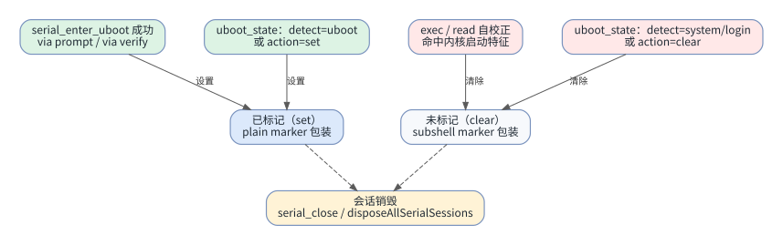
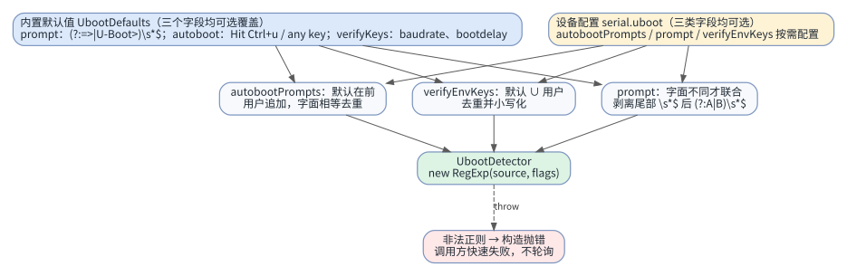
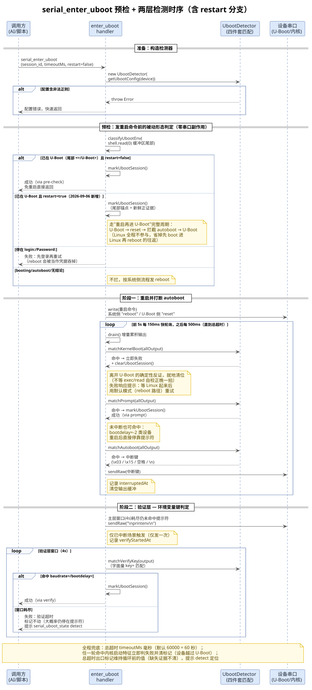
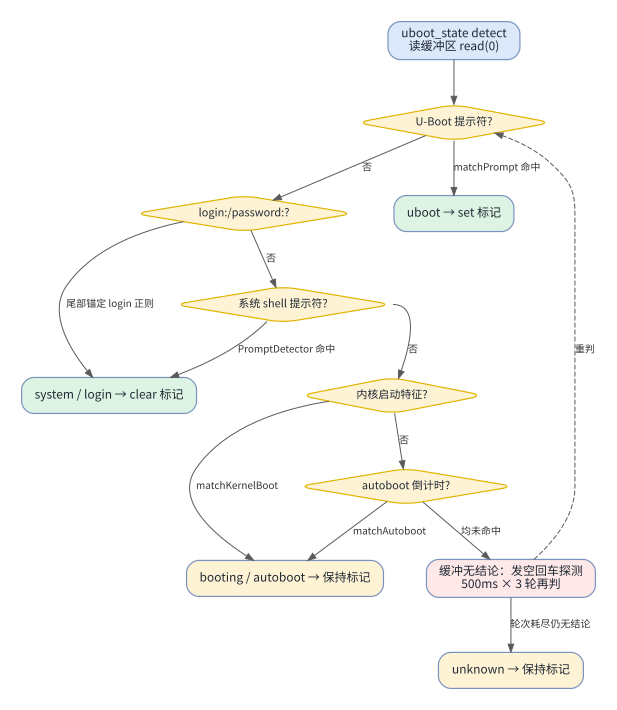
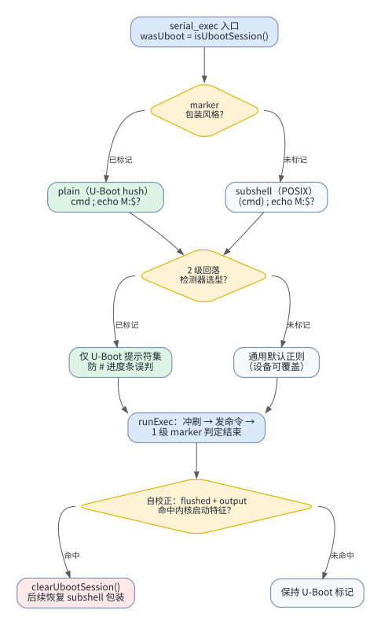

## 一、 概述

串口通道的 U-Boot 支持由三部分构成：设备配置里的 `serial.uboot` 检测规则、[`src/sdk/tools/serial/sessions.ts`](../src/sdk/tools/serial/sessions.ts) 中按会话维护的「U-Boot 标记」，以及 [`src/sdk/tools/serial/uboot.ts`](../src/sdk/tools/serial/uboot.ts) 提供的两个 MCP 工具（`serial_enter_uboot` / `serial_uboot_state`）。标记本身只是一个 `Set<string>` 里的 `session_id`，但它决定了 `serial_exec` 的 marker 包装风格与 2 级回落检测器选型，是整个 U-Boot 命令执行可靠性的中枢。

本文分析以下问题：

- 配置如何加载、与默认值如何合并（merge 而非 replace）
- 标记在何时被设置、查询、同步、清理，各自的判断逻辑
- 为什么刻意不用「提示符排除法」清理标记（2026-08-27 事故复盘）



## 二、 配置体系：serial.uboot 子段

### 1. 配置字段

`UbootYaml` 接口在 [`src/sdk/shared/config.ts`](../src/sdk/shared/config.ts#L37) 中声明，全部字段可选：

```typescript
// src/sdk/shared/config.ts
export interface UbootYaml {
  autobootPrompts?: string[]; // autoboot 提示正则数组，数组顺序即优先级
  prompt?: string;            // 命令提示符正则，命中即判成功（主层）
  verifyEnvKeys?: string[];   // printenv 验证键名（纯字面量，不走正则）
}
```

- 字段值直接写 JavaScript 正则源码字符串，由 `new RegExp(source, flags)` 构造，不做任何预处理，所见即所得
- YAML 双引号字符串中反斜杠必须双写（`"\\s+"`），单引号字符串可免双写，详见 [regex-guide.md](regex-guide.md)
- `getUbootConfig()` 在 [`src/sdk/shared/config.ts`](../src/sdk/shared/config.ts#L334) 中按设备名读取 `serial.uboot` 子段，未配置时返回空对象 `{}`，由检测器回退默认值

### 2. 默认值与合并规则

内置默认值 `UbootDefaults` 定义在 [`src/sdk/exec/prompt-detector.ts`](../src/sdk/exec/prompt-detector.ts#L143)，未配置时行为与改动前的硬编码实现完全等价：

- `autobootPrompts`：`Hit Ctrl+u to stop autoboot`（发 `\x15`）在前、`Hit any key to stop autoboot`（发换行）在后
- `prompt`：`(?:=>|U-Boot>)\s*$`，无 flags（`=>` 和 `U-Boot>` 固定大小写）
- `verifyEnvKeys`：`baudrate`、`bootdelay`
- `verifyTimeoutMs`：4000；`kernelBootPattern`：`Starting kernel|Linux version`（带 `i` 标志，不可配置）

合并策略是「默认优先的并集」，而非覆盖替换：

- `autobootPrompts`：默认值在前、用户值追加在后，字面相等去重，数组顺序即匹配优先级
- `prompt`：仅当用户值与默认值**字面不同**时才联合——剥离两者尾部 `\s*$` 后拼成 `(?:(?:A)|(?:B))\s*$`；用户照抄默认值时跳过合并，避免 `(?:A|A)` 冗余
- `verifyEnvKeys`：默认 ∪ 用户，去重后全部小写化，匹配时走 `key=` 字面量包含判断



【**容错原则**】配置含非法正则时 `new UbootDetector()` 在构造期抛错，调用方捕获后快速返回配置错误，不进入轮询；`serial_exec` / `serial_read` 内的检查则降级为跳过，不阻断主流程。

## 三、 UbootDetector 四件套检测

`UbootDetector` 类在 [`src/sdk/exec/prompt-detector.ts`](../src/sdk/exec/prompt-detector.ts#L176) 中定义，只做匹配、不操作串口，时序编排由工具 handler 负责。四个 match 方法对应进入 U-Boot 的四种判据。

### 1. matchAutoboot()

识别 autoboot 倒计时提示并返回应发送的中断键，该函数在 [`src/sdk/exec/prompt-detector.ts`](../src/sdk/exec/prompt-detector.ts#L287) 文件中定义：

【**函数作用**】

按配置数组顺序逐条测试 autoboot 提示正则（构造时统一带 `i` 标志），命中即返回该条目绑定的中断键

【**参数含义**】

- `output`：累积的串口输出（全程累积，非增量）

【**返回值**】

- 命中返回中断键：`\x03`（条目含 `Ctrl+c` 字样）、`\x15`（含 `Ctrl+u` 字样）、`\n`（其余，如 any key）
- 未命中返回 `null`

### 2. matchPrompt()

识别 U-Boot 命令提示符，该函数在 [`src/sdk/exec/prompt-detector.ts`](../src/sdk/exec/prompt-detector.ts#L301) 文件中定义：

【**函数作用**】

用合并后的 prompt 正则测试输出，默认锚定末尾（`\s*$`），作为主层成功判据

【**参数含义**】

- `output`：中断键发送之后累积的 U-Boot 阶段输出

【**返回值**】

- 命中返回 `true`，未命中返回 `false`

### 3. matchVerifyKey()

验证 `printenv` 输出中的环境变量键，该函数在 [`src/sdk/exec/prompt-detector.ts`](../src/sdk/exec/prompt-detector.ts#L314) 文件中定义：

【**函数作用**】

`printenv` 输出形如 `baudrate=115200\nbootdelay=3`，用字面量 `key=` 做大小写不敏感包含判断。刻意不走正则——键名是固定标识符，正则转换无收益反增错

【**参数含义**】

- `output`：`printenv` 命令发出后累积的输出

【**返回值**】

- 任一验证键命中返回 `true`，否则返回 `false`

### 4. matchKernelBoot()

识别内核启动特征，该函数在 [`src/sdk/exec/prompt-detector.ts`](../src/sdk/exec/prompt-detector.ts#L328) 文件中定义：

【**函数作用**】

匹配 `Starting kernel` / `Linux version` 特征（带 `i` 标志）。主层与验证层都应检查：设备可能在中断失败后越过 U-Boot 进入内核，命中即立即判失败，不等超时。该判据同时被 `serial_exec` / `serial_read` 复用为「已离开 U-Boot」的自校正证据

【**参数含义**】

- `output`：累积输出（可含前置冲刷残留）

【**返回值**】

- 命中内核启动特征返回 `true`，否则返回 `false`

## 四、 标记的设置：serial_enter_uboot 两层检测

`serialEnterUbootHandler()` 在 [`src/sdk/tools/serial/uboot.ts`](../src/sdk/tools/serial/uboot.ts#L78) 中实现，整体是一个 500ms 步进的轮询循环，内分三个阶段，总超时兜底。

### 1. 三阶段流程

1. 构造 `UbootDetector`：配置非法立即返回错误，不进入轮询
2. 发送 `reboot`，进入 500ms 轮询；`read(0)` 不清空缓冲区，持续累积
3. 阶段 1（未中断时）：`matchAutoboot()` 命中即发对应中断键，记录 `interruptedAt` 并清空累积输出，之后只收集 U-Boot 阶段输出
4. 阶段 2（主层）：中断后 4s 窗口内，先查内核启动特征（命中即失败），再查 `matchPrompt()`，命中即 `markUbootSession()` 成功返回（via prompt）
5. 阶段 3（验证层）：主层窗口耗尽仍未命中提示符时，发一次 `\nprintenv\n`（仅发一次），4s 窗口内 `matchVerifyKey()` 命中即成功（via verify）；窗口耗尽或命中内核特征则快速失败，建议重试

### 2. 时序图



### 3. 设计要点

- **双窗口计时**：主层与验证层各自以 `interruptedAt` / `verifyStartedAt` 为起点的 4s 窗口，与总超时 `timeout`（默认 60s）相互独立
- **输出分段**：命中 autoboot 与发出 `printenv` 两处都会清空累积输出，保证各阶段判定材料干净，不被上一阶段的引导日志污染
- **失败快速化**：内核启动特征是「越过 U-Boot」的确定性证据，任一层命中立即返回，不傻等超时

## 五、 标记的查询与同步：serial_uboot_state

`serialUbootStateHandler()` 在 [`src/sdk/tools/serial/uboot.ts`](../src/sdk/tools/serial/uboot.ts#L321) 中实现，提供四个动作。

### 1. 四个动作

- `status`：只读标记，无设备 I/O
- `set` / `clear`：强制覆盖标记，是自动检测失同步时的权威手动入口
- `detect`（默认）：分类当前真实环境并同步标记，两级策略——被动优先（缓冲区未消费内容的尾部即设备最近输出，命中即零副作用判定），主动兜底（发空回车让设备重绘提示符，500ms × 3 轮轮询）

【**注意**】不要在命令可能仍在运行、或等待交互输入（如 Y/N）时 detect——探测回车可能替用户回答了挂起的提示。

### 2. classifyUbootEnv() 分类逻辑

`classifyUbootEnv()` 在 [`src/sdk/tools/serial/uboot.ts`](../src/sdk/tools/serial/uboot.ts#L275) 中定义，判定顺序即优先级：先看输出末尾的「当前停靠点」，末尾无提示符再看「过程特征」，均未命中返回 `null`：

1. `matchPrompt()` 命中 → `uboot`
2. 尾部锚定正则 `/(?:login|password):\s*$/i` 命中 → `login`（系统侧未登录）
3. 通用 `PromptDetector` 命中 → `system`（Linux/Android shell）
4. `matchKernelBoot()` 命中 → `booting`（过渡态）
5. `matchAutoboot()` 命中 → `autoboot`（过渡态）
6. 均未命中 → `null`（unknown，命令可能仍在跑）



### 3. 标记同步规则

只有**结论性结果**才动标记，过渡态与未知态保持原值：

- `uboot` → `markUbootSession()`
- `system` / `login` → `clearUbootSession()`
- `booting` / `autoboot` / `unknown` → 不动标记

## 六、 标记的消费：serial_exec 的 marker 包装

标记的消费点在 [`src/sdk/tools/serial/shell.ts`](../src/sdk/tools/serial/shell.ts) 的 `serial_exec` handler，入口先采样 `wasUboot = isUbootSession()`，据此做两个分支决策。

### 1. marker 包装风格

在 [`src/sdk/exec/exec-runner.ts`](../src/sdk/exec/exec-runner.ts#L303) 中按 `markerStyle` 二选一：

```typescript
// src/sdk/exec/exec-runner.ts
const fullCommand: string =
  markerStyle === "plain"
    ? `${input.command}; echo "${marker}:$?"`
    : `(${input.command}); echo "${marker}:$?"`;
```

- `subshell`（未标记，POSIX shell）：子 shell 兜住 `exit`/`exec`、尾部 `&` 等会破坏外层 `echo` 的命令，并隔离 fd/PS1 等 shell 状态污染
- `plain`（已标记，U-Boot hush）：hush 无子 shell / 后台任务语法，上述威胁不存在，去掉括号即等价；`;` 为无条件顺序分隔，`echo` 必然执行，1 级 marker 检测照常生效

### 2. 2 级回落检测器收窄

U-Boot 态会话的 2 级回落检测器收窄为「仅 U-Boot 提示符集」——由 `createUbootPromptDetector()`（[`src/sdk/exec/prompt-detector.ts`](../src/sdk/exec/prompt-detector.ts#L403)）构造，而非通用默认正则。原因：U-Boot 下 TFTP/升级类命令用连续 `#` 刷进度条，通用正则「行尾 `#`」分支会把进度帧误判为 Linux root 提示符导致提前返回（实测 alg 升级 42s 的命令 406ms 即被截胡）。U-Boot 会话 plain 包装必有 marker，真结束由 1 级 marker 确定性判定，无需通用提示符参与。



## 七、 标记的清理

标记的存取由 [`src/sdk/tools/serial/sessions.ts`](../src/sdk/tools/serial/sessions.ts) 中三个函数完成：`markUbootSession()`（L43）、`isUbootSession()`（L49）、`clearUbootSession()`（L54）。清理路径有四条。

### 1. serial_exec 自校正（证据驱动）

U-Boot 态会话执行命令后，对「本次输出 + 前置冲刷残留（`flushed`）」做 `matchKernelBoot()` 检查，命中即判定已离开 U-Boot（`reset`/`boot`/`bootm` 或设备自行重启），清除标记，后续 `serial_exec` 恢复 subshell 包装。

证据合并是关键细节：`reset` 后内核日志晚于 exec 返回时会滞留 buffer，被下次 exec 的前置冲刷带出——合并检查避免证据随冲刷丢弃导致标记永久残留。冲刷发生在本次 `wasUboot` 采样之后，只影响自校正、不影响本次包装风格；plain 包装在 Linux sh 下照常展开，晚一拍无功能性破坏。

【**刻意不为**】不用「提示符排除法」（completedBy=prompt 且尾部非 U-Boot 提示符）清标记：负向证据不可靠，`#` 进度帧等垃圾尾部同样能触发误判（2026-08-27 事故即由此误清）。权威同步入口是 `serial_uboot_state` 的 detect/clear。

### 2. serial_read 同步清理

手动 `serial_read` 读到的内容若含内核启动特征，同样清标记。覆盖「用户手动 read 读到 reset/bootm 后内核日志」的场景——证据若被 read 取走而未判定，下次 exec 前置冲刷已无可回收材料。检测器构造失败（配置非法）时跳过检查，不阻断 read 主流程。

### 3. serial_uboot_state 手动清理

`action=clear` 强制清除；`detect` 得出 `system`/`login` 结论时自动同步清除。这是自动机制失同步时的权威人工入口。

### 4. 会话销毁

`serial_close`（[`src/sdk/tools/serial/shell.ts`](../src/sdk/tools/serial/shell.ts#L219)）在关闭会话后清标记；MCP Server 进程退出时 `disposeAllSerialSessions()`（[`src/sdk/tools/serial/sessions.ts`](../src/sdk/tools/serial/sessions.ts#L65)）对整个 `ubootSessions` Set 做 `clear()`，无泄漏。

## 八、 设计要点总结

- **单一事实源**：标记只存 `session_id`，环境真相在设备端；检测（detect）负责同步，exec/read 负责自校正，close 负责回收
- **正向证据驱动**：设置靠提示符/环境变量键（阳性），清理解靠内核启动特征（阳性）；负向证据（提示符不在）一律不作为清理依据
- **失败快速化**：任一层命中内核特征立即失败；配置非法构造期抛错，不进轮询
- **合并而非覆盖**：用户配置只增不减，保证默认行为始终兜底；字面相等判断避免语义等价的复杂分析
- **零副作用优先**：detect 先读缓冲区尾部，能不动串口就不动串口；探测回车是兜底手段且有明确警告
