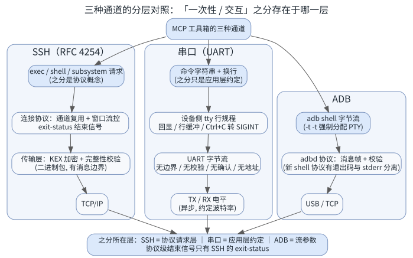
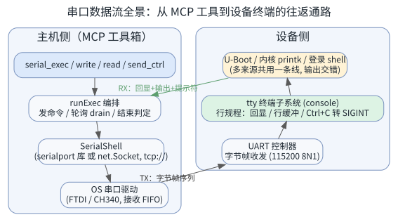
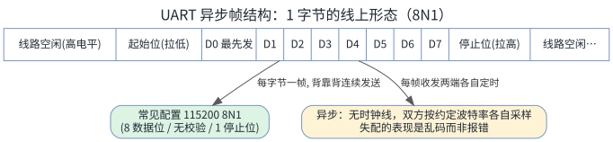
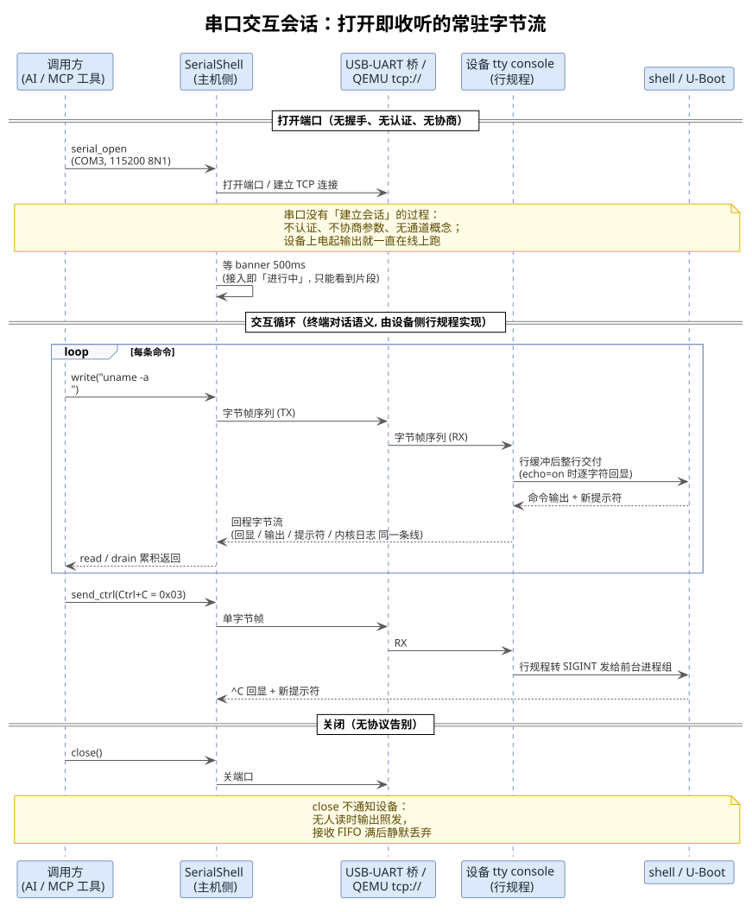
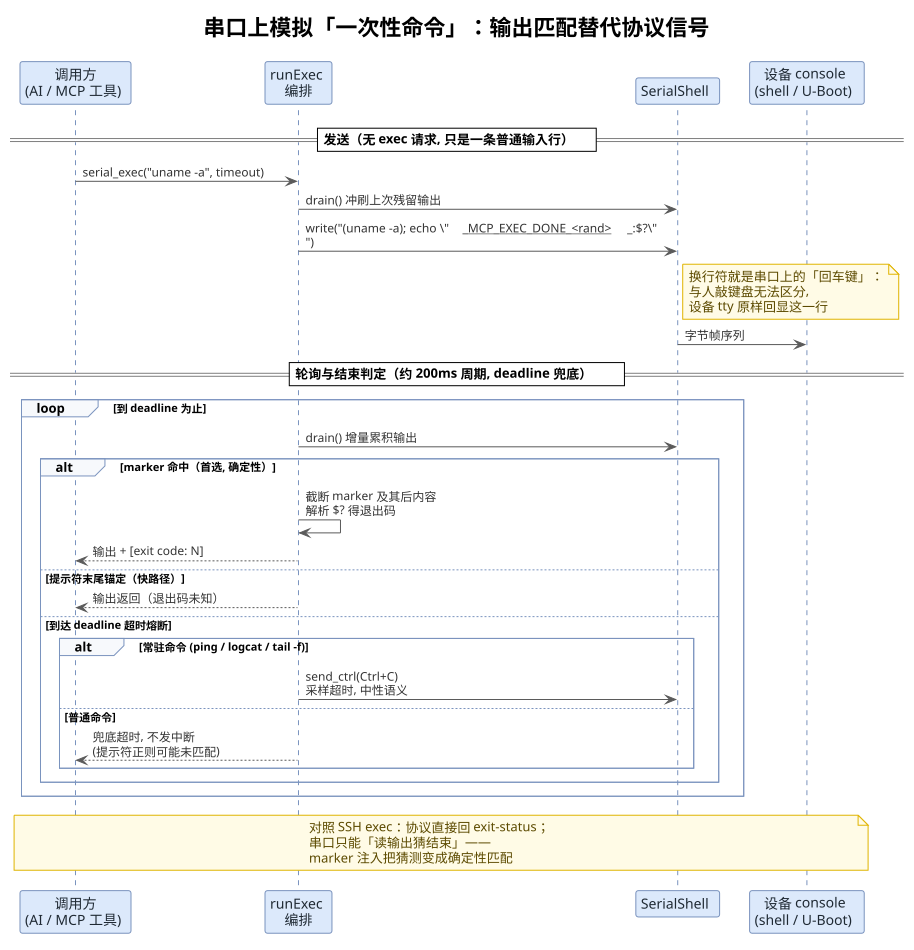

<!-- more -->

## 一、 概念澄清：串口有这种之分吗

### 1. 结论：传输层无此之分，会话层天然交互

上一篇（[MCP-SSH一次性命令与交互会话通道分析](./MCP-SSH一次性命令与交互会话通道分析.md)）已经说明：SSH 上的「一次性命令」与「交互会话」是 `session` 通道上 `exec` 与 `shell` 两种请求之分，属于**协议概念**。串口上这个问题有个干脆的答案：

- **UART 传输层没有这种之分，也根本没有「会话」「命令」「请求」这些概念**。串口是一条物理线上的透明字节流：写什么发什么，读什么是什么，没有通道、没有消息边界、没有结束信号、没有退出码
- 接在串口另一端的是设备的 console（U-Boot、内核 console、登录 shell），这个终端会话**天然就是交互会话形态**：打开即收听、输出常驻、命令共享现场
- 「一次性命令」在串口上**只能靠应用层约定模拟**：发送 `命令 + 换行`，然后从输出流里匹配结束标记。本工具箱 `runExec` 的 marker 注入（`(cmd); echo "___MCP_EXEC_DONE_<rand>___:$?"`）就是这种模拟

一句话总结：**SSH 的之分存在于协议请求层，串口的之分只存在于应用层约定**。

### 2. 三种通道的分层对照

| 层次 | SSH | 串口 | ADB |
| --- | --- | --- | --- |
| 会话语义 | exec / shell / subsystem 请求（协议级） | 命令字符串 + 换行（应用层约定） | adb shell 字节流（`-t -t` 强制 PTY） |
| 结束信号 | `exit-status`（协议级权威） | 无，靠输出匹配推断 | 无协议级逐命令信号（新 shell 协议带退出码） |
| 传输可靠性 | 加密 + 完整性校验 + TCP 重传 | 无校验、无重传 | adbd 消息帧 + 校验 |
| 多路复用 | 多通道并行 | 不存在（物理独占） | 单流 |
| 认证 | publickey / password | 无（物理接触即权限） | adbd RSA 配对 |

## 二、 串口数据流的原理

先用一张全景图定位各层：主机侧在左、设备侧在右。命令沿左列自上而下到达 OS 串口驱动，TX 对角边穿过物理链路（USB-UART 桥，或 QEMU `tcp://` 透明转发）进入设备侧 UART 控制器，再经 tty 终端子系统上行到 shell / U-Boot；RX 回程沿绿色对角边返回 `runExec`。本节沿这条通路拆解各层。

### 1. 物理层：UART 异步帧

串口（RS-232 / TTL UART）用 TX、RX 两根线做全双工传输，数据按字节逐帧发送：

- **线路空闲为高电平**；起始位拉低宣告一字节开始，随后 8 个数据位（LSB 最先发），最后停止位拉高回到空闲
- 默认配置 115200 8N1（8 数据位 / 无校验 / 1 停止位）；本工具箱的 [src/sdk/transports/serial.ts](../src/sdk/transports/serial.ts) 中 `baudRate`、`dataBits`、`stopBits`、`parity` 均可配置
- **异步**是关键词：没有时钟线，收发两端各自按约定的波特率定时采样（典型做法是以波特率 16 倍频多点采样取多数）。一帧约 10 位，两端累计时钟误差必须远小于半位，否则采样错位
- 波特率失配的**表现是乱码而非报错**——串口没有任何机制告诉接收端「这帧错了」，这是与 SSH 二进制包协议（长度前缀 + MAC 校验 + TCP 重传）最本质的差别之一

### 2. 链路特性：透明字节流的「四无」

- **无消息边界**：字节背靠背发送，接收端看到的只是字节序列。「一条命令」「一次响应」完全是应用层的划分
- **无校验确认**：可选的 parity 位只覆盖单字节且只能检出奇数个比特错；没有校验和、没有 ACK / 重传。丢字节、插字节静默发生
- **无流控**：默认不接 RTS / CTS 硬件握手，XON / XOFF 软件流控对 console 场景也不可用。接收端驱动维护接收 FIFO，**无人及时读取时 FIFO 满后静默丢弃**——这正是本工具箱 `runExec` 以约 200 ms 周期轮询 `drain()` 的底层原因：不是风格偏好，是防止输出丢失
- **无地址、无多路复用**：一条线一对一物理连接，不存在 SSH 那种「一条连接上多通道并行交错」

### 3. 终点：设备侧的 console 终端

串口线的另一端接的是设备的 UART 控制器 → tty 终端子系统（console）→ 上层程序：

- **终端语义由设备侧 tty 行规程实现**：echo 回显、canonical 模式行缓冲（整行交付）、`Ctrl+C`（0x03）转 SIGINT 发给前台进程组。这套语义正是 SSH 中 PTY 所模拟的原型——「伪终端」伪的就是这种串口终端
- **多来源共线混流**：U-Boot banner、内核 printk、登录 shell 的输出全部涌向同一条 console 线，内核日志随时可能「插播」到命令输出中间，这是串口自动化最大的噪声来源
- **上电即输出**：设备从上电那一刻就在往线上打字，观察者任何时刻接入都只能看到片段，不存在「会话开始」事件

## 三、 交互会话：串口的天然形态

### 1. 无建立过程

- 打开端口（`COM3` / `/dev/ttyUSB0`，或 `tcp://` 端点）即完成全部「建立」：无握手、无认证、无参数协商。物理接触即权限
- 所谓「会话」只是两个不存在协议对象的合称：主机侧的端口句柄 + 设备侧常驻的 shell。`close()` 也不通知设备——输出照发，无人读就丢
- 实现上（[src/sdk/transports/serial.ts](../src/sdk/transports/serial.ts)）：物理串口走 `serialport` 库（波特率等参数生效）；`tcp://` 前缀走 `net.Socket` 字节透明转发（QEMU `-serial tcp:...`、串口服务器），物理层参数被忽略，TCP 连接有 5 秒超时防黑洞；打开后统一等 500 ms 收 banner 残留

### 2. 协议时序

### 3. 特征与风险

- **输出不等人**：命令发出的瞬间设备就开始回，任何「先发完再读」的写法都会丢输出，必须边发边轮询读
- **现场共享**：cd 过的目录、导出的环境变量、已进入的 U-Boot 状态跨命令保持——这是选交互会话模型的核心收益（详见四、二两节的动机说明）
- **回显与提示符是设备 tty 给的**：echo=on 时发的每个字符都被逐字回显，命令行会原样出现在输出开头，自动化解析必须先剥离回显

## 四、 一次性命令：应用层模拟

### 1. 原理

在常驻字节流上模拟 exec 语义，把「协议信号」替换成「输出约定」：

- **发送侧**：`命令 + 换行`（`lineEnding` 默认 `\n`）——与人敲回车完全无法区分，这是串口上唯一的「请求」形式
- **结束判定三件套**：marker 注入（命令尾部拼 `(cmd); echo "___MCP_EXEC_DONE_<rand>___:$?"`，命中即结束、附带退出码，确定性首选）→ 提示符末尾锚定（快路径，退出码未知）→ 超时熔断（常驻命令发 `Ctrl+C` 采样，普通命令兜底不熔断）
- **U-Boot 特例**：hush shell 无子 shell 语法时去掉括号用 plain 风格；老 simple parser 不展开 `$?`，marker 后跟字面量 `"$?"`，退出码按未知处理

机制的完整细节（marker 随机后缀防误判、负向后行断言排除回显行、常驻命令分类等）见 [MCP交互式会话命令分析.md](./MCP交互式会话命令分析.md)，此处不重复。

### 2. 协议时序

### 3. 与 SSH exec 的关键差异

| 维度 | SSH exec | 串口 + marker 模拟 |
| --- | --- | --- |
| 结束信号 | 协议级 `exit-status`，绝对可靠 | 应用级 marker 匹配，可靠但可被输出噪声干扰 |
| 退出码 | 协议字段 | `$?` 经 shell 展开（U-Boot 老 parser 展开不了） |
| stdout / stderr | 协议级分离 | console 上同线混流，还可能混入内核 printk |
| 命令边界 | 每命令一条通道，天然隔离 | 共用一条流，靠 drain 冲刷隔离残留 |
| 传输中丢数据 | 不可能（校验 + 重传，出错即断连） | 可能且无感知 |

可靠性排序：SSH exec > SSH shell + marker > 串口 + marker——噪声源递增，这就是为什么串口编排保留了三级判定外加提示符正则可配置（`promptPattern`）等更多兜底。

## 五、 为什么本工具箱统一用交互会话模型

三通道统一编排（`runExec`）的前提是三通道存在共同形态，而共同形态只能是交互会话：

- **串口没有 exec 请求可用**——它只有字节流，天然交互会话形态
- **ADB 的 `adb shell` 是伪终端字节流**，也是交互形态
- **嵌入式流程需要现场共享**：登录 → cd → 进入 U-Boot → 连续操作，exec 的无状态模型每条命令都要重建现场

于是 SSH 侧「屈就」交互会话（放弃协议级 exit-status，用 marker 补回确定性），换来三通道一套编排、一套结束判定、一套超时语义。串口则是这个模型的「原生居民」——它从一开始就只有这一种形态。

## 六、 小结

- 串口传输层没有「一次性命令 / 交互会话」之分——UART 只是透明字节流，之分只存在于应用层约定；而串口上的 shell 会话天然是交互形态
- 串口数据流的原理是**异步帧**：无时钟线靠约定波特率各自采样，帧无边界、无校验、无确认、无流控，可靠性由物理近距离与及时读保证
- 终端语义（回显、行缓冲、Ctrl+C 信号）来自设备侧 tty 行规程——SSH 的 PTY 正是对它的模拟，理解串口 console 就理解了 PTY 的由来
- 串口上的「一次性命令」= 换行代替 exec 请求 + marker 匹配代替 exit-status + 轮询读代替流控——`runExec` 的每个设计点都有串口链路特性的直接对应

---
*本文档由 markdowncli 技能辅助生成*
