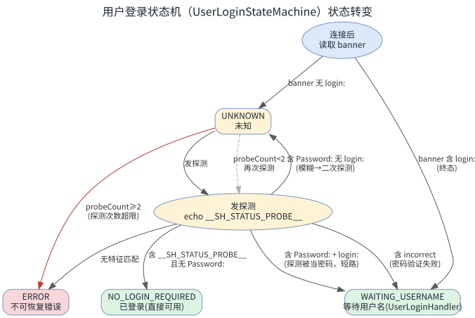
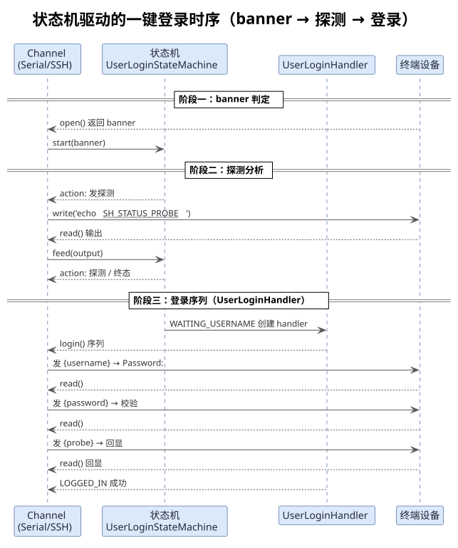
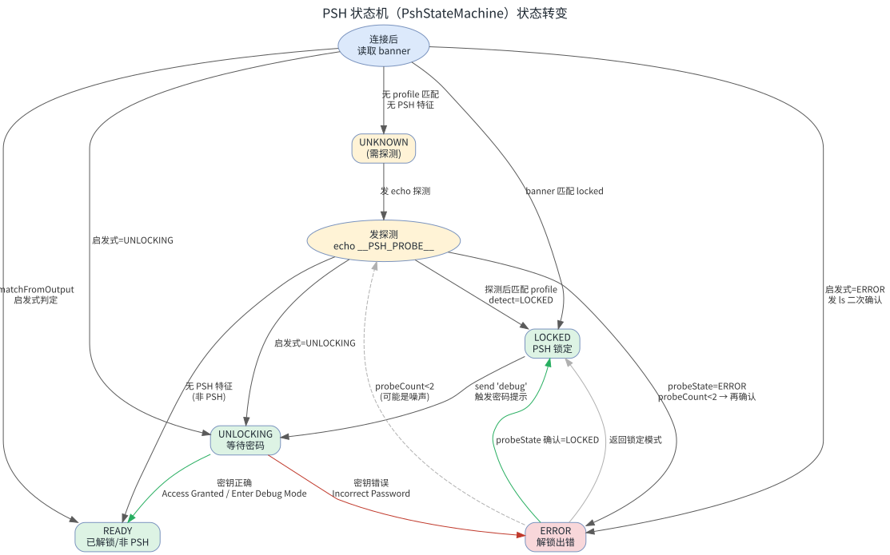
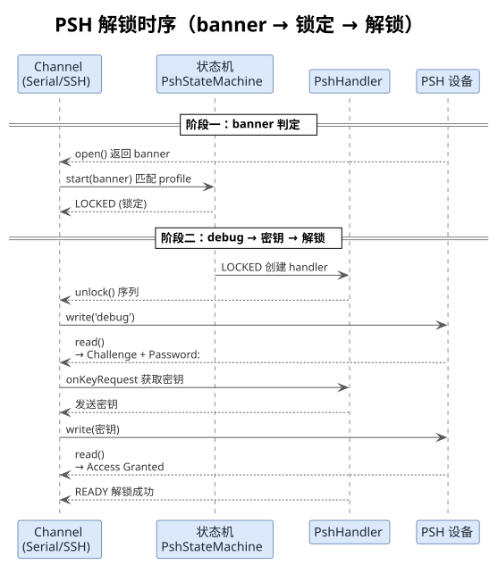

## 一、 概述

MCP 一键登录命令是嵌入式设备自动化连接的核心能力，用于在串口（Serial）或 SSH 通道建立后，自动识别终端状态并完成 **用户登录** 或 **PSH 解锁**，最终进入可交互的完整 Shell。

整个过程由两个相对独立的**有限状态机**驱动，底层逻辑与传输层无关，串口与 SSH 复用同一套实现：

- **用户登录状态机**（`UserLoginStateMachine`）：探测终端是否需要用户名 / 密码登录，以及当前处于哪个登录阶段。
- **PSH 状态机**（`PshStateMachine`）：探测设备是否为 PSH（Protect Shell 锁定 shell），并驱动解锁流程。

两个状态机的核心设计原则是一致的：

- **先读后发**：优先分析通道中已有的输出（banner / 缓冲区），能判断就绝不发送探测数据。
- **探测免污染**：在 `Password:` 等待状态下，任何带换行符的数据都会被当作密码读入，因此探测命令必须谨慎发送，甚至用 `ls` 这类无害命令做二次确认。
- **Profile 配置化**：不同设备 / PSH 变体的差异通过 profile 配置化，不硬编码设备名。
- **传输层无关**：通过统一的 `UserLoginChannel` / `PshChannel` 接口抽象读写，SSH 和串口共用同一套状态机逻辑。

## 二、 源码结构与职责划分

### 1. 核心文件

| 文件 | 职责 |
|---|---|
| [`src/sdk/auth/user-login.ts`](src/sdk/auth/user-login.ts) | 用户登录：`UserLoginStateMachine`（状态机）+ `UserLoginHandler`（登录序列） |
| [`src/sdk/auth/psh.ts`](src/sdk/auth/psh.ts) | PSH 解锁：`PshStateMachine`（状态机）+ `PshHandler`（解锁序列） |
| [`src/sdk/transports/serial.ts`](src/sdk/transports/serial.ts) | 串口通道封装 + 一键登录 / PSH 解锁演示编排 |
| [`src/sdk/transports/ssh.ts`](src/sdk/transports/ssh.ts) | SSH 通道封装 + PSH 解锁演示编排 |

### 2. 状态机与执行器分工

状态机只负责**判断终端当前状态**，真正的用户名 / 密码交互、密钥输入由对应的 Handler 完成。这种"判定与执行分离"的设计，让状态机保持纯函数式、易测试，也让 Handler 能复用状态机判断出的状态来编排交互。

```text
UserLoginStateMachine  ── 判定状态 ──▶  UserLoginHandler 执行登录序列
        ▲                                        │
        └────────────────────────────────────────┘
                    WAITING_USERNAME 作为衔接点

PshStateMachine  ── 判定状态 ──▶  PshHandler 执行解锁序列
        ▲                                        │
        └────────────────────────────────────────┘
                    LOCKED 作为衔接点
```

## 三、 用户登录状态机（UserLoginStateMachine）

### 1. 状态枚举

用户登录状态机定义了 7 种语义状态（`UserLoginStatus`）：

| 状态 | 含义 |
|---|---|
| `UNKNOWN` | 未知：刚连接，还未判断 |
| `NO_LOGIN_REQUIRED` | 已登录：可以直接操作设备 |
| `WAITING_USERNAME` | 等待用户名：终端显示 `login:` |
| `WAITING_PASSWORD` | 等待密码：终端显示 `Password:` |
| `LOGGED_IN` | 登录成功 |
| `WRONG_KEY` | 密钥错误（用户名或密码不正确） |
| `ERROR` | 不可恢复的错误 |

【**注意**】状态是**语义标签**，不是过程步骤。"正在发探测""正在验证密码"这类过程步骤不放入状态枚举，而是通过内部变量（如 `_probeCount`）跟踪。

### 2. 对外接口

状态机对调用方只暴露两个动作：

- `start(banner)`：喂入连接后的初始输出，返回第一个动作指令。
- `feed(output)`：喂入每次读取的输出，拿到下一动作指令。

每个动作指令（`StateMachineAction`）告诉调用方三件事：

```typescript
interface StateMachineAction {
  send?: string;      // 下一步要发送的命令（undefined = 已达终态）
  waitMs: number;     // 发送后等待多久（毫秒）
  state: UserLoginStatus;  // 当前检测到的状态
  done: boolean;      // 是否终态（不需继续交互）
}
```

调用方只需一个简单循环：

```typescript
const sm = new UserLoginStateMachine();
let action = sm.start(banner);

while (!action.done) {
  channel.write(action.send!, 1);      // 写之前清空缓冲区
  await wait(action.waitMs);
  action = sm.feed(channel.read(1));   // 喂入输出，拿下一指令
}

// 终态处理
if (action.state === NO_LOGIN_REQUIRED) { /* 已登录 */ }
else if (action.state === WAITING_USERNAME) { /* 走登录 */ }
else { /* 异常 */ }
```

### 3. 状态转变图



### 4. 判定处理细节

状态机的判定核心在 `feed()` 方法中，它从输出中提取 4 个特征位，再组合判断：

```typescript
const hasProbe    = output.includes("__SH_STATUS_PROBE__");  // 探针回显
const hasPassword = /Password:\s*$/im.test(output);          // 密码提示
const hasLogin    = /login:\s*$/im.test(output);             // 登录提示
const hasIncorrect = /incorrect/i.test(output);              // 密码错误
```

| 特征组合 | 判定结果 | 处理 |
|---|---|---|
| 含探针回显 + 无密码提示 | `NO_LOGIN_REQUIRED` | 已登录，直接可用 |
| 含密码提示 + 含登录提示 | `WAITING_USERNAME` | 探测被当密码吃掉，短路回登录 |
| 含密码提示 + 无登录提示 | 二次探测 | 无法确定，再发一次 echo |
| 含 `incorrect` | `WAITING_USERNAME` | 探测被当密码，验证失败 |
| 以上均不匹配 | `ERROR` | 无法识别终端状态 |

【**探测次数上限**】二次探测后仍模糊不清，不再无限重试，返回 `ERROR`。防止因串口噪声、设备异常等导致的死循环。

```typescript
if (this._probeCount > 2) {
  return this.#reply(UserLoginStatus.ERROR, "探测次数超限");
}
```

【**短路优化**】当一次探测输出同时含 `Password:` 和 `login:`，说明探测命令被当密码吃掉、验证失败、终端已回到登录提示。此时直接返回 `WAITING_USERNAME`，**不需要再发一次探测**，节省一轮往返。

【**不含 login: 的进一步区分**】如果含 `Password:` 但不含 `login:`，无法判断是"探测被吞但终端还在等密码"还是"探测被吞但密码正确已登录"。此时需要二次探测——再发一次 echo，从新一轮输出中判断。

### 5. 状态机驱动的一键登录时序



时序关键点：

- **banner 判定**：`start()` 用 `login:` 正则判断连接后初始输出是否含登录提示，若含则直接返回 `WAITING_USERNAME` 终态，走登录序列。
- **探测循环**：banner 不含 `login:` 时，状态机进入 `UNKNOWN`，返回探测动作，调用方发送 `echo __SH_STATUS_PROBE__`，再 `feed()` 分析回显，可能多次循环直到判定终态。
- **登录序列**：`WAITING_USERNAME` 终态触发 `UserLoginHandler`，按 profile 定义的步骤发用户名 → 等 `Password:` → 发密码 → 探测验证。

### 6. 登录序列（UserLoginHandler）

`UserLoginHandler` 负责实际的用户名 / 密码交互，通过 `UserLoginProfile.loginSequence` 配置化步骤。默认 `default` profile 的登录序列：

| 步骤 | 发送内容 | 期望匹配 | 错误匹配 | 成功状态 | 失败状态 |
|---|---|---|---|---|---|
| 1 | `{username}` | `Password:` | - | `WAITING_PASSWORD` | `ERROR` |
| 2 | `{password}` | `.*` | `incorrect` | `LOGGED_IN` | `WRONG_KEY` |
| 3 | `{probe}` | `__SH_STATUS_PROBE__` | - | `LOGGED_IN` | `ERROR` |

`send` 字段支持占位符，运行时自动替换：

- `{username}` → `UserLoginConfig.username`
- `{password}` → `UserLoginConfig.password`
- `{probe}` → `UserLoginProfile.probeCmd`（默认 `echo __SH_STATUS_PROBE__`）

此外还支持 `password-only` profile（无需用户名，部分嵌入式设备连接后直接显示 `Password:`）。

## 四、 PSH 状态机（PshStateMachine）

### 1. PSH 是什么

PSH（Protect Shell）是嵌入式设备上的**锁定 Shell**，启动后限制可用命令，只能执行 `help`、`dmesg`、`debug` 等受限命令。需要通过特定流程（如 `debug` + 密钥）解锁后才能获得完整 Shell。

### 2. 状态枚举

`PshState` 定义了 5 种状态：

| 状态 | 含义 |
|---|---|
| `READY` | 已解锁，拥有完整 Shell 权限 |
| `LOCKED` | 锁定状态，只能执行受限命令 |
| `UNLOCKING` | 解锁中，正在等待用户输入密码 / 密钥 |
| `ERROR` | 解锁出错（密码错误、输入无效等） |
| `UNKNOWN` | 无法判断当前状态 |

### 3. 状态检测优先级

`detectState()` 是 PSH 状态机的核心判定方法，采用**纯输出分析**（不发送任何数据，可安全在 `Password:` 等待状态下调用）。匹配优先级严格排序：

```text
READY > ERROR > UNLOCKING > LOCKED > UNKNOWN
```

这个优先级排序至关重要：

- **READY 优先**：避免解锁成功后的输出中残留 LOCKED 特征导致误判。
- **ERROR 优先于 UNLOCKING**：密码错误时输出中可能同时包含 `Password:` 和 `Incorrect Password`，必须先识别错误。
- **UNLOCKING 优先于 LOCKED**：`debug` 后输出中可能同时包含 `Protect Shell` 和 `Password:`。

### 4. 状态转变图



### 5. 判定处理细节

`PshStateMachine` 的状态探测分三种路径，根据 banner 能否匹配 profile 决定：

#### 5.1 banner 匹配到 profile

`start()` 用 `PshHandler.matchFromOutput()` 从内置 profile 中匹配 PSH 类型。匹配成功则直接 `#doDetect()` 分析状态：

- `READY / LOCKED / UNLOCKING` → 终态。
- `ERROR` 且探测次数 < 2 → 可能为噪声，发 `echo __PSH_PROBE__` 二次探测。
- `UNKNOWN / ERROR 超限` → 接受为终态。

#### 5.2 banner 启发式判定为 UNLOCKING / ERROR

当 banner 无法匹配 profile，但启发式检测（`heuristicDetect`）判断为 `UNLOCKING` 或 `ERROR` 时，**不发送 echo 探测**，避免探测数据被 PSH 当作密码输入导致污染：

- `UNLOCKING` → 直接返回终态（`handler=psh_generic`），交给 `unlock()`。
- `ERROR` → 可能上次解锁失败，发 `ls` 二次确认是否为 PSH（PSH 会返回 `'ls' Not Supported`，普通 shell 则正常列文件）。

#### 5.3 banner 无 PSH 特征

发送 `echo __PSH_PROBE__` 探测。探测后：

- 匹配到 profile → `#doDetect()`。
- 启发式 `UNLOCKING / ERROR` → 同 5.2。
- 均未匹配 → 判定为**非 PSH 设备**（`READY`），直接进入交互。

### 6. 解锁流程（PshHandler.unlock）

`PshHandler.unlock()` 按 profile 的 `unlockSequence` 逐步执行解锁。以 `psh_generic` 为例：

| 步骤 | 发送内容 | 期望匹配 |
|---|---|---|
| 1 | `debug` | `Password:` |
| 2 | 密钥（userInput） | `Enter (Debug\|BASH) Mode` / `built-in shell` 等 |

关键设计：**解锁过程中不发送任何 echo 探测标记**。因为任何带换行符的数据在 `Password:` 提示下都会被 PSH 当作密码读入，导致 `input invaild len param` 或 `Incorrect Password` 错误。这是串口解锁的核心问题。

### 7. 解锁时序



### 8. PSH 解锁的终态判定

解锁完成后，`unlock()` 做最终状态检查：

```typescript
const finalState = this.detectState(lastOutput);
const success = finalState === PshState.READY;
```

只有最终状态为 `READY`（匹配 `Enter Debug Mode` / `built-in shell (ash)` / `PSH_AUTH=1` 等）才算解锁成功，否则返回失败及当前状态。

## 五、 串口与 SSH 的统一原理

串口和 SSH 的 PSH 解锁、用户登录内部原理完全一致，这是通过**接口抽象**实现的：

### 1. 传输层无关接口

```typescript
// 用户登录通道（Serial / SSH 通用）
interface UserLoginChannel {
  write(cmd: string, clear?: number): void;
  read(clear?: number): string;
  close(): Promise<void>;
}

// PSH 通道（SSH / Serial 通用）
interface PshChannel {
  write(cmd: string, clear?: number): void;
  read(clear?: number): string;
}
```

`SerialShell` 和 `SSHShell` 都满足这两个接口，状态机只依赖接口方法，不感知底层传输方式。

### 2. 唯一区别：transport 标识

`PshStateMachine` 和 `PshHandler` 仅通过 `transport` 参数（`"ssh"` / `"serial"`）区分日志标识，**不影响任何判定逻辑**：

```typescript
const sm = new PshStateMachine("serial");  // 串口
const sm = new PshStateMachine("ssh");     // SSH
```

这是因为 PSH 的**行为与传输层无关**——无论是 SSH 还是串口连入，PSH 的状态特征、Challenge Code 格式、解锁序列都相同，因此共用同一个 profile。

### 3. 差异点：串口的信号噪声

串口相比 SSH 多一个风险：**信号干扰字符**。某些设备在串口连接时会混入控制字符，因此 `psh` profile 的 `features` 中设置了 `signalResistant: true`，指示解锁逻辑对信号干扰字符更宽容。

## 六、 最终状态判定汇总

无论是用户登录还是 PSH 解锁，状态机最终都会收敛到一个明确的终态，由调用方据此决定后续动作：

### 1. 用户登录终态

| 终态 | 调用方动作 |
|---|---|
| `NO_LOGIN_REQUIRED` | 已登录，直接进入交互式 Shell |
| `WAITING_USERNAME` | 交给 `UserLoginHandler` 执行登录序列 |
| `LOGGED_IN` | 登录成功，进入交互式 Shell |
| `WRONG_KEY` | 密钥错误，关闭通道并报错 |
| `ERROR` | 状态机检测异常，关闭通道并报错 |

### 2. PSH 终态

| 终态 | 调用方动作 |
|---|---|
| `READY` | 已解锁（或非 PSH），直接进入交互式 Shell |
| `LOCKED` | 是 PSH 且锁定，交给 `PshHandler.unlock()` 解锁 |
| `UNLOCKING` | 已处于等待密码状态，直接交密钥解锁 |
| `ERROR` | 解锁出错，按 `attemptsLeft` 判断是否还有重试机会 |
| `UNKNOWN` | 状态不明，需手动交互 |

### 3. 终态判定共同点

两个状态机在终态判定上有共同原则：

- **状态必须明确才收敛**：`READY / LOCKED / UNLOCKING / NO_LOGIN_REQUIRED / WAITING_USERNAME` 等明确状态立即返回终态。
- **模糊状态有限重试**：`ERROR / UNKNOWN` 等模糊状态通过 `probeCount` 上限约束，超过则接受为终态，避免死循环。
- **探测免污染优先**：在等待密码状态下绝不发送带换行符的数据，是确保状态机不误判的前提。

## 七、 扩展指南

### 1. 添加新的用户登录样式

遇到新的设备登录提示符（如 `Username:` 而不是 `login:`），只需在 `BUILTIN_PROFILES` 中添加新的 profile 条目。状态机本身不需要修改。

### 2. 添加新的 PSH 变体

不同 PSH 设备的提示符、Challenge 格式、解锁序列差异，通过新增 `PshProfile` 配置化。支持：

- 状态特征正则（`statePatterns`）
- 解锁序列（`unlockSequence`）
- Challenge Code 提取正则（`challengeCodePattern`）
- 行为特性开关（`features`）

### 3. 环境变量自定义

无需改代码即可适配新设备：

- `PSH_PROFILE`：指定内置 profile 名。
- `PSH_LOCKED_PROMPT` / `PSH_UNLOCKING_PROMPT` 等：自定义状态特征。
- `PSH_UNLOCK_SEQUENCE`：自定义解锁序列，格式 `cmd1=>expect1||cmd2=>expect2`，空 cmd 表示密钥输入步骤。

---

*本文档由 markdowncli 技能辅助生成*
