<!-- more -->

## 一、 设计背景

### 1. 问题来源

`embedded-mcp-toolkit` 的串口通道（`serial_open` 建立的会话）一旦建立，串口设备（如 `COM3`、`/dev/ttyUSB0`）就被 MCP 进程**长期独占**。在会话存活期间，任何外部程序（如 `sz`/`rz`、`minicom` 的 ZMODEM、第三方传文件工具）都无法再打开同一串口，也就无法完成二进制文件传输。

这对用户的实际场景构成了硬约束：

- 目标是纯串口设备（无网络、无 SSH），只能通过串口交互
- 需要向设备传一个大于 10M 的二进制文件（固件、压缩包等）
- MCP 已经登录设备并持有串口会话，用户希望在不关闭会话的前提下完成传输

### 2. 现有通道的局限

串口通道原本只提供**文本态**交互能力：

| 现有工具 | 能力 | 限制 |
|---|---|---|
| `serial_write` | 发送字符串命令 | 只发文本，无法发二进制帧 |
| `serial_read` | 读取文本输出 | 数据监听走 `data.toString()`，二进制帧会被 UTF-8 解码污染 |
| `serial_exec` | 执行命令取结果 | 基于提示符检测，无法承载协议帧 |

问题的核心在 [`src/transports/serial.ts`](../src/transports/serial.ts) 的数据监听：原始 `Buffer` 被无条件 `toString()` 后送入文本态 `OutputBuffer`，ZMODEM 协议帧（含大量非 ASCII 字节）一旦经过 UTF-8 解码就不可逆地损坏。

### 3. 解决思路

采用 **B1 方案**：让 MCP 进程本身充当 ZMODEM 协议的一端（发送端或接收端），复用已持有的串口连接，在会话内部完成二进制传输。全程不释放串口、会话保持不断。

具体角色分配：

- **上传**（本地 → 设备）：MCP 当 ZMODEM **发送端**，设备端运行 `rz` 接收
- **下载**（设备 → 本地）：MCP 当 ZMODEM **接收端**，设备端运行 `sz` 发送

设备端依赖 `lrzsz` 包提供的 `rz`/`sz` 命令，这是嵌入式 Linux 上最通用的 ZMODEM 实现。

## 二、 总体架构

### 1. 三层分层设计

整个方案分为三层，自上而下各司其职，层间通过明确的接口解耦：

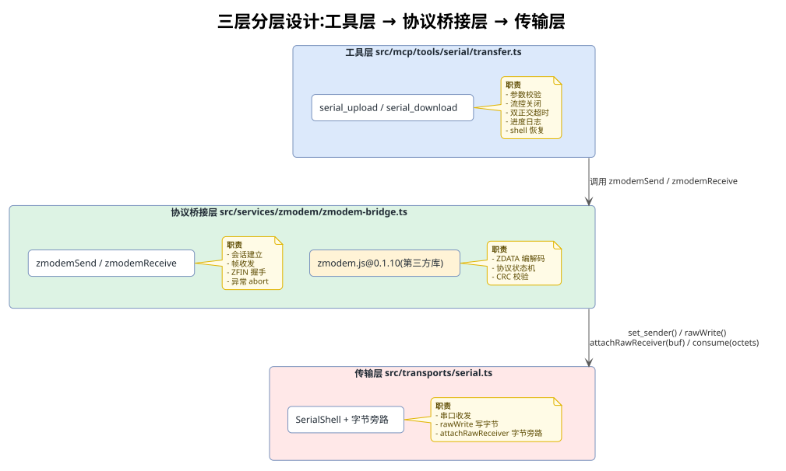

底层依赖第三方库 `zmodem.js@0.1.10` 负责协议帧的编码解码，桥接层把它和串口的字节流粘合起来。

### 2. 字节旁路与双向数据流

#### 2.1 字节旁路（双写策略）

这是整个方案的地基。串口的 `data` 事件原本只喂文本态 `OutputBuffer`，ZMODEM 帧会被污染。解决方案是**双写**——`data` 事件同时喂文本态和字节旁路：

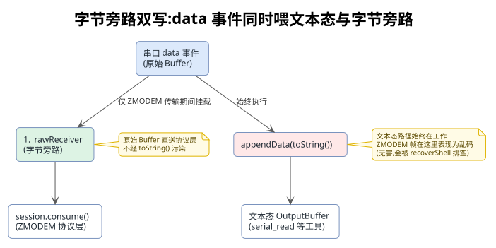

相关代码在 [`src/transports/serial.ts`](../src/transports/serial.ts#L180-L183) 的数据监听：

```typescript
// src/transports/serial.ts
serialPort.on("data", (data: Buffer) => {
  if (this.#rawReceiver) this.#rawReceiver(data);
  this.appendData(data.toString());
});
```

- `#rawReceiver` 默认 `null`，此时与改造前逐字一致（只走文本态）
- ZMODEM 传输期间，桥接层通过 `attachRawReceiver(cb)` 挂载回调，原始 `Buffer` 同时喂给协议层
- 传输结束后 `detach()` 卸载回调，恢复纯文本态

【**关键**】双写策略保证 ZMODEM 传输不影响 `serial_read` 等现有工具——文本态路径始终在工作，只是 ZMODEM 帧在文本态里表现为乱码（无害，会被 `recoverShell` 排空）。

#### 2.2 双向数据流

上传与下载的字节流向是对称的，区别仅在于"谁发数据、谁发控制帧"。完整双向数据流如下：

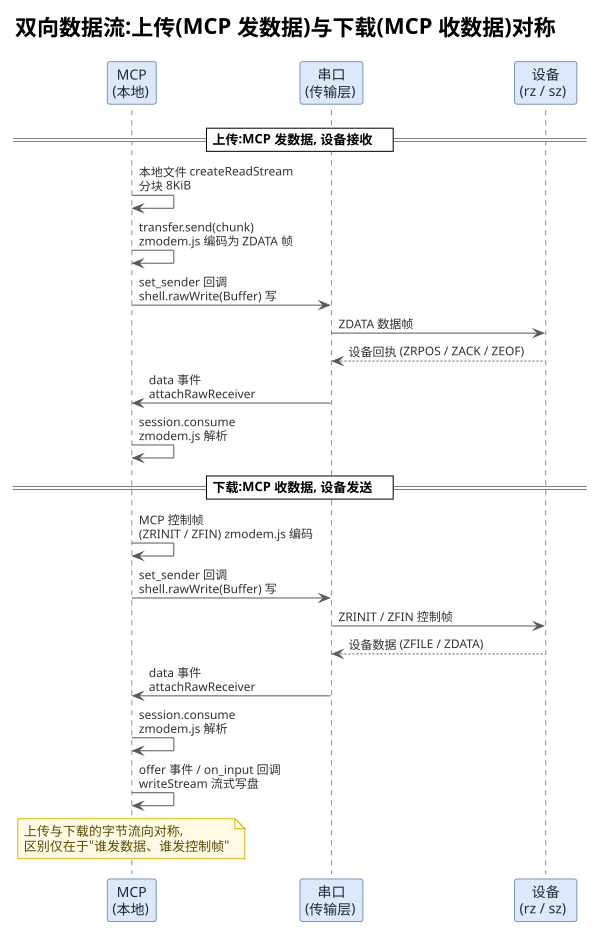

### 3. 文件组织

新增和修改的文件清单：

| 文件 | 状态 | 职责 |
|---|---|---|
| [`src/services/zmodem/zmodem-bridge.ts`](../src/services/zmodem/zmodem-bridge.ts) | 新增 | 协议桥接层，`zmodemSend`/`zmodemReceive` |
| [`src/services/zmodem/index.ts`](../src/services/zmodem/index.ts) | 新增 | 模块导出 |
| [`src/sdk/tools/serial/transfer.ts`](../src/sdk/tools/serial/transfer.ts) | 新增 | 工具层，两个 handler |
| [`src/sdk/tools/serial/index.ts`](../src/sdk/tools/serial/index.ts) | 修改 | 注册新工具 |
| [`src/transports/serial.ts`](../src/transports/serial.ts) | 修改 | 字节旁路、rawWrite、drainPort |
| [`src/shared/transfer-result.ts`](../src/shared/transfer-result.ts) | 新增 | 传输结果摘要格式化 |
| [`src/mcp/server.ts`](../src/mcp/server.ts) | 修改 | 全局异常兜底 |

## 三、 协议与传输原理

本章从 ZMODEM 协议本身出发，先讲清楚协议层面的约定，再展开上传、下载两个方向的具体实现。

### 1. ZMODEM 协议基础

#### 1.1 协议角色与帧类型

ZMODEM 是一个**主从式**的文件传输协议，关键帧类型如下：

| 帧类型 | 编号 | 发送方 | 含义 |
|---|---|---|---|
| ZRQINIT | 0 | 发送端 | 请求建立会话（"我要发文件了"） |
| ZRINIT | 1 | 接收端 | 接收端就绪（"我准备好接收了"） |
| ZSINIT | 2 | 发送端 | 发送端初始化信息 |
| ZFILE | 4 | 发送端 | 文件元信息（文件名、大小、时间戳） |
| ZSKIP | 5 | 接收端 | 拒绝该文件（如已存在） |
| ZRPOS | 9 | 接收端 | 指定接收起始偏移（断点续传） |
| ZDATA | — | 发送端 | 文件数据帧 |
| ZEOF | 11 | 发送端 | 文件发送完毕 |
| ZFIN | 8 | 任一端 | 会话结束握手 |
| ZNAK | — | 任一端 | 否定应答（CRC 错误，要求重传） |

#### 1.2 头部格式

ZMODEM 帧头部有两种编码格式：

- **16 进制头（ZHEX）**：用于控制帧（ZRINIT、ZFILE、ZEOF、ZFIN 等），可读性强。前缀字节 `2a 2a 18 42`（`**` + ZDLE + `'B'`）
- **二进制头（ZBIN/ZBIN32）**：用于数据帧，紧凑高效。前缀字节 `2a 18 41`（`*` + ZDLE + `'A'`）或 `2a 18 43`（ZBIN32，32 位 CRC）

所有头都以 `ZPAD(0x2a)` + `ZDLE(0x18)` 开头，这是定位帧起始的标志。

【**易错点**】注意区分 `ZDLE(0x18)` 和 `CAN(0x18)`——两者字节值相同但语义完全不同。`ZDLE` 是协议转义前导符，`CAN` 是中止信号；判断时必须结合上下文（`ZDLE` 前必有 `ZPAD`）。

#### 1.3 标准中止序列

当一方需要强制中止 ZMODEM 会话时，发送标准中止序列：

```
CAN(0x18) × 5  +  BS(0x08) × 5
```

lrzsz 收到后会立即退出接收/发送态。注意：

- `Ctrl+C(0x03)` 在 ZMODEM 协议态下**会被当作数据吞掉**，无法中断——必须用 CAN 序列
- 设备端 lrzsz **超时**时（如等不到对端响应）会自发 `CAN × 10`（双倍），这是"超时退出"的特征，与"主动中止"的 `CAN × 5` 不同

### 2. 会话建立机制（establishSession）

会话建立（`establishSession`）是上传和下载共用的核心流程，也是整个方案最脆弱的环节。上传时设备 `rz` 发 ZRINIT（建 Send 会话），下载时设备 `sz` 发 ZRQINIT（建 Receive 会话），两者建立逻辑完全一致。

#### 2.1 挂旁路后再发命令

【**根因**】如果先发 `rz` 再挂旁路，设备几乎瞬间回 ZRINIT，此时 `rawReceiver` 还是 `null`，ZRINIT 帧就进了文本态 `OutputBuffer`（被 `toString()` 污染），协议层永远收不到首帧。必须**先挂旁路、后发命令**。

```typescript
// src/services/zmodem/zmodem-bridge.ts
// 先挂字节旁路
const detach = shell.attachRawReceiver((buf: Buffer) => {
  if (session) {
    session.consume(Array.from(buf.values()));
  } else {
    for (const b of buf.values()) preBuffer.push(b);
  }
});

// 挂完旁路再发 rz/sz 命令——否则设备回的首帧会进文本态
if (startCmd) {
  shell.write(startCmd, 1);
}
```

#### 2.2 剥离命令回显

`rz` 命令执行后，设备会回显 `"rz\r\n rz waiting to receive."` 这类文本，然后才是 ZRINIT 帧。`zmodem.js` 的 `Session.parse` 内部假设输入从 ZMODEM 头开始，**不剥离前缀垃圾**。

解决方案是 `findZmodemHeaderStart()` 定位真正的帧头起始：

```typescript
// src/services/zmodem/zmodem-bridge.ts
function findZmodemHeaderStart(bytes: number[]): number {
  for (let i = 0; i < bytes.length - 1; i++) {
    // hex 头：0x2a 0x2a 0x18（ZPAD ZPAD ZDLE）
    if (bytes[i] === 0x2a && bytes[i + 1] === 0x2a &&
        i + 2 < bytes.length && bytes[i + 2] === 0x18) {
      return i;
    }
    // binary 头：0x2a 0x18（ZPAD ZDLE）+ ZBIN/ZBIN32
    if (bytes[i] === 0x2a && bytes[i + 1] === 0x18 &&
        i + 2 < bytes.length &&
        (bytes[i + 2] === 0x41 || bytes[i + 2] === 0x43)) {
      return i;
    }
  }
  return -1;
}
```

找到头起始后，从那里截取再 `parse`。

#### 2.3 传副本防 mutation

`Zmodem.Session.parse` 内部会 `splice` 传入的数组（消费掉已解析字节），**破坏原数组**。因此必须传副本：

```typescript
const parsed = Zmodem.Session.parse(preBuffer.slice(headerStart));
```

#### 2.4 建链轮询

建立会话是**轮询式**的，不是事件驱动。每 100ms 检查一次 `preBuffer` 是否有足够字节解析出会话，超时 5 秒（`HANDSHAKE_TIMEOUT_MS`）。

【**关键**】轮询循环里**先做失败检测，再做 parse**——单纯 parse 成功不代表握手成功（详见 2.4.1 节）：

```typescript
// src/services/zmodem/zmodem-bridge.ts
const deadline = Date.now() + timeoutMs;
let failReason = null;
while (Date.now() < deadline) {
  if (preBuffer.length > 0) {
    // 先检测握手期失败信号（CAN 连击 / 错误文本 / 提示符 / 垃圾溢出）
    failReason = detectHandshakeFailure(preBuffer);
    if (failReason) break;

    const headerStart = findZmodemHeaderStart(preBuffer);
    if (headerStart >= 0) {
      const parsed = Zmodem.Session.parse(preBuffer.slice(headerStart));
      if (parsed) {
        // parse 成功后再次检测：sz 文件不存在时会先发合法 ZRQINIT 首帧（让 parse
        // 成功），紧接着在同一批字节里报错 + CAN×10 退出。preBuffer 残留的错误
        // 文本/CAN 仍在，这里再检一次，命中则判定握手失败
        failReason = detectHandshakeFailure(preBuffer);
        if (failReason) {
          session = null;  // parse 出的会话不再使用
          break;
        }
        session = parsed;
        session.set_sender(onOutput);
        break;
      }
    }
  }
  await new Promise((r) => setTimeout(r, HANDSHAKE_POLL_MS));  // 100ms
}
```

##### 2.4.1 握手期失败检测（detectHandshakeFailure）

`detectHandshakeFailure()` 在轮询循环里被调用**两次**（parse 前一次、parse 成功后一次），用于识别对端在握手阶段就非协议态退出的四类情况：

```typescript
// src/services/zmodem/zmodem-bridge.ts
function detectHandshakeFailure(bytes: number[]):
  "abort" | "garbage" | "error-marker" | "prompt" | null
{
  // 1) CAN 连击检测：连续 CAN(0x18) ≥ 3 → 对端发中止序列
  //    阈值 3 容忍单字节噪声；ZMODEM 头里的单个 ZDLE（同为 0x18）不连续，不触发
  let maxCanRun = 0, curCanRun = 0;
  for (const b of bytes) {
    if (b === 0x18) { curCanRun++; if (curCanRun > maxCanRun) maxCanRun = curCanRun; }
    else curCanRun = 0;
  }
  if (maxCanRun >= HANDSHAKE_CAN_THRESHOLD) return "abort";

  // 2) 垃圾溢出：缓冲区超 256 字节仍无 ZMODEM 头 → 对端没进协议态
  if (bytes.length > HANDSHAKE_MAX_GARBAGE_BYTES) return "garbage";

  // 3) 错误文本嗅探：命中 cannot open / no such file / command not found 等
  if (bytes.length >= 8) {
    const text = Buffer.from(bytes).toString("latin1").toLowerCase();
    for (const marker of DEVICE_CMD_ERROR_MARKERS) {
      if (text.includes(marker)) return "error-marker";
    }
    // 4) shell 提示符：行尾是 # 或 $ → 设备已回 shell，没进协议
    if (/(^|[\r\n])[^\r\n]*[#$]\s*$/.test(text) && !text.includes("zmodem")) {
      return "prompt";
    }
  }
  return null;
}
```

各失败原因的含义与触发场景：

| 失败原因 | 触发条件 | 典型场景 |
|---|---|---|
| `abort` | 连续 CAN(0x18) ≥ 3 | sz/rz 文件不存在，发 ZRQINIT 后立即 CAN×10 退出 |
| `error-marker` | 命中错误文本子串 | `sz: cannot open ...: No such file or directory` |
| `prompt` | 行尾为 `#`/`$` 的 shell 提示符 | sz 未安装 / 命令拼错，直接回 shell |
| `garbage` | 缓冲区超 256 字节无 ZMODEM 头 | 设备输出大量文本但没进协议态 |

【**为什么 parse 成功后还要再检一次**】实测 lrzsz 在文件不存在时，会**先发一个合法的 ZRQINIT 首帧**（让 `Session.parse` 成功），**紧接着**在同一批字节里打印 `cannot open` 并发 CAN×10 退出。由于设备端时序极快（< 1ms），ZRQINIT + 错误文本 + CAN 往往在第一次 100ms 轮询时就已经一起塞进 `preBuffer`。parse 只消费了首帧，preBuffer 里残留的错误信息仍在，parse 成功后的二次检测即可命中，比纯 idle 兜底更快更准。安全性上，preBuffer 此时只含首帧 + 紧随的少量设备输出，不含用户文件数据（文件数据要等 offer/accept 之后才流入），不会误报。

#### 2.5 建链流程图

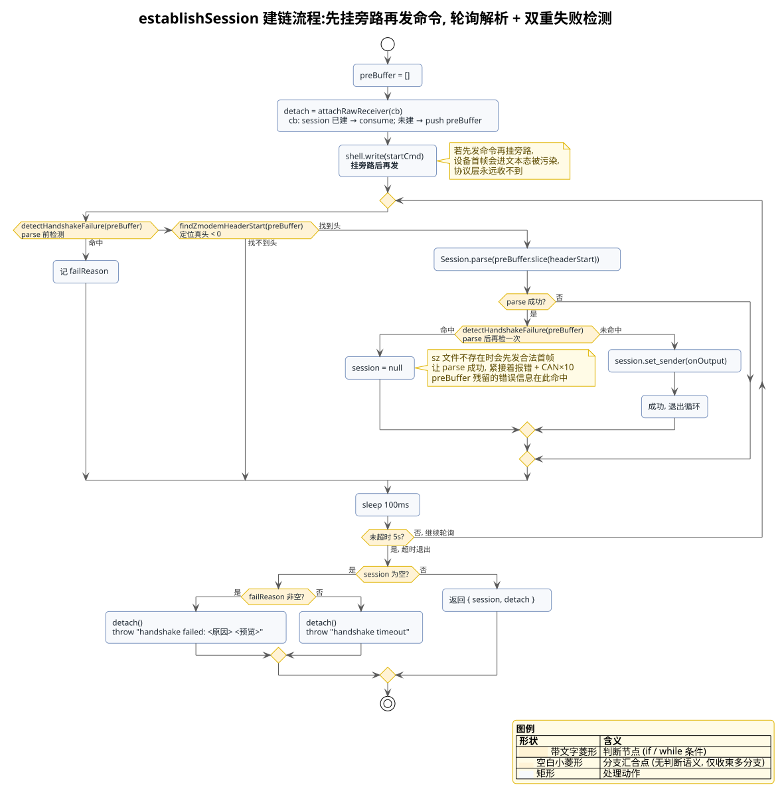

### 3. 上传方案（serial_upload）

#### 3.1 角色与流程概览

上传时，MCP 是 ZMODEM **发送端**，设备端 `rz` 是接收端。完整时序：

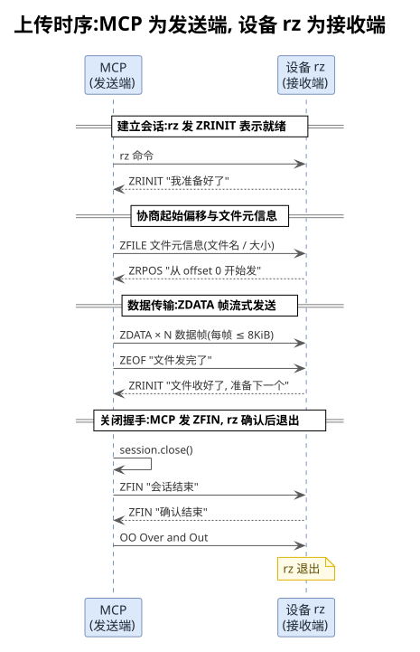

#### 3.2 数据发送

会话建立后，进入数据发送阶段。`zmodemSend()` 的核心逻辑分为四步：

```typescript
// src/services/zmodem/zmodem-bridge.ts
// 1. 发 offer（ZFILE），携带文件名和大小
const offer = Zmodem.Validation.offer_parameters({
  name: remoteName,
  size,
});
const transfer = await raceAbort(session.send_offer(offer), opts?.signal);

// 2. 对端若回 ZSKIP（拒绝），transfer 为 undefined
if (!transfer) {
  throw new Error("Device refused the file offer (ZSKIP received)");
}

// 3. 流式读本地文件，分块发送
let sent = 0;
const stream = createReadStream(localPath, { highWaterMark: ZMODEM_CHUNK_SIZE });
for await (const chunk of stream as Readable) {
  if (opts?.signal?.aborted) {
    throw new Error("Transfer aborted by signal");
  }
  const buf = Buffer.isBuffer(chunk) ? chunk : Buffer.from(chunk);
  transfer.send(Array.from(buf.values()));  // 编码成 ZDATA 帧发出
  sent += buf.length;
  opts?.onProgress?.({ bytes: sent, total: size });
}

// 4. 全部发完，等对端确认 ZEOF
await raceAbort(transfer.end([]), opts?.signal);
```

【**流式设计**】用 `createReadStream` + `for await` 流式读取，每次最多 8KiB（`ZMODEM_CHUNK_SIZE`），避免一次性把大文件读进内存。进度回调在每个块发送后触发。

【**raceAbort 的作用**】`send_offer` 和 `transfer.end` 返回的 Promise 在 `session.abort()` 后可能既不 resolve 也不 reject（悬挂），导致超时 abort 后整个传输永久卡死。`raceAbort` 给这些 await 加一个 abort 出口：signal 一旦 abort，立即 reject 抛错，让上层 catch 接管。

#### 3.3 ZFIN 关闭握手（关键）

这是上传方案的**核心难点**，也是调试过程中最棘手的 bug。`transfer.end([])` 只完成单文件结束（发 ZEOF、等对端 ZRINIT），**它不会发 ZFIN**。必须额外调用 `session.close()`：

```typescript
// src/services/zmodem/zmodem-bridge.ts
await raceAbort(transfer.end([]), opts?.signal);

// 关键：调 session.close() 发 ZFIN 关闭握手
const closeResult = await closeSessionWithTimeout(session, opts?.signal);
cleanEnded = closeResult.cleanEnded;
```

`closeSessionWithTimeout()` 内部用超时兜底 + abort 感知，避免对端异常不回 ZFIN 时无限阻塞：

```typescript
// src/services/zmodem/zmodem-bridge.ts
function closeSessionWithTimeout(
  session: SendSession,
  signal?: AbortSignal
): Promise<{ cleanEnded: boolean }> {
  return new Promise((resolve) => {
    let done = false;
    const finish = (clean: boolean): void => {
      if (done) return;
      done = true;
      clearTimeout(timer);
      signal?.removeEventListener("abort", onAbort);
      resolve({ cleanEnded: clean });
    };
    const onAbort = (): void => finish(false);
    const timer = setTimeout(() => finish(false), SESSION_END_TIMEOUT_MS);
    // 已 abort 则立即返回（如传输超时已在别处触发 controller.abort）
    if (signal?.aborted) {
      finish(false);
      return;
    }
    signal?.addEventListener("abort", onAbort, { once: true });
    try {
      // close() resolve（非 reject）才算干净结束；reject 视为未完成
      session.close().then(() => finish(true), () => finish(false));
    } catch {
      finish(false);
    }
  });
}
```

`session.close()` 的内部流程：发 ZFIN → 等对端回 ZFIN → 发 OO（Over and Out）→ 触发 `session_end`。

【**实测根因**】如果不调 `session.close()`：

1. 设备 `rz` 收完文件后一直等 ZFIN
2. 约 5 秒后超时，自发 `CAN × 10 + BS × 10`（双倍中止，lrzsz 超时退出的特征）
3. 这个中止路径会**破坏终端模式**（关 echo、不显示提示符）
4. 之后 shell 对所有命令零响应，必须重启或发 abort 序列才能恢复

5 秒的等待 + CAN×10（而非 CAN×5）是定位这个 bug 的关键线索。

### 4. 下载方案（serial_download）

#### 4.1 角色与流程概览

下载时，MCP 是 ZMODEM **接收端**，设备端 `sz` 是发送端。完整时序：

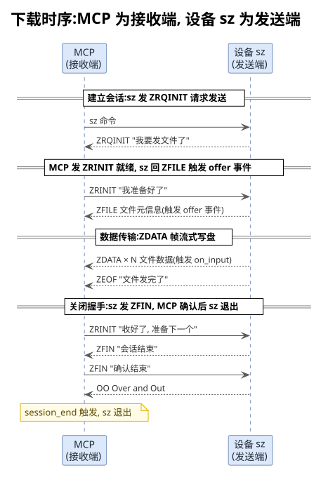

#### 4.2 接收端的惰性会话（关键）

这是下载方案的核心难点。与上传不同，下载侧的 ZMODEM 会话在 `parse()` 后是**惰性的**——必须显式调用 `session.start()` 才会驱动状态机。

【**实测根因**】如果不调 `session.start()`：

1. `parse()` 返回一个 Receive 会话对象，但它是"静止"的
2. 不调 `start()` 则永不发 ZRINIT、永不 arm ZFILE 处理器
3. `offer` 事件**永远不会触发**，收不到任何文件数据
4. 设备 `sz` 收不到 ZRINIT，约 5 秒后超时，自发 `CAN × 10` 中止
5. 同样破坏终端模式

`zmodemReceive()` 的正确顺序——**先注册事件处理器，再调 `start()`**：

```typescript
// src/services/zmodem/zmodem-bridge.ts
// 1. 先注册 offer 和 session_end 事件处理器
session.on("session_end", () => {
  cleanEnded = true;
  resolveEnd();
});

session.on("offer", (xfer: ReceiveOffer) => {
  offerSize = xfer.get_details().size;
  writeStream = createWriteStream(localPath);
  xfer.accept({
    on_input: (payload: Octets) => {
      const buf = Buffer.from(payload);
      writeStream?.write(buf);
      received += buf.length;
      opts?.onProgress?.({ bytes: received, total: offerSize });
    },
  });
});

// 2. 再调 start()——发 ZRINIT 引来 sz 回 ZFILE，触发 offer
await session.start();

// 3. 等 session_end（OO 收到时触发）
await sessionEnd;
```

【**顺序约束**】`start()` 必须在 offer handler 注册**之后**调用。因为 `start()` 发的 ZRINIT 会立即引来 sz 回 ZFILE，ZFILE 触发 offer 事件——如果 handler 还没注册，offer 就丢了。

#### 4.3 流式写盘

下载采用流式写盘，避免大文件撑爆内存。`on_input` 回调在每个数据帧到达时触发，直接写入文件流，不做内存缓存：

```typescript
// src/services/zmodem/zmodem-bridge.ts
session.on("offer", (xfer: ReceiveOffer) => {
  writeStream = createWriteStream(localPath);
  xfer.accept({
    on_input: (payload: Octets) => {
      const buf = Buffer.from(payload);
      writeStream?.write(buf);        // 每个 payload 直接写盘
      received += buf.length;
      opts?.onProgress?.({ bytes: received, total: offerSize });
    },
  });
});
```

#### 4.4 接收端的关闭握手（自动）

与上传侧不同，**接收端不需要手动调 `close()`**——ZMODEM 协议规定，接收端完成接收后会自动应答发送端的 ZFIN：

1. sz 发 ZEOF → 接收端发 ZRINIT（"准备下一个文件"）
2. sz 无更多文件 → 发 ZFIN
3. 接收端自动回 ZFIN（zmodem.js 内部 `_consume_ZFIN` 处理）
4. sz 发 OO → 接收端触发 `session_end`

因此下载侧只需 `await sessionEnd`，等待 `session_end` 事件即可。

## 四、 串口持续输出对传输的影响

前面各章的分析默认了一个理想前提：**串口链路是"干净"的**——除 ZMODEM 协议帧外，设备不向串口输出任何无关字节。但真实嵌入式场景往往并非如此。本章专门分析**设备端持续输出**（内核日志、诊断打印、常驻任务的周期性输出等）对 ZMODEM 传输造成的冲击。

### 1. 问题来源：什么是"串口持续输出"

嵌入式设备上，串口常常同时承担 **shell 交互**和**系统日志输出**两个职责。以下几类输出会在 ZMODEM 传输期间持续灌入串口：

| 输出来源 | 典型场景 | 输出特征 |
|---|---|---|
| 内核日志（printk） | 驱动异常、USB 枚举、OOM、panic 前兆 | 突发性、不可预测，直通 UART 不经 shell |
| 常驻诊断任务 | `dmesg -w`、`logcat`、自定义守护进程周期打印 | 周期性、稳定速率 |
| 业务打印 | 应用日志、传感器数据上报 | 与业务逻辑相关，速率不定 |
| 其他终端会话 | 设备多路 tty 输出重定向到同一串口 | 不可控 |

【**为什么这些输出会冲击传输**】ZMODEM 是**带内协议**——协议帧和噪声字节共享同一条串口字节流，没有任何链路层的隔离机制。串口本身也不提供消息边界：接收方只能靠 `ZPAD ZDLE` 前缀在字节流中"捞"协议帧。于是持续输出带来的所有字节都会与协议帧**物理交织**，协议层的每一个阶段都可能被污染。

### 2. 影响机理：分阶段的冲击分析

持续输出对 ZMODEM 传输的冲击在不同阶段表现不同。下面按建链期、数据期、关闭期依次展开。

#### 2.1 建链期：首帧被洪水淹没

建链期（`establishSession`）只等一个东西：设备 `rz`/`sz` 发出的首帧（ZRINIT/ZRQINIT）。此时协议层还没有任何状态，唯一的定位手段是 `findZmodemHeaderStart()` 在 `preBuffer` 里扫描 `ZPAD ZDLE` 前缀。

持续输出在这个阶段的冲击路径：

- **首帧被稀释**：日志行持续灌入 `preBuffer`，首帧夹在日志字节中间到达。`findZmodemHeaderStart` 能跳过前缀垃圾定位到帧头，**但前提是首帧完整到达**。若日志输出把首帧冲断（分多次 `data` 事件到达），100ms 轮询周期内可能拼不出完整帧
- **垃圾上限误判**：`detectHandshakeFailure` 的 `garbage` 判据是"缓冲区超 256 字节仍无 ZMODEM 头"。持续的日志输出完全可能在首帧到达前就把 256 字节额度烧光，导致**误判为"对端没进协议态"**而提前失败——这本来是为"命令打错、设备回 shell"设计的判据，在洪水场景下变成了误伤源
- **错误文本误命中**：日志行里如果恰好包含 `not found`、`skipped` 等子串（`DEVICE_CMD_ERROR_MARKERS` 的成员），会被 `error-marker` 判据误命中，建链直接判死

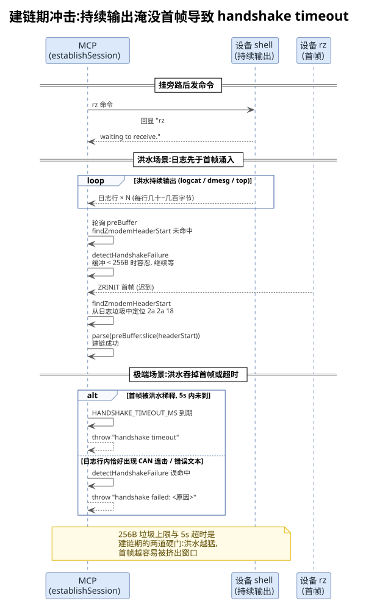

#### 2.2 数据期：上传与下载的差异化冲击

数据期是受冲击**最重**的阶段。子包是**整体验 CRC 校验**的最小单位，任何污染都会让整个子包作废。

【**结论**】同等洪水强度下，**下载方向（设备 sz → MCP）受影响更大**，上传方向相对更能扛。差异来自三个不对称：接收端身份不对称、恢复链路不对称、失败上限不对称。下面分别展开。

##### 2.2.1 上传方向（MCP → 设备 rz）：污染正面命中，但有缓存可重传

上传时，MCP 是发送端，设备 rz 是接收端。内核日志从设备侧写入 UART，恰好命中 rz 的接收缓冲——污染是正面命中的，但本地重传弹药让上传能以"吞吐滑坡"的形态硬扛洪水：

1. MCP 发出 ZDATA 子包（512B，见第四章 3.2 节的小包与节流设计）
2. 设备内核日志在**同一时刻**向 UART 写出——printk 直通硬件，与用户态 `rz` 的读入竞争同一个 RX 缓冲
3. `rz` 从 UART 读到的是"子包前半 + 日志字节 + 子包后半"的交错序列
4. 子包边界被破坏、CRC 校验失败，`rz` 丢弃整个子包
5. `rz` 周期性重发 ZRPOS 请求从上次正确偏移续传（lrzsz 的 `rzfile()` 每循环顶部发一次，约 10s 超时）
6. MCP 侧的 `RetransmitController` 响应 ZRPOS，重发缓存块
7. 若洪水不停，下一个子包再次被污染，回到步骤 2——形成**续传风暴**

上传方向能扛住洪水的三点底气：

- **本地缓存重传弹药**：`RetransmitController` 按 offset 缓存每个已发子包，ZRPOS 一到立即重发，**不计次数上限**——洪水不停就硬扛到底，代价只是吞吐下降
- **回执信道同向搭载**：ZRPOS 从设备发回 MCP，与日志同向共用设备 UART TX；但控制帧只有几字节，在日志洪流中存活概率远高于长数据帧，回执路径被淹没的概率低
- **节流错峰**：`SEND_THROTTLE_MS=50` 的块间节流让每次只暴露一个 512B（约 44ms）的撞车窗口，不是成批子包同时进洪水

因此上传方向的典型退化形态是**吞吐滑坡**（重传消耗时间）而非传输失败。

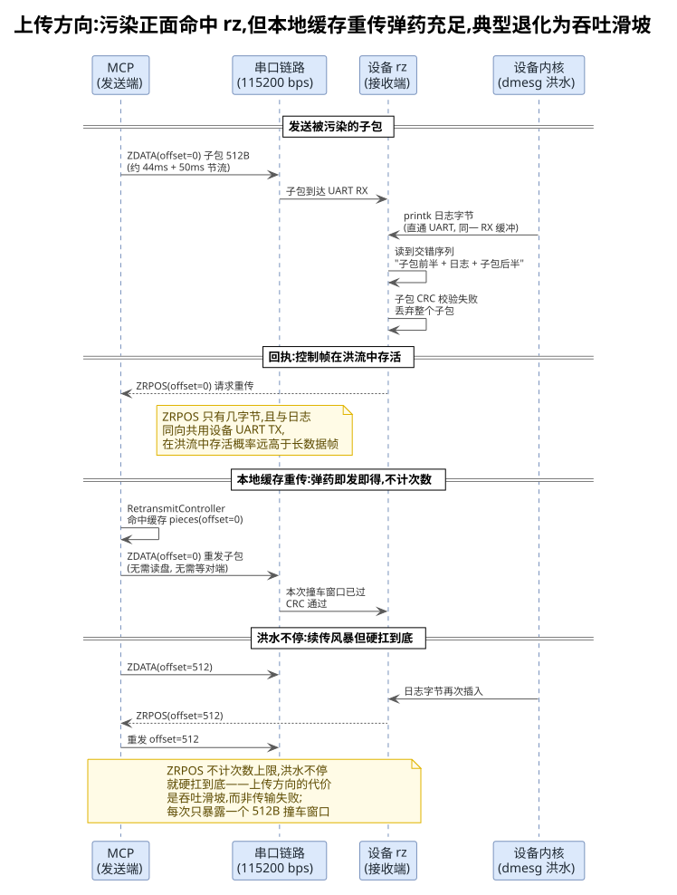

##### 2.2.2 下载方向（设备 sz → MCP）：污染双重命中 + 恢复链路更脆

下载时，设备 sz 是发送端，MCP 是接收端。洪水对下载是**双重命中**：

- **第一重：设备侧发送被打断**。sz 与 printk 竞争设备 UART TX——日志字节直接插进 sz 的 ZDATA 子包流，发出的数据流本身就是污染的；同时 printk 还抢占 CPU/UART 中断，打断 sz 的发送节奏
- **第二重：MCP 接收侧污染**。MCP 收到的每个子包都泡在洪水里，zmodem.js 抛 CRC 错误后**会话直接进入死态**（`_input_buffer` 已前进、子包处理器仍挂着），单次污染的杀伤更大

恢复链路也更脆弱：`recoverFromCrcError` 捕获 CRC 错误后，需要**双向趟过洪水**——ZRPOS 控制帧下行到设备（与日志同向逆行）、sz 重发的子包上行到 MCP（再次撞洪水）——两个环节任一失败，恢复就中断。且恢复依赖远端 sz 进程存活且愿意续传，MCP 处于被动。

失败上限更硬：`MAX_CRC_RETRIES=10` 烧穿后桥接层放弃恢复，交由 idle/overall 超时兜底报错，传输整体失败；上传方向没有这个上限。

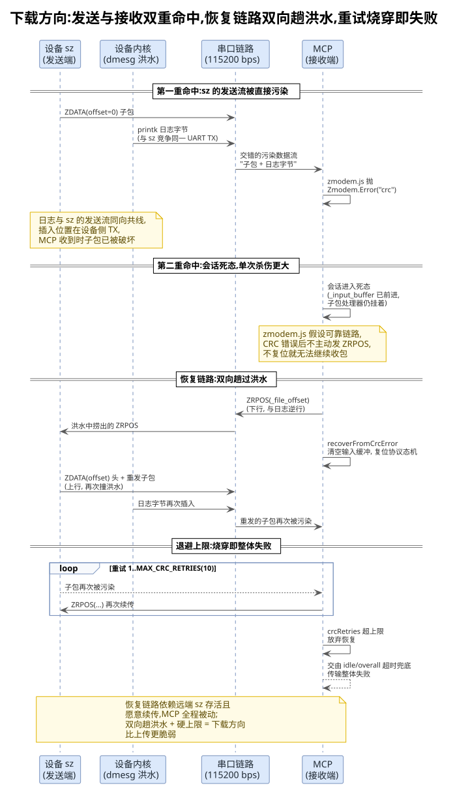

zmodem.js 在子包 CRC 校验失败时直接抛 `Zmodem.Error("crc")` 且不主动发 ZRPOS（它假设可靠传输）。桥接层的 `recoverFromCrcError` 捕获该错误后主动发 `ZRPOS(_file_offset)` 请 sz 从上次正确位置续传，并复位协议态机重新等 ZDATA 头对齐。完整恢复链与时序见下图：

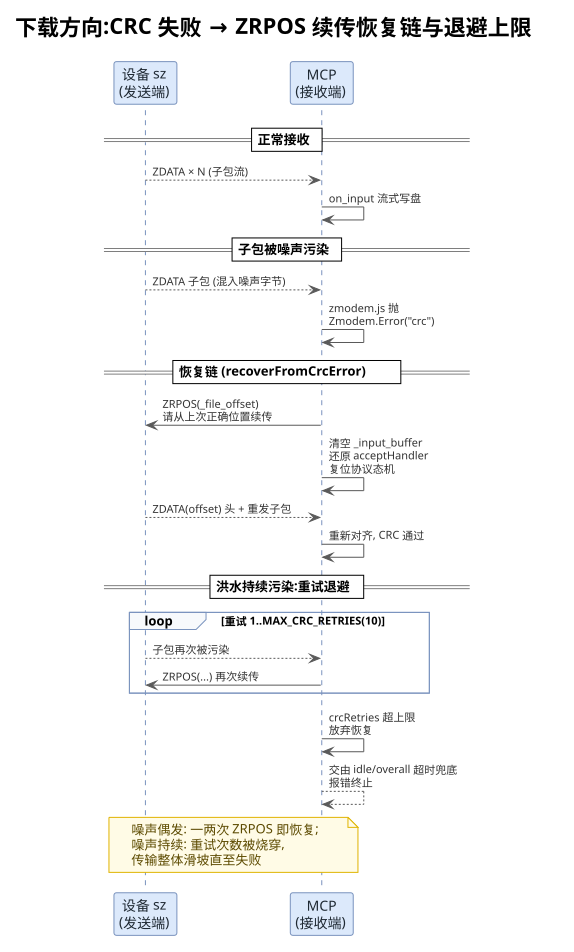

##### 2.2.3 上传与下载的差异汇总

| 差异维度 | 上传方向（MCP → 设备 rz） | 下载方向（设备 sz → MCP） |
|---|---|---|
| 污染命中位置 | 设备 UART RX（rz 接收缓冲） | 设备 UART TX（sz 发送流）+ MCP 接收侧，双重命中 |
| 发送端暴露面 | MCP 在 PC 侧，发送流不碰洪水 | sz 在设备侧，发送流被 printk 直接插入 |
| 单次污染杀伤 | 子包作废，本地缓存可重发 | 会话死态，需复位协议态机才能恢复 |
| 重传弹药 | `RetransmitController` 本地缓存，即发即得 | 依赖远端 sz 续传，无本地弹药 |
| 回执路径风险 | ZRPOS 帧短，淹没概率低 | ZRPOS 下行 + 子包上行双向趟洪水 |
| 失败上限 | 无硬上限，硬扛到底 | `MAX_CRC_RETRIES=10` 烧穿即失败 |
| 退化形态 | 吞吐滑坡 | 吞吐滑坡 → 重试烧穿 → 传输失败 |

【**洪水密度决定失败形态**】偶发噪声（如一次孤立的内核警告）只会触发一两次 ZRPOS 续传，传输总时间小幅变长；持续洪水（如每秒数 KB 的日志）则会让重试次数快速逼近 `MAX_CRC_RETRIES=10` 上限——超限后桥接层放弃恢复，交由 idle/overall 超时兜底报错，传输整体失败。

#### 2.3 关闭期：ZFIN 握手被拉长

关闭期（ZEOF/ZFIN/OO 握手）本身没有数据帧，靠心跳续命（见第五章 4 节）。持续输出在这个阶段的直接破坏较小，但会拉长握手时间：

- **回执被淹没**：MCP 等 ZFIN 时，洪水字节与 ZFIN 帧混在 `data` 事件里到达。`session.consume` 收到混合输入后，靠内部状态机逐字节扫描定位帧头，扫描开销与垃圾量成正比
- **idle 窗口被心跳掩盖**：只要心跳在跑（500ms 节拍），关闭期的洪水**不会触发 idle 超时**——心跳只是证明"MCP 还活着"，并不证明对端 ZFIN 在正常推进。若对端因洪水冲击已经异常退出，MCP 要等 `SESSION_END_TIMEOUT_MS=5s` 的关闭超时或上层 idle 才能发现

#### 2.4 吞吐影响：时间线对比

把静默链路与洪水链路放在同一条时间线上对比，冲击一目了然：

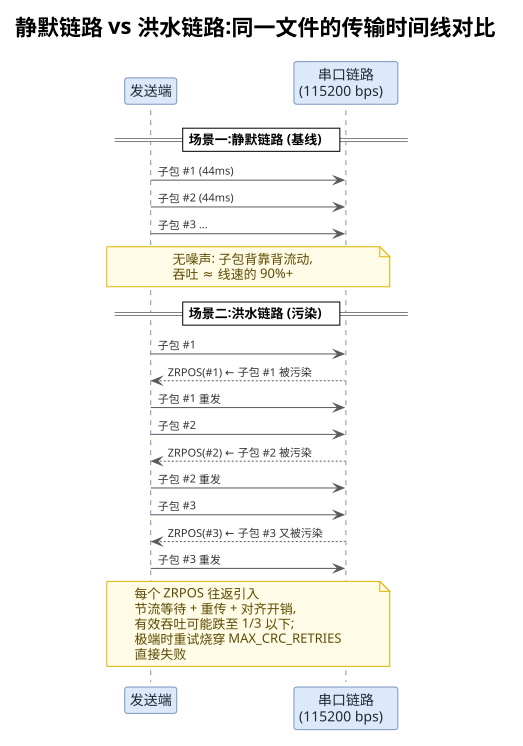

其中洪水链路对上传/下载的退化形态并不相同（差异分析见 2.2.3），上传方向在本地重传弹药支撑下典型表现为吞吐滑坡；下载方向则叠加了设备侧 sz 发送被打断、恢复链路双向趟洪水的双重冲击：

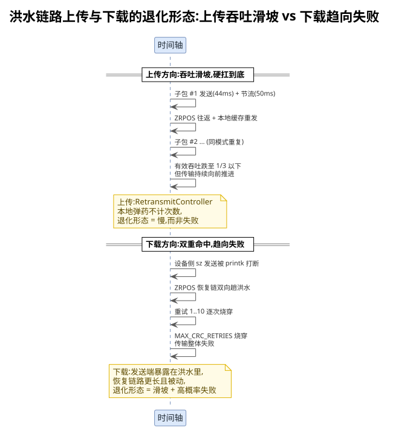

静默链路上子包背靠背流动，吞吐接近线速的 90% 以上；洪水链路上每次污染都要付出"重传 + 重新对齐 + 节流等待"的往返代价，有效吞吐可能跌至 1/3 以下。按 115200bps 线速约 11.5KB/s 计，一个 10MB 文件在静默链路约需 15 分钟，洪水链路下可能超过 45 分钟——若期间重试烧穿上限，则直接失败。

### 3. 防御与缓解机制

针对上述冲击，当前方案已在多个层面布防。各项机制并非专为洪水设计，但组合起来构成了对持续输出的系统性防御：

#### 3.1 协议层：CRC + ZRPOS 续传

ZMODEM 协议自带的**逐子包 CRC 校验**是第一道防线——任何被污染的子包都会在接收端被识别并丢弃，**不会写坏文件**（这是正确性的底线）。配合 ZRPOS 断点续传语义：

- **上传方向**：`RetransmitController` 接管传输中的 ZRPOS（zmodem.js 原生只打警告不响应），按对端回报的 offset 复位 ZDATA 发送态并重发缓存块
- **下载方向**：`recoverFromCrcError` 捕获 CRC 错误，主动发 `ZRPOS(_file_offset)` 请 sz 续传，并清空输入缓冲、还原 accept 阶段的 ZDATA 处理器，重新对齐协议态机
- **重试上限**：`MAX_CRC_RETRIES=10` 防止链路持续污染时空转烧 CPU，超限交由超时机制兜底

#### 3.2 链路层：小包 + 节流

上传方向的两个参数是**以退为进**的缓冲设计：

- `UPLOAD_CHUNK_SIZE=512`：子包越小，单次污染作废的字节数越少，重传代价越低。8KiB 大包一旦被污染，整包 8KiB 都要重发；512B 小包作废面缩小 16 倍
- `SEND_THROTTLE_MS=50`：块间节流给设备 UART RX 缓冲和 MCP 的 `data` 事件处理留出喘息空间，降低"日志写入与子包读取竞争缓冲"导致的字节交错概率

这两个值最初是为解决"Windows→USB 串口→设备 UART RX 链路大块突发丢字节"而引入的（详见第九章调试经验），对洪水场景同样有效——突发越猛，交错概率越高；节奏化发送天然降低了与日志写入撞车的窗口。

#### 3.3 建链层：垃圾剥离与容忍上限

建链期的防御是"剥离 + 上限"的组合：

- `findZmodemHeaderStart()` 能从日志垃圾中定位真正的帧头（`2a 2a 18` 或 `2a 18 41/43` 前缀），首帧夹在日志中间也能被捞出来
- `HANDSHAKE_MAX_GARBAGE_BYTES=256` 的垃圾上限是对"对端根本没进协议态"的快速判死，避免干等 5s 超时。代价是洪水极猛时可能误伤（日志先于首帧烧光额度），属于**有意的权衡**——宁可偶发误判（重试一次即可），不忍受静默卡死
- `HANDSHAKE_CAN_THRESHOLD=3` 的 CAN 连击阈值容忍单字节噪声，不会因日志里零星的 0x18 字节误判中止

#### 3.4 超时层：idle 判据天然适配洪水场景

洪水场景下"数据还在流动"与"传输还在推进"的区分尤为关键——被污染的子包虽然作废了，但链路上确实有字节往返，传输**没有死**：

- `touch(bytes)` 在每次 `onProgress` 时重置 idle——即使传输因续传风暴变慢，只要子包仍在推进（哪怕反复重传），idle 不会误杀
- `heartbeat()` 覆盖关闭握手阶段——洪水拉长 ZFIN 往返时，心跳保证 idle 不把"慢握手"误判为"链路挂了"
- `overall-proceeding` 判据给出"timeout 设小了"的提示而非静默截断——洪水链路上传输时间可能是静默链路的三倍以上，总超时需要按实测速率放宽

### 4. 用户侧操作建议

机制层面的防御之外，用户在传输前的预处理能显著降低洪水冲击：

- **先停掉可控的输出源**：`dmesg -D`（关闭控制台日志）、`kill` 常驻打印任务、降低应用日志级别。命令类输出源（`logcat`、`tail -f`）可以先 `Ctrl+Z` 挂起或重定向到文件
- **检查内核日志速率**：传输前 `cat /proc/sys/kernel/printk` 看控制台日志级别，级别越低（数值越大）直通串口的日志越少
- **预估超时**：洪水链路上按 1/2~1/3 线速预估传输时间，相应调大 `timeout`；`idle_timeout` 一般无需调整（续传风暴期间数据仍在流动，touch 会持续重置）
- **失败后重试**：若因重试烧穿 `MAX_CRC_RETRIES` 失败，说明洪水过猛，必须先治理输出源再重传——重试本身不会改善信道质量

【**注意**】传输期间不要通过 `serial_write` 发送任何命令——所有字节都会混入协议流（虽然对协议层是可剥离的垃圾，但徒增污染量）。

## 五、 超时机制设计

### 1. 设计动机：区分"真故障"与"超时设小了"

文件传输超时面临一个核心问题：**总时间到了，到底是传输出了问题，还是 timeout 设得太小？**

如果一刀切按总时间截断，会产生两个 bad case：

- 大文件 + 慢串口（如 115200 波特率），正常传输也会被误杀
- 链路真的断了，却要等到总超时才报错，浪费时间

核心判据是**传输是否还在流动**，而非"总时间到了没有"：

- 一直在推进（每收到一块数据就重置空闲计时）→ 链路是好的，只是文件大/速率慢 → 属于 timeout 设小了，不应硬截断
- 一段时间内零数据流动 → 链路或对端挂了 → 真故障，必须终止

### 2. 双正交超时

基于上述判据，工具层拆成两个**正交**的超时，由 `createTransferTimeoutGuard()` 统一管理：

| 超时 | 默认值 | 语义 | 触发动作 |
|---|---|---|---|
| `idle_timeout` | 15s（最小 3s） | 无数据流动判真故障，与文件大小无关 | 终止并报错 |
| `timeout` | 300s | 总时长兜底防无限挂起 | 到点看是否仍在推进再决定文案 |

`idle_timeout` 有下限 `IDLE_TIMEOUT_MIN_SEC=3s`，防止调用方误设过小（如 `idle_timeout=1`）导致正常慢传输被误杀。传入值低于下限时自动抬升至 3s。

### 3. 超时守卫实现

代码在 [`src/sdk/tools/serial/transfer.ts`](../src/sdk/tools/serial/transfer.ts) 中实现，核心判定逻辑：

```typescript
// src/sdk/tools/serial/transfer.ts
function createTransferTimeoutGuard(
  controller: AbortController,
  timeoutSec: number,
  idleTimeoutSec: number
) {
  let reason: AbortReason | null = null;
  let lastProgressAt = Date.now();
  let lastBytes = 0;

  // 空闲定时器：可重置。touch / heartbeat 都会重置它；到期 → 真故障
  let idleTimer: ReturnType<typeof setTimeout> | null = null;
  const armIdle = (): void => {
    if (idleTimer) clearTimeout(idleTimer);
    idleTimer = setTimeout(() => {
      if (!controller.signal.aborted) {
        reason = "idle";
        controller.abort();
      }
    }, idleTimeoutSec * 1000);
  };

  // 总时长定时器：到点看是否仍在推进
  const overallTimer = setTimeout(() => {
    if (controller.signal.aborted) return;
    // 最近 idleTimeoutSec 内还有进度 → 仍在推进（timeout 设小了）
    const proceeding = Date.now() - lastProgressAt < idleTimeoutSec * 1000;
    reason = proceeding ? "overall-proceeding" : "overall-stalled";
    controller.abort();
  }, timeoutSec * 1000);

  // 启动时空闲计时器先 arm 一次，覆盖到首个数据/心跳之前的窗口
  armIdle();

  return {
    reason: () => reason,
    touch: (bytes: number): void => {
      lastProgressAt = Date.now();
      lastBytes = bytes;
      armIdle();
    },
    heartbeat: (): void => {
      // 仅刷新时间戳（重置 idle + 为 overall-proceeding 判定提供"仍在推进"依据），
      // 不增加字节数——握手/关闭阶段本就无数据帧，但协议确实在推进。
      lastProgressAt = Date.now();
      armIdle();
    },
    lastBytes: () => lastBytes,
    clear: (): void => {
      clearTimeout(overallTimer);
      if (idleTimer) clearTimeout(idleTimer);
    },
  };
}
```

### 4. 心跳机制（heartbeat）：门控启动，数据期不被误杀

`touch(bytes)` 只在**数据帧**到达/发出时触发（上传的 `transfer.send` 后、下载的 `on_input` 回调里）。但 ZMODEM 传输有一个**无数据帧但协议仍在推进**的阶段：收发完数据后的 ZEOF/ZFIN 关闭握手（上传的 `transfer.end([])` + `session.close()`，下载等 `session_end`）。这些阶段没有 `onProgress`，idle 计时器持续运行，会把"正常的握手等待"误判成"链路挂了"，在慢串口 + 大文件场景下尤其容易触发（实测 208KB 文件全部发完后，等设备回 ZFIN 被默认 15s idle 误杀）。

解决方案是**心跳**：guard 的 `heartbeat()` 只刷新 `lastProgressAt` 时间戳（重置 idle + 让 overall 能判"仍在推进"），**不增加字节数**——握手阶段本就无数据，但协议确实在推进。

```
数据帧 onProgress → guard.touch(bytes)  → 刷新时间戳 + 记字节数 + 重置 idle
ZEOF/ZFIN 握手    → guard.heartbeat()   → 仅刷新时间戳 + 重置 idle（不增字节）
```

#### 4.1 门控启动（gated heartbeat）—— 关键设计

心跳**不能在会话一建立就启动**，否则会引入新的致命问题：

【**问题根因**】若心跳在会话建立后即启动并覆盖整个生命周期，握手阶段（上传的 `send_offer` 等对端 ZRPOS、下载的 `session.start` 等对端 offer）的心跳会**持续喂活 idle 计时器**。当对端在握手阶段就死了（如 sz 文件不存在报错退出、rz 拒绝 offer），idle 计时器被心跳喂活而**永远不触发**，只能靠 `timeout=300s` 总超时兜底（实测一次下载卡死 2 分多钟才返回，即此场景）。

【**门控策略**】心跳推迟到**首个数据块到达/发出后**才启动，由 `startHeartbeat()` 辅助函数（幂等）触发：

```typescript
// src/services/zmodem/zmodem-bridge.ts
function startHeartbeat(
  onHeartbeat: (() => void) | undefined,
  timerHolder: { timer: ReturnType<typeof setInterval> | null }
): boolean {
  if (!onHeartbeat) return false;
  if (timerHolder.timer) return false;  // 幂等：已启动则不再启
  timerHolder.timer = setInterval(onHeartbeat, HEARTBEAT_INTERVAL_MS);
  return true;
}
```

这样划分出两个阶段的 idle 行为差异：

| 阶段 | 心跳状态 | idle 计时器行为 | 含义 |
|---|---|---|---|
| 握手期（send_offer / 等 offer） | **未启动** | 正常计时 | 对端拒绝/卡死能被 idle 在 `idle_timeout` 内抓到 |
| 数据期 + ZEOF/ZFIN 握手 | 启动 | 被心跳重置 | 合法的协议间隙不被误杀 |

#### 4.2 上传侧的启动时机

上传的"首个数据块发出"在 `for await` 循环里，每个 chunk `transfer.send` 后调一次 `startHeartbeat`（幂等，首个 chunk 即启动）：

```typescript
// src/services/zmodem/zmodem-bridge.ts（zmodemSend）
for await (const chunk of stream as Readable) {
  if (opts?.signal?.aborted) throw new Error("Transfer aborted by signal");
  const buf = Buffer.isBuffer(chunk) ? chunk : Buffer.from(chunk);
  transfer.send(Array.from(buf.values()));
  sent += buf.length;
  // 门控心跳：首个数据块发出后才启动。后续 transfer.end / session.close
  // 等 ZEOF/ZFIN 握手阶段无数据帧，需要心跳防止 idle 误杀
  startHeartbeat(opts?.onHeartbeat, heartbeatHolder);
  opts?.onProgress?.({ bytes: sent, total: size });
}
```

#### 4.3 下载侧的启动时机

下载的"首个数据块到达"在 `offer` 事件的 `on_input` 回调里，每次写盘后调 `startHeartbeat`（首个 payload 即启动）：

```typescript
// src/services/zmodem/zmodem-bridge.ts（zmodemReceive）
session.on("offer", (xfer: ReceiveOffer) => {
  writeStream = createWriteStream(localPath);
  xfer.accept({
    on_input: (payload: Octets) => {
      const buf = Buffer.from(payload);
      writeStream?.write(buf);
      received += buf.length;
      // 门控心跳：首个数据块到达后才启动。后续 ZEOF/ZFIN 握手阶段无数据帧，
      // 需要心跳防止 idle 误杀
      startHeartbeat(opts?.onHeartbeat, heartbeatHolder);
      opts?.onProgress?.({ bytes: received, total: offerSize });
    },
  });
});
```

【**与握手期失败检测的协同**】门控心跳与第三章 2.4.1 节的 `detectHandshakeFailure` 是双重保险：握手期失败检测负责在 `establishSession` 阶段就识别对端非协议态退出并立即抛错（毫秒级）；门控心跳则兜底——即使握手期检测漏掉某个时序（如 parse 已成功但后续 offer 永不到达），`idle_timeout` 也能在 15s 内抓到，不再被心跳喂活而失效。

### 5. 超时判定原理

三种中止原因的触发条件（`touch` 与 `heartbeat` 都会刷新 `lastProgressAt`）：

- **idle**：从最后一次 `touch()` 或 `heartbeat()` 起经过 `idleTimeoutSec` 秒，仍未收到下一次活动。即**连续 `idleTimeoutSec` 秒无任何数据流动且无心跳**，判定为真故障
- **overall-proceeding**：`timeout` 秒到点，但距离最近一次活动小于 `idleTimeoutSec` 秒。说明数据仍在流动或协议仍在推进，只是速率低于预期导致总时长不够 → timeout 设得过小
- **overall-stalled**：`timeout` 秒到点，且距离最近一次活动已超过 `idleTimeoutSec` 秒。说明传输已停滞但 idle 定时器因某种原因未触发（兜底路径）

### 6. 超时时间线图解

以下用时间轴展示典型场景下两个定时器与心跳的协作（以 `idle_timeout=15s`、`timeout=300s` 为例）。图中 `♥` 表示 heartbeat（握手/关闭阶段），`●` 表示数据 touch：

```
场景一：正常完成（含握手阶段，两定时器均未触发）
─────────────────────────────────────────────────────► 时间
  0s    5s    10s   15s   16s(发完)        19s(ZFIN完成)
   │     │     │     │     │   ♥♥♥♥♥♥♥♥♥♥    │
   ●     ●     ●     ●     ●  transfer.end   ✓
   ↓     ↓     ↓     ↓     ↓  /close 握手
  [idle 15s ── 重置 ── 重置 ── 重置 ── ♥重置 ──]  ← 数据+心跳都重置，永不超时
  [overall 300s ──────────────────── ─ ─ ─ ─ ─]
  → 修复前：16s 发完数据后无 touch，19s 才完成 ZFIN 握手，
    16s + 15s = 31s 时若还没握完手会被 idle 误杀
  → 修复后：16s~19s 期间 heartbeat 每 500ms 重置 idle，正常完成


场景二：空闲超时（真故障，数据 + 心跳都停了）
─────────────────────────────────────────────────────► 时间
  0s     5s(data停)                    20s
   │      │                             │
   ●      ●                             ✗ idle 触发
   ↓reset ↓reset                          reason="idle"
          [idle 15s ───────────────────] → 15s 无 touch/♥
  [overall 300s ────────────────── ─ ─ ─] ← 未到点
  → 判定真故障（链路/对端挂），终止并报错


场景三：总时长到点但仍在推进（timeout 设小了）
─────────────────────────────────────────────────────► 时间
  0s   ……   298s  299s  300s(overall 到点)
   │          │     │     │
   ● ……       ●     ●     ●（或 ♥）
   ↓reset       ↓reset↓reset↓reset
  [idle 15s ── 重置 ── 重置 ── 重置]       ← 从未超时（数据/心跳一直在）
  [overall 300s ─────────────────] ✗ 到点
  → 检查：距上次活动 < 15s？是 → reason="overall-proceeding"
  → 文案给建议值，非静默截断
```

### 7. 关键设计点

1. **touch 即重置**：每收到一个数据块（`onProgress` 回调）就调 `touch()`，相当于把空闲计时器拨回原点。因此 idle 超时不是"从传输开始计时"，而是"从上次收到数据开始计时"。慢但稳定的传输（如 115200 波特率下每 800ms 一个包）永远不会触发 idle
2. **heartbeat 覆盖关闭握手间隙**：`transfer.end` / `session.close` 等无数据帧的阶段，由 bridge 层按 500ms 节拍触发 `heartbeat()`，同样重置 idle。这样 idle 判据从"无数据流动"细化为"既无数据也无协议心跳"，关闭握手阶段不再被误杀。**注意心跳是门控启动的**——仅在首个数据块到达/发出后才启用，握手期（send_offer / 等 offer）不启动，让 idle 能抓到对端在握手期就死了的情况（详见 4.1 节）
3. **复用 idleTimeoutSec 判 progressing**：overall 到点时，用 `lastProgressAt` 是否落在最近 `idleTimeoutSec` 窗口内来判断传输是否仍在推进（touch 与 heartbeat 都会刷新 `lastProgressAt`）。这个窗口值与 idle 超时值一致，保证了**判据统一**：如果传输出问题了，idle 必先触发；如果 idle 没触发，说明数据一直在流或协议在推进，overall 就不该静默截断
4. **共用 AbortController**：两个定时器独立运行，但共享同一个 `AbortController`。谁先到点谁 abort，后到点的检查 `controller.signal.aborted` 后直接 return，不做重复 abort

## 六、 异常处理机制

### 1. 异常分类与处理矩阵

整个传输过程的异常分为六类，每类有对应的处理策略：

| 异常类型 | 触发场景 | 处理方式 | 设备端状态 |
|---|---|---|---|
| 建链超时 | 5 秒内没收到 ZRQINIT/ZRINIT | 抛错，finally 发 abort | rz/sz 可能还在等，abort 让它退出 |
| **握手期失败检测** | `detectHandshakeFailure` 在 establishSession 命中 CAN 连击 / 错误文本 / 提示符 / 垃圾溢出 | 立即抛带上下文的错（含失败原因 + 设备输出预览），finally 发 abort | sz/rz 多已自行退出（如文件不存在），abort 兜底 |
| 本地文件不存在 | `stat` 失败 | 直接返回失败结果，不进协议 | 未启动 rz |
| **空闲超时（idle）** | `idle_timeout` 秒内无数据流动（握手期因心跳门控未启动，故也覆盖握手失败） | 判定**真故障**（链路/对端挂了），abort 终止，finally 发设备 abort | rz/sz 还活着，abort 让它退出 |
| **总时长超时（overall，仍在推进）** | `timeout` 秒到点且传输仍在推进（idle 未触发） | 判定 **timeout 设得过小**，abort 终止，文案给建议值 | rz/sz 收到 abort 退出，已传数据视协议状态可能已落盘 |
| **总时长超时（overall，已停滞）** | `timeout` 秒到点且传输已停滞 | 兜底（正常由 idle 先触发），按真故障处理 | rz/sz 还活着，abort 让它退出 |
| 对端拒绝 | rz 回 ZSKIP | 抛错，finally 发 abort | rz 在等下一个 offer |
| ZFIN 握手失败 | close() 超时或 reject | cleanEnded=false，finally 发 abort | rz 在等 ZFIN |

### 2. 异常处理决策流

异常发生后，代码按统一路径处理。以下决策流展示了不同异常的走向：

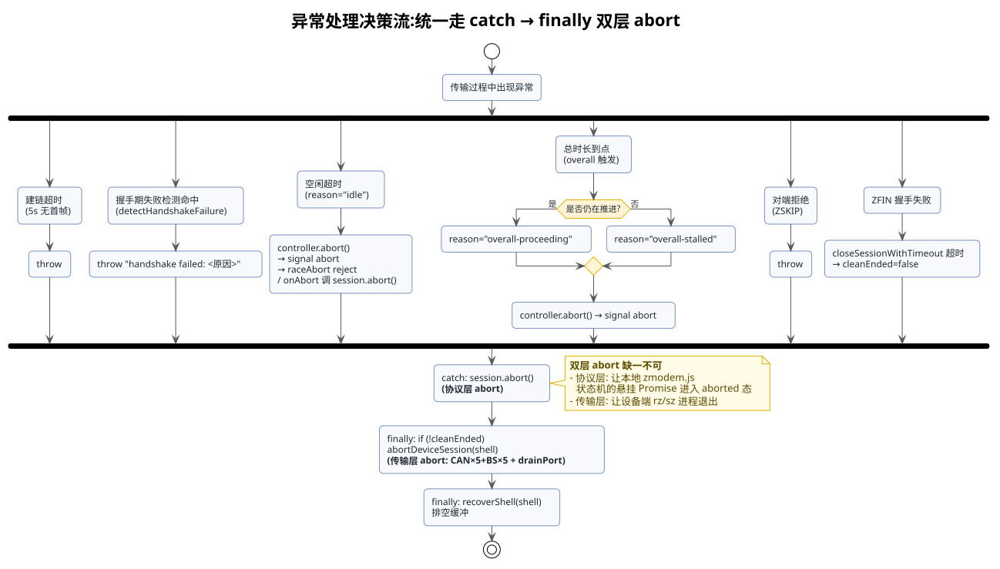

### 3. 双层 abort 设计

异常处理有一个关键的**双层 abort** 设计，分别作用于不同对象：

#### 3.1 协议层 abort（session.abort）

```typescript
// src/services/zmodem/zmodem-bridge.ts（catch 块）
try {
  session?.abort?.();
} catch {
  /* ignore */
}
```

作用对象：本地 `zmodem.js` 状态机。让库内部的 Promise 链进入 aborted 态，避免悬挂的 Promise 无人接听导致进程崩溃。

#### 3.2 传输层 abort（abortDeviceSession）

```typescript
// src/services/zmodem/zmodem-bridge.ts
async function abortDeviceSession(shell: SerialShell): Promise<void> {
  try {
    logger.info("[zmodem] sending CAN×5+BS×5 to abort device-side rz/sz");
    shell.rawWrite(ZMODEM_ABORT_SEQUENCE);  // CAN×5 + BS×5
    await shell.drainPort();                // 关键：等发送缓冲排空，确保字节真正上线
    await new Promise((r) => setTimeout(r, ABORT_SETTLE_MS));
  } catch {
    /* 串口可能已关闭，忽略 */
  }
}
```

作用对象：设备端 lrzsz 进程。让卡在协议态的 `rz`/`sz` 退出。

【**关键**】这两个 abort 缺一不可：协议层 abort 只管本地状态机，设备端进程不知道；传输层 abort 只管设备进程，本地状态机的悬挂 Promise 还在。

【**drainPort 必不可少**】`serialport.write()` 是异步的——字节先进 OS 发送缓冲，未必立即上线。Windows 串口驱动实测：超时 abort 后若不 `drainPort`，CAN×5+BS×5 会滞留缓冲，设备端 rz/sz 收不到而卡死、shell 无响应（关端口重开才会补发）。故写完中止序列必须 `drainPort()` 等缓冲排空，再 `ABORT_SETTLE_MS` 等设备处理。

### 4. cleanEnded 门控（关键设计）

是否发传输层 abort，由 `cleanEnded` 标志门控——这是经过多次踩坑后的正确设计：

```typescript
// src/services/zmodem/zmodem-bridge.ts（finally 块）
if (!cleanEnded) {
  await abortDeviceSession(shell);
}
detach?.();
```

#### 4.1 为什么不用 session.has_ended()

`zmodem.js` 的 `has_ended()` 实现是：

```javascript
// node_modules/zmodem.js/src/zsession.js
_has_ended() { return this.aborted() || !!this._sent_OO; }
```

问题在于：本地调 `session.abort()` 会置 `_aborted = true`，导致 `has_ended()` **立即返回 true**。在超时场景下：

1. signal abort → `session.abort()` → `_aborted = true`
2. finally 检查 `has_ended()` → 返回 true（被 `_aborted` 干扰）
3. 误判为"已干净结束"**漏发 `abortDeviceSession`**
4. 设备端 rz/sz 卡死

#### 4.2 cleanEnded 的正确置位

`cleanEnded` 只在**真正的干净结束路径**置 true，不受本地 abort 影响：

- **Send 侧**：`closeSessionWithTimeout` 返回 `{cleanEnded: true}`，仅当 `session.close()` 正常 resolve（ZFIN/OO 握手完成）时
- **Receive 侧**：`session_end` 事件回调里置 true，该事件仅在收到 OO 时触发

### 5. 下载侧的特殊处理：aborted 标志

下载侧（`zmodemReceive`）的 finally 块有一个额外考量：

```typescript
// src/services/zmodem/zmodem-bridge.ts（zmodemReceive finally 块）
if (!cleanEnded || aborted) {
  await abortDeviceSession(shell);
}
```

【**问题来源**】下载侧的超时 `onAbort` 回调中调 `session.abort()` 时，zmodem.js 可能**同步触发** `session_end` 事件，将 `cleanEnded` 误置为 `true`：

```typescript
const onAbort = (): void => {
  aborted = true;
  session?.abort?.();      // ← 可能同步触发 session_end → cleanEnded = true
  resolveEnd();             // ← 解除 sessionEnd 阻塞
};
```

若不处理，finally 检查 `!cleanEnded` 时为 false，**漏发 `abortDeviceSession`**，设备端 sz 卡在协议态、shell 无响应。

【**修复**】额外检查 `aborted` 标志：只要是被 abort 信号中止的，就**无条件发 abort 序列**，确保设备端 sz 退出。`aborted` 标志在 `onAbort` 中先行置位、不受 `session_end` 事件干扰。

此外，`aborted` 标志还有第二个作用：`resolveEnd()` 只解除 `sessionEnd` 阻塞，但会让代码误入"成功"返回路径（带着部分字节返回 `success:true`）。故 `await sessionEnd` 后检查 `aborted` 标志，置位则抛错强制走 catch（删残缺文件 + 返回失败）。

### 6. 全局异常兜底

即使双层 abort 都做了，zmodem.js 内部仍可能产生未被捕获的 Promise rejection（如 "Peer aborted session"）。为此在 [`src/mcp/server.ts`](../src/mcp/server.ts) 的 `registerCleanupHooks()` 里加了全局兜底：

```typescript
// src/mcp/server.ts
process.on("unhandledRejection", (reason) => {
  const msg = reason instanceof Error ? reason.message : String(reason);
  logger.warn(`[mcp] unhandledRejection swallowed: ${msg}`);
});
process.on("uncaughtException", (err) => {
  logger.warn(`[mcp] uncaughtException swallowed: ${err.message}`);
});
```

这保证即使协议层有未预期的 rejection，MCP 进程也不会崩溃。

### 7. 失败时清理半写文件

下载失败时，本地可能已有部分写入的文件。`zmodemReceive()` 的 catch 块负责清理：

```typescript
// src/services/zmodem/zmodem-bridge.ts
catch (err) {
  // ... abort session ...
  try {
    await unlink(localPath);      // 失败时清理半写文件
  } catch {
    /* 文件可能未创建，忽略 */
  }
  // ... 返回失败结果 ...
}
```

### 8. shell 恢复（recoverShell）

传输结束后（无论成功失败），工具层都会调 `recoverShell()` 清理 shell 缓冲：

```typescript
// src/sdk/tools/serial/transfer.ts
async function recoverShell(shell): Promise<void> {
  shell.read(1);                          // 丢弃缓冲残留
  shell.write("", 1);                     // 发回车触发提示符
  await new Promise((r) => setTimeout(r, SHELL_RECOVER_MS));  // 800ms
  for (let i = 0; i < SHELL_RECOVER_MAX_DRAINS; i++) {        // 循环排空
    const drained = shell.read(1);
    if (!drained) break;
    await new Promise((r) => setTimeout(r, SHELL_RECOVER_DRAIN_MS));
  }
}
```

- **正常路径**：rz/sz 已干净退出、shell 在提示符，本函数只是排空缓冲里残留的协议字节回显，属于轻量清理
- **失败路径**：finally 已发 abort 让 rz/sz 退出，本函数发回车触发重新输出提示符 + 循环排空

## 七、 前置条件与流控

### 1. 关闭软件流控（disableFlowControl）

多数 Linux 终端默认开启 `ixon`/`ixoff` 软件流控，会拦截 `XON(0x11)`/`XOFF(0x13)` 字节。这两个字节在 ZMODEM 数据流中是合法的（文件内容可能包含），一旦被终端流控拦截，协议帧就被破坏。

`disableFlowControl()` 在每次传输前执行：

```typescript
// src/sdk/tools/serial/transfer.ts
const STTY_DISABLE_FLOW_CTRL = "stty -ixon -ixoff";

async function disableFlowControl(shell): Promise<void> {
  shell.write(STTY_DISABLE_FLOW_CTRL, 1);
  await new Promise((r) => setTimeout(r, STTY_SETTLE_MS));  // 500ms
}
```

【**实测根因**】如果不关流控，ZMODEM 握手阶段就会失败——ZRINIT 帧末尾的 XON 字节被终端吞掉，协议层解析出错。

### 2. 设备端依赖

- `lrzsz` 包必须安装，提供 `rz`（接收）和 `sz`（发送）命令
- 可通过 `which sz && which rz` 检查

### 3. 命令可覆盖

工具支持自定义设备端命令，应对特殊场景：

- `serial_upload` 的 `recv_cmd` 参数：默认 `"rz"`，可传 `"rz -e"`（转义所有控制字符）
- `serial_download` 的 `send_cmd` 参数：默认 `"sz {remote}"`，`{remote}` 占位符替换为远端路径

## 八、 工具接口与调用链

本章给出两个工具的接口定义与从 handler 到串口字节流的完整调用链，供排查问题时按图索骥。

### 1. 工具接口

#### 1.1 serial_upload

##### 1.1.1 serialUploadHandler()

该函数在 [`src/sdk/tools/serial/transfer.ts`](../src/sdk/tools/serial/transfer.ts) 文件中声明：

```typescript
// src/sdk/tools/serial/transfer.ts
export async function serialUploadHandler(args: {
  session_id: string;
  local_path: string;
  remote_name?: string;
  recv_cmd?: string;
  idle_timeout?: number;
  timeout?: number;
}): Promise<{ content: { type: "text"; text: string }[] }>;
```

【**函数作用**】

将本地二进制文件通过 ZMODEM 协议上传到设备端，复用已有串口会话。阻塞式调用，传输过程中通过 logger 输出进度，完成或失败或超时后返回传输摘要。

【**参数含义**】

- `session_id`：由 `serial_open` 返回的会话 ID
- `local_path`：本地源文件路径
- `remote_name`：远端文件名（默认取 `local_path` 的 basename）
- `recv_cmd`：设备端接收命令（默认 `"rz"`，可传 `"rz -e"` 等）
- `idle_timeout`：空闲超时秒数：无数据流动超过此值判真故障并终止（默认 15，最小 3）
- `timeout`：总时长超时秒数，兜底防无限挂起（默认 300）

【**返回值**】

返回 MCP 响应，`content[0].text` 为传输摘要文本，含字节数、耗时、速率。

##### 1.1.2 使用示例

```
serial_upload:
  session_id: serial_1
  local_path: E:/firmware/image.bin
  remote_name: image.bin
```

#### 1.2 serial_download

##### 1.2.1 serialDownloadHandler()

该函数在 [`src/sdk/tools/serial/transfer.ts`](../src/sdk/tools/serial/transfer.ts) 文件中声明：

```typescript
// src/sdk/tools/serial/transfer.ts
export async function serialDownloadHandler(args: {
  session_id: string;
  remote_path: string;
  local_path: string;
  send_cmd?: string;
  idle_timeout?: number;
  timeout?: number;
}): Promise<{ content: { type: "text"; text: string }[] }>;
```

【**函数作用**】

将远端文件从设备下载到本地，复用已有串口会话。阻塞式调用，传输过程中通过 logger 输出进度。

【**参数含义**】

- `session_id`：由 `serial_open` 返回的会话 ID
- `remote_path`：远端源文件路径
- `local_path`：本地目标文件路径
- `send_cmd`：设备端发送命令模板（默认 `"sz {remote}"`，`{remote}` 替换为 `remote_path`）
- `idle_timeout`：空闲超时秒数：无数据流动超过此值判真故障并终止（默认 15，最小 3）
- `timeout`：总时长超时秒数，兜底防无限挂起（默认 300）

【**返回值**】

返回 MCP 响应，`content[0].text` 为传输摘要文本。

##### 1.2.2 使用示例

```
serial_download:
  session_id: serial_1
  remote_path: /home/root/dump.bin
  local_path: E:/logs/dump.bin
```

### 2. 完整调用链

#### 2.1 上传调用链

```
serialUploadHandler(args)
  │
  ├─ serialStore.getOrNotFound(args.session_id) → shell          [查会话]
  ├─ stat(args.local_path) → totalSize                           [文件存在性校验]
  ├─ remoteName = args.remote_name ?? basename(local_path)
  ├─ recvCmd = args.recv_cmd ?? "rz"
  │
  ├─ disableFlowControl(shell)
  │     └─ shell.write("stty -ixon -ixoff") + 等 500ms
  │
  ├─ controller = new AbortController()
  ├─ guard = createTransferTimeoutGuard(controller, timeoutSec, idleTimeoutSec)
  │     ├─ idleTimer:   guard.touch(bytes) / guard.heartbeat() 重置；
  │     │               idleTimeoutSec 未重置 → reason="idle"
  │     └─ overallTimer: timeoutSec 到点 → 检查距上次进度
  │                       → "overall-proceeding" / "overall-stalled"
  │
  ├─ zmodemSend(shell, localPath, remoteName,
  │             { onProgress: guard.touch, onHeartbeat: guard.heartbeat, signal }, recvCmd)
  │     │
  │     ├─ stat(localPath) → size
  │     ├─ establishSession(shell, onOutput, 5000, recvCmd)
  │     │     ├─ attachRawReceiver((buf) => preBuffer.push / session.consume)
  │     │     ├─ shell.write(recvCmd)                            [挂旁路后再发]
  │     │     ├─ 轮询：detectHandshakeFailure（parse 前）+ findZmodemHeaderStart
  │     │     │         + Session.parse + detectHandshakeFailure（parse 后）
  │     │     │     └─ 命中失败 → throw "handshake failed: <原因>"
  │     │     └─ session.set_sender((octets) => shell.rawWrite(Buffer.from(octets)))
  │     │
  │     │   （此处不再立即启心跳——门控心跳，握手期 send_offer 无心跳保护）
  │     │
  │     ├─ offer = Validation.offer_parameters({ name: remoteName, size })
  │     ├─ transfer = await raceAbort(session.send_offer(offer), signal)
  │     │     └─ transfer === undefined → throw "ZSKIP"
  │     │
  │     ├─ for await (chunk of createReadStream(localPath, { highWaterMark: 8192 }))
  │     │     ├─ signal.aborted → throw "Transfer aborted by signal"
  │     │     ├─ transfer.send(Array.from(chunk))                [编码 ZDATA]
  │     │     ├─ startHeartbeat(onHeartbeat, heartbeatHolder)    [门控：首个 chunk 启动，幂等]
  │     │     └─ onProgress({ bytes: sent, total: size })
  │     │
  │     ├─ await raceAbort(transfer.end([]), signal)             [发 ZEOF，等 ZRINIT，靠 ♥ 续命]
  │     ├─ closeResult = await closeSessionWithTimeout(session, signal)
  │     │     ├─ session.close()                                 [发 ZFIN → 等对端 ZFIN → 发 OO，靠 ♥ 续命]
  │     │     └─ cleanEnded = closeResult.cleanEnded
  │     ├─ signal.aborted → throw                                [abort 兜底返回的 false 不可当成功]
  │     │
  │     └─ return { direction: "upload", success: true, bytes: sent, ... }
  │
  ├─ catch (err)
  │     ├─ session.abort()                                        [协议层 abort]
  │     └─ return { success: false, error: errMsg, ... }
  │
  └─ finally（bridge 层）
        ├─ clearInterval(heartbeatHolder.timer)                  [注销心跳]
        └─ detach()
  │
  └─ finally（工具层）
        ├─ guard.clear()                                          [注销 idle/overall 定时器]
        ├─ if (!cleanEnded) abortDeviceSession(shell)             [传输层 abort: CAN×5+BS×5]
        └─ recoverShell(shell)                                    [排空缓冲]
```

#### 2.2 下载调用链

```
serialDownloadHandler(args)
  │
  ├─ serialStore.getOrNotFound(args.session_id) → shell          [查会话]
  ├─ sendCmd = (args.send_cmd ?? "sz {remote}").replace("{remote}", remote_path)
  ├─ disableFlowControl(shell)
  ├─ controller = new AbortController()
  ├─ guard = createTransferTimeoutGuard(controller, timeoutSec, idleTimeoutSec)
  │
  ├─ zmodemReceive(shell, localPath,
  │                { onProgress: guard.touch, onHeartbeat: guard.heartbeat, signal }, sendCmd)
  │     │
  │     ├─ establishSession(shell, onOutput, 5000, sendCmd)
  │     │     ├─ attachRawReceiver((buf) => preBuffer.push / session.consume)
  │     │     ├─ shell.write(sendCmd)                            [挂旁路后再发]
  │     │     ├─ 轮询：detectHandshakeFailure（parse 前）+ findZmodemHeaderStart
  │     │     │         + Session.parse + detectHandshakeFailure（parse 后）
  │     │     │     └─ 命中失败 → throw "handshake failed: <原因>"
  │     │     └─ session.set_sender((octets) => shell.rawWrite(Buffer.from(octets)))
  │     │
  │     │   （此处不再立即启心跳——门控心跳，握手期等 offer 无心跳保护）
  │     │
  │     ├─ session.on("session_end", () => { cleanEnded = true; resolveEnd() })
  │     ├─ session.on("offer", (xfer) => {
  │     │     writeStream = createWriteStream(localPath)
  │     │     xfer.accept({ on_input: (payload) => {
  │     │         writeStream.write(Buffer.from(payload))
  │     │         startHeartbeat(onHeartbeat, heartbeatHolder)  [门控：首个 payload 启动，幂等]
  │     │     }})
  │     │   })
  │     ├─ signal.addEventListener("abort", onAbort)
  │     │     └─ onAbort: aborted = true; session.abort(); resolveEnd()  [不置 cleanEnded]
  │     │
  │     ├─ await session.start()                                 [发 ZRINIT，arm ZFILE]
  │     ├─ await sessionEnd                                      [等 OO，触发 session_end，靠 ♥ 续命]
  │     ├─ signal.removeEventListener("abort", onAbort)
  │     ├─ aborted → throw "Transfer aborted by signal"          [防误入成功路径]
  │     ├─ writeStream.end()                                     [刷盘]
  │     │
  │     └─ return { direction: "download", success: true, bytes: received, ... }
  │
  ├─ catch (err)
  │     ├─ session.abort()
  │     ├─ unlink(localPath)                                     [清理半写文件]
  │     └─ return { success: false, error: errMsg, ... }
  │
  └─ finally（bridge 层）
        ├─ clearInterval(heartbeatHolder.timer)                  [注销心跳]
        └─ detach()
  │
  └─ finally（工具层）
        ├─ guard.clear()
        ├─ if (!cleanEnded || aborted) abortDeviceSession(shell)  [aborted 时无条件发]
        └─ recoverShell(shell)
```

## 九、 关键常量与调试经验

### 1. 关键常量

整个方案涉及的常量集中在两个文件，以下是完整清单及取值依据：

#### 1.1 协议层常量（zmodem-bridge.ts）

| 常量 | 值 | 含义 |
|---|---|---|
| `ZMODEM_CHUNK_SIZE` | 8192 | ZMODEM 子包最大长度，对齐 zmodem.js 内部 `MAX_CHUNK_LENGTH`（lrzsz 允许 8KiB） |
| `HANDSHAKE_POLL_MS` | 100 | 等待设备首帧的轮询间隔 |
| `HANDSHAKE_TIMEOUT_MS` | 5000 | 等待设备首帧的总超时 |
| `HANDSHAKE_CAN_THRESHOLD` | 3 | 握手期 CAN 连击判定阈值，连续 CAN(0x18) ≥ 此值判对端中止（容忍单字节噪声，ZMODEM 头里单个 ZDLE 不触发） |
| `HANDSHAKE_MAX_GARBAGE_BYTES` | 256 | 握手期缓冲区无 ZMODEM 头时的最大字节数，超此值判对端没进协议态 |
| `DEVICE_CMD_ERROR_MARKERS` | 字符串数组 | 设备端 sz/rz 启动失败的错误文本标记（`cannot open` / `no such file` 等），握手期嗅探命中即判失败 |
| `HEARTBEAT_INTERVAL_MS` | 500 | 心跳节拍，刷新 idle 计时器，覆盖 ZEOF/ZFIN 关闭握手阶段（门控启动，握手期不启用） |
| `ZMODEM_ABORT_SEQUENCE` | `0x18×5 + 0x08×5` | ZMODEM 标准中止序列 |
| `ABORT_SETTLE_MS` | 500 | 发 abort 序列后等设备退出的延时 |
| `SESSION_END_TIMEOUT_MS` | 5000 | 等 ZFIN 握手 / session_end 的超时 |

#### 1.2 工具层常量（transfer.ts）

| 常量 | 值 | 含义 |
|---|---|---|
| `DEFAULT_TIMEOUT_SEC` | 300 | 默认总时长超时（秒），防无限挂起的兜底 |
| `DEFAULT_IDLE_TIMEOUT_SEC` | 15 | 默认空闲超时（秒），无数据流动判真故障，与文件大小无关 |
| `IDLE_TIMEOUT_MIN_SEC` | 3 | 空闲超时下限，防止误设过小把正常慢传输误杀 |
| `PROGRESS_LOG_THROTTLE_MS` | 1000 | 进度日志节流间隔，避免刷屏 |
| `STTY_DISABLE_FLOW_CTRL` | `"stty -ixon -ixoff"` | 关闭软件流控的命令 |
| `STTY_SETTLE_MS` | 500 | stty 命令后等提示符的延时 |
| `SHELL_RECOVER_MS` | 800 | 传输后恢复 shell 的等待时间 |
| `SHELL_RECOVER_MAX_DRAINS` | 5 | recoverShell 排空缓冲的最大轮次 |
| `SHELL_RECOVER_DRAIN_MS` | 300 | recoverShell 每次排空间隔 |

### 2. 调试经验总结

本方案在真机调试过程中累计定位并修复了 11 个 bug，以下是按发现顺序的经验总结，对后续维护有参考价值：

#### 2.1 软件流控拦截协议字节

- **现象**：ZRINIT 帧解析失败，握手超时
- **根因**：终端 `ixon`/`ixoff` 拦截 ZRINIT 末尾的 XON(0x11)
- **修复**：rz/sz 前发 `stty -ixon -ixoff`

#### 2.2 命令发送早于旁路挂载

- **现象**：间歇性握手失败
- **根因**：先发 rz 再挂 rawReceiver，ZRINIT 进了文本态
- **修复**：`establishSession` 先挂旁路再发命令

#### 2.3 parse 破坏输入数组

- **现象**：首帧解析后，后续帧丢失
- **根因**：`Session.parse` 内部 splice 消费字节，破坏原数组
- **修复**：传 `slice()` 副本

#### 2.4 parse_hex 不剥命令回显

- **现象**：握手失败，preBuffer 里有 "rz waiting to receive." 前缀
- **根因**：`parse_hex` 假设输入从帧头开始，不剥离前缀垃圾
- **修复**：`findZmodemHeaderStart` 定位真头

#### 2.5 进程崩溃

- **现象**：传输完成后 MCP 进程退出
- **根因**：zmodem.js 内部 "Peer aborted session" 等 rejection 无人接听
- **修复**：全局 `unhandledRejection`/`uncaughtException` 兜底

#### 2.6 上传侧缺 session.close()

- **现象**：上传后 shell 卡死，设备发 CAN×10
- **根因**：`transfer.end([])` 不发 ZFIN，rz 等不到 ZFIN 超时 abort
- **修复**：补 `closeSessionWithTimeout(session)` 调 `session.close()`

#### 2.7 下载侧缺 session.start()

- **现象**：下载 0 字节，offer 不触发
- **根因**：Receive 会话惰性，不调 `start()` 永不发 ZRINIT
- **修复**：offer handler 注册后 `await session.start()`

#### 2.8 finally 无条件 abort 破坏终端

- **现象**：下载成功后 shell 卡死
- **根因**：finally 对已干净退出、回到提示符的 shell 发 CAN×5+BS×5
- **修复**：用 `cleanEnded` 标志门控（不用 `has_ended()`，因其受本地 abort 干扰）

#### 2.9 下载侧 session.abort() 同步触发 session_end 致 cleanEnded 误置

- **现象**：下载超时后 shell 卡死（与 Bug 6 现象相同但根因不同）
- **根因**：下载侧 `onAbort` 调 `session.abort()` 时，zmodem.js **同步触发** `session_end` 事件，`cleanEnded` 被误置为 `true`，finally 检查 `!cleanEnded` 时为 false，跳过 `abortDeviceSession`，设备端 sz 卡在协议态
- **修复**：finally 条件从 `if (!cleanEnded)` 改为 `if (!cleanEnded || aborted)`——只要是被 abort 信号中止的，无条件发 CAN×5+BS×5

#### 2.10 握手阶段无数据帧被 idle 误杀

- **现象**：上传 208KB 文件，数据全部 `transfer.send` 出去（`bytes=208498` 与文件总大小一致），但 `fail ms=15165`，耗时正好等于默认 `idle_timeout=15s`。后续重试又因设备端残留同名文件触发 ZSKIP，需要改名 + `rz -y` 才能恢复
- **根因**：`onProgress` 只在数据帧到达/发出时触发（`transfer.send` 后），但 `transfer.end([])`（等 ZEOF/ZRINIT）和 `session.close()`（等 ZFIN/OO）两个握手阶段**没有数据帧也没有 onProgress**，idle 计时器持续运行。慢串口 + 设备 rz 处理大文件握手稍慢时，"发完数据到握完手"的间隙超过 `idle_timeout`，正常的握手等待被误判为"链路挂了"
- **修复**：guard 新增 `heartbeat()` 方法，只刷新 `lastProgressAt` 时间戳（重置 idle + 让 overall 能判"仍在推进"），不增加字节数。idle 判据从"无数据流动"细化为"既无数据也无协议心跳"，关闭握手阶段不再被误杀。注意心跳的启动时机在 Bug 11 中被进一步修正为门控启动

#### 2.11 握手期对端退出未被检测，心跳喂活 idle 致下载卡死

- **现象**：下载 `/root/package-lock.json`（设备上不存在该文件），从 23:29:21 卡到 23:31:36，整整 2 分 15 秒才返回（最终是 MCP 客户端先断开），期间无任何 progress 日志
- **根因**（双重）：
  - **establishSession 只做 parse 不识别握手期失败**：sz 文件不存在时会先发一个合法的 ZRQINIT 首帧（让 `Session.parse` 成功），紧接着打印 `cannot open ...: No such file or directory` 并发 `CAN×10` 退出。工具的 Receive 状态机等不到 ZFILE offer，永远卡在 `await sessionEnd`
  - **心跳在会话建好后即启动**：原始心跳设计（Bug 10 的修复）在会话建立后立即启动并覆盖整个生命周期，握手期的心跳持续喂活 idle 计时器，使"对端在握手期就死了"被误判为"协议还在推进"，idle 永不触发，只能靠 `timeout=300s` 兜底
- **修复**：
  - 新增 `detectHandshakeFailure()`，在 establishSession 轮询循环里 parse 前和 parse 成功后各检测一次，覆盖 CAN×3+ 连击、`cannot open` / `no such file` 等错误文本、shell 提示符回显、缓冲区垃圾溢出四类对端非协议态退出，命中即抛带上下文的错
  - 心跳改为**门控启动**（`startHeartbeat`，幂等），推迟到首个数据块到达/发出后才启用；握手期不启动心跳，让 idle 能正常兜底
  - CAN 连击阈值取 3：容忍单字节噪声，ZMODEM 头里的单个 ZDLE（同为 0x18）和转义数据 `0x18 0x18` 都不触发，只有协议层 CAN×5+ 中止才达到
- **定位线索**：串口日志里出现 `sz: cannot open ...: No such file or directory` + `[CAN]×10` + `command not found`（工具发的 ZDATA 被 shell 当命令），且 MCP 日志里 download 无任何 progress 行——典型的握手期对端退出

#### 2.12 定位技巧

调试 ZMODEM 协议问题时，几个有效手段：

- **看 CAN 序列长度**：CAN×5 是主动中止，CAN×10 是 lrzsz 超时退出（`fubar:` 路径 + `main()` 退出各调一次 `canit`）
- **看时间间隔**：数据发完后 5 秒才 abort，通常是"等 ZFIN 超时"
- **看 0x42 的位置**：在 `2a 2a 18` 之后是 hex 头格式指示符 ZHEX（'B'），不是帧类型
- **独立诊断脚本**：`test/scripts/serial/abort-zmodem.mjs` 可在 MCP 释放端口后单独发 abort 恢复设备

## 十、 验收标准

### 1. AC1：上传正确性

- 上传后设备端文件 md5 与本地一致
- 上传耗时应在秒级（小文件 < 1 秒）
- 上传后 shell 命令（如 `md5sum`）能正常响应，证明会话未中断

### 2. AC2：下载正确性

- 下载到本地的文件 md5 与设备端一致
- 下载耗时应在秒级
- 下载后 shell 命令能正常响应

### 3. AC3：会话不中断

- 传输全程不释放串口、不关闭会话
- 传输前后可用同一 `session_id` 继续执行 `serial_exec` 等命令

### 4. AC4：大文件传输

- 支持大于 10M 的二进制文件传输
- 传输过程中有进度日志输出

### 5. AC5：超时中止

- 两个正交超时：`idle_timeout`（默认 15s，无数据流动判真故障）+ `timeout`（默认 300s，总时长兜底）
- **idle 触发**：判定为真故障（链路/对端挂了），终止并报错；与文件大小无关，大文件正常传输不会误杀
- **overall 触发**：到点时若传输仍在推进（idle 未触发），报告 `timeout` 过小并基于实测速率给出建议值，而非静默截断
- **上传超时能正确中止**：`zmodemSend` 注册 abort 事件监听 + `raceAbort` 打破 `send_offer`/`transfer.end` 的悬挂 await，返回 `success:false`（修复前上传超时完全失效）
- **下载超时不再假成功**：`onAbort` 置 `aborted` 标志，`await sessionEnd` 后检查并抛错走 catch，删除残缺文件，返回 `success:false`（修复前带着部分字节报 Download succeeded）
- **握手期对端退出立即报错**：`detectHandshakeFailure` 在 establishSession 阶段识别 CAN×3+ 连击 / `cannot open` 等错误文本 / shell 提示符 / 垃圾溢出，命中即抛 `handshake failed: <原因>`（含设备输出预览），毫秒级返回，不再干等 5s 握手超时或 300s 总超时（修复前下载不存在的文件会卡 2 分多钟）
- **心跳门控不误杀握手失败**：心跳推迟到首个数据块到达/发出后才启动，握手期无心跳保护，idle 计时器能正常抓到对端在握手期就死了的情况（修复前心跳在会话建好即启动，喂活 idle 致握手期挂死被漏判）
- 中止后设备端 rz/sz 能干净退出（`abortDeviceSession` 发 CAN×5+BS×5 + `drainPort` 确保字节上线）
- 中止后 shell 自动恢复（`recoverShell`），**无需手动跑 `serial_abort_zmodem.mjs` 拯救脚本**
- 中止后进程干净退出，不再因 `session.consume()` 在已 abort 会话上抛 `already_aborted` 而崩溃

### 6. AC6：命令覆盖

- `recv_cmd` 可覆盖默认的 `rz`（如 `rz -e`）
- `send_cmd` 可覆盖默认的 `sz {remote}` 模板

---
*本文档由 markdowncli 技能辅助生成*
