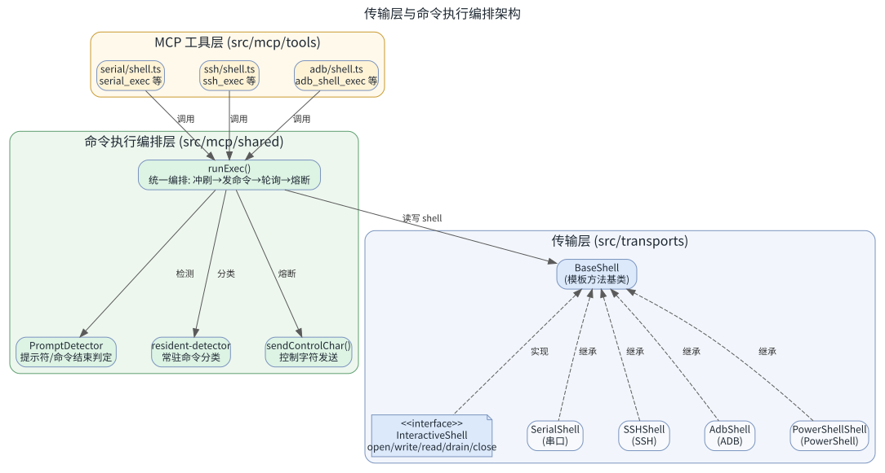
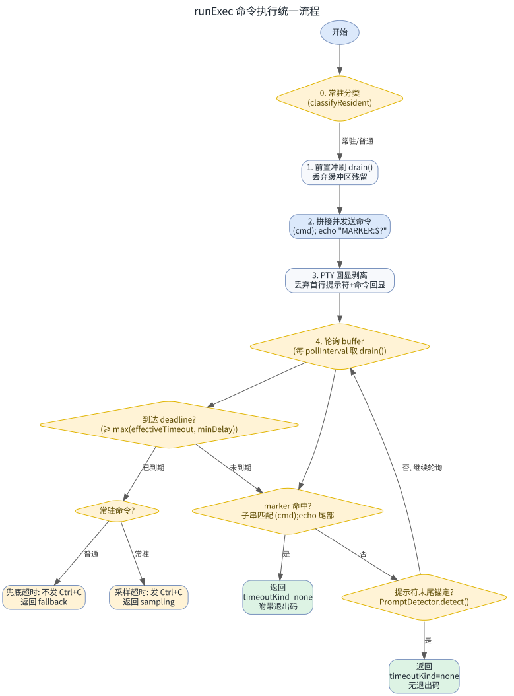
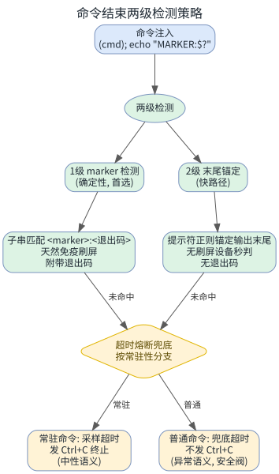
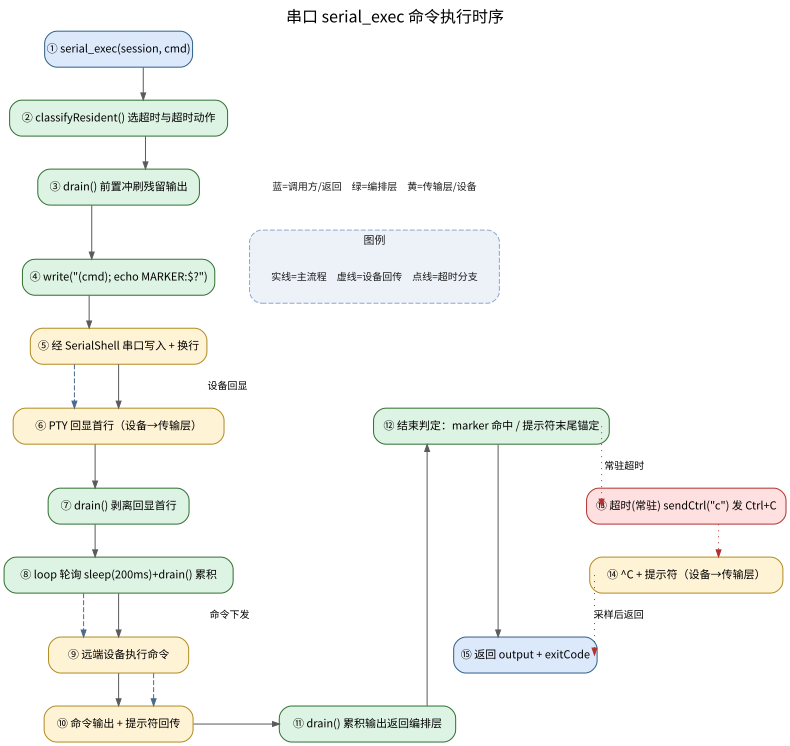

<!-- more -->

## 一、 文档概述

本文档分析本仓库中串口（Serial）、SSH、ADB 三种交互式会话通道的命令执行逻辑，重点介绍命令执行流程的**框架**、**原理**以及**命令结束的判定**机制，并以串口为例进行详细剖析。

命令执行的核心编排逻辑集中在 `src/mcp/shared/exec-runner.ts`（统一编排器）、`src/mcp/shared/prompt-detector.ts`（提示符检测）、`src/mcp/shared/resident-detector.ts`（常驻命令分类）与 `src/mcp/shared/send-ctrl.ts`（控制字符发送）。三个通道的传输层类继承自 `src/transports/base-shell.ts` 的统一基类，通过依赖注入将通道差异交给编排层处理，实现「机制统一、通道无关」的设计。

## 二、 整体架构框架

### 1. 分层职责

命令执行涉及四层结构，自下而上依次为：

- **传输层**（`src/transports/`）：负责建立物理连接、收发原始字节、维护输出缓冲区，提供统一的 `open / write / read / drain / close` 五方法契约
- **编排层**（`src/mcp/shared/`）：负责命令发送、输出轮询、命令结束判定、超时熔断的统一流程
- **工具层**（`src/mcp/tools/{serial,ssh,adb}/shell.ts`）：提供 MCP 工具（如 `serial_exec`、`ssh_exec`、`adb_shell_exec`），构造输入并调用编排层
- **会话管理层**（`src/mcp/sessions/`）：维护会话注册表与并发锁

### 2. 传输层类结构

传输层通过「模板方法模式」统一四个传输类（SSHShell / SerialShell / AdbShell / PowerShellShell）的公共逻辑。基类 `BaseShell` 持有 `OutputBuffer`（输出缓冲区）与 `FileLogger`（文件日志），子类只需实现三个差异化的受保护方法：`acquire()`（建立连接）、`rawWrite()`（发送字节）、`release()`（释放资源）。

`BaseShell` 实现 `InteractiveShell` 接口，接口定义了 `open / write / read / drain / close` 五个方法签名，构成编译期契约。



### 3. 缓冲区管理机制

`OutputBuffer` 封装四个传输类共用的缓冲区逻辑，核心状态为：

- `#buffer`：累积的文本内容
- `#collecting`：是否开启数据收集
- `#overflow`：缓冲区溢出时的保留策略

缓冲区采用「先追加再截断」的策略，超过上限 `MAX_BUFFER_SIZE`（1 MB）后根据 `overflow` 标志决定保留头部还是尾部：

| `collecting` | `overflow` | 缓冲区未满 | 缓冲区已满（>1 MB） | 使用场景 |
| --- | --- | --- | --- | --- |
| false | — | 丢弃 | 丢弃 | close() 后、banner 捕获前 |
| true | false | 追加 | 丢弃新数据，保留头部 | 单次命令（如 `cat /proc/cpuinfo`） |
| true | true | 追加 | 覆盖最早数据，保留尾部 | 监控日志、编译输出等持续追加 |

`prepareWrite(clear)` 在写入前准备状态：`clear=1` 时清空缓冲区、关闭溢出覆盖、开启收集（满后丢新）；`clear=0` 时保留缓冲区、开启溢出覆盖（满后覆盖旧数据），适用于轮询长任务的持续输出。

## 三、 命令执行流程框架

命令执行统一由 `runExec()` 编排器完成，三个通道的 `*_exec` 工具构造 `ExecInput` 输入后调用它。核心流程分五个步骤。

### 1. 常驻命令分类

调用 `classifyResident()` 判定命令是否「常驻」（即永不返回 shell 提示符、持续输出的命令，如 `ping`、`logcat`、`top`、`tail -f`），据此选择超时时长与超时动作：

- **常驻命令**：用采样超时时长（默认 10 秒），到点发 Ctrl+C 终止（中性语义）
- **普通命令**：用兜底超时时长（默认 5 分钟），到点不发 Ctrl+C（异常语义，仅安全阀）

常驻识别策略分为三类：内置 A 类白名单（首 token 精确匹配）、内置 B 类参数模式（如 `dmesg -w`、`tail -f` 带 follow 参数）、用户配置扩展名单。

### 2. 前置冲刷

发送命令前调用 `shell.drain()` 丢弃缓冲区可能残留的上次未终止输出，避免污染本次命令结果。

### 3. 发送命令与 marker 注入

在原始命令尾部注入完成标记，包装风格按目标环境二选一：

```sh
# subshell（POSIX shell：Linux / Android，默认）
(cmd); echo "___MCP_EXEC_DONE_<rand>___:$?"

# plain（U-Boot hush，serial_enter_uboot 标记的会话自动切换）
cmd; echo "___MCP_EXEC_DONE_<rand>___:$?"
```

- 子 shell 包装兜住 `exit`/`exec`、尾部 `&` 等会破坏外层 `echo` 的命令，并隔离 fd/PS1 等 shell 状态污染；hush 无子 shell / 后台任务语法，这些威胁不存在，去括号即为等价写法
- `;` 为无条件顺序分隔，两种风格下 `echo` 都必然执行
- marker 带随机后缀，避免命令输出中偶然出现相同字符串导致误判
- marker 后跟退出码 `$?`：POSIX shell 与 hush 都展开为数字；U-Boot 老 simple parser 不展开，按字面量 `"$?"` 匹配（此时退出码未知）
- 检测正则带负向后行断言 `(?<!")`，排除 PTY 回显行（`echo "<marker>:$?"`）里的字面 marker，避免回显剥离失败时误判完成

### 4. PTY 回显剥离

PTY 模式下设备会原样回显输入的命令行（如 `rk3568:/ $ echo hi`），这一行不是真实输出。编排层等待并寻找第一个 `\n`，`\n` 之后的内容才是命令的真实输出。

### 5. 轮询检测与超时熔断

在 `max(effectiveTimeout, minDelay)` 的 deadline 内，以固定间隔（默认 200 ms）调用 `shell.drain()` 累积输出，并执行两级命令结束检测。超时后按常驻性分支熔断。



## 四、 命令结束的判定原理

命令结束判定是整套框架的关键，采用「两级检测 + 超时兜底」策略。

### 1. 一级检测：marker 注入（确定性，首选）

命令尾部拼接的 `echo "MARKER:$?"` 在命令结束后必然输出，因此**匹配到 marker 即命令结束**，这是最可靠的判定方式：

- 不受刷屏影响（匹配天然免疫后台日志干扰）
- 附带退出码（从 `<marker>:<digits>` 中解析；simple parser 输出字面量 `"$?"` 时退出码为 null）
- 对常驻命令（marker 永不出现）天然不会误判

命中后截断 marker 及其后内容，只返回命令输出。

### 2. 二级检测：提示符末尾锚定（快路径）

当 marker 尚未出现时（hush 解析错误整行被拒、设备无 echo、常驻命令采样中），用 `PromptDetector.detect()` 判定累积输出**是否以提示符结尾**。PTY 回显的命令行本身不以提示符结尾，只有命令执行完返回到交互态时才会出现提示符，因此「末尾锚定」可判定命令结束。

默认提示符正则锚定输出末尾，覆盖常见 prompt：

- Android：`/ $`、`:/ $`、`:/ #`
- Linux：`$`、`#`、`>`
- U-Boot：`=>`、`U-Boot>`

提示符正则可通过设备配置 `promptPattern` 覆盖，以应对自定义 `PS1`。serial 通道在 U-Boot 态（`serial_enter_uboot` 标记的会话）例外：二级检测固定用默认正则而非 `promptPattern`——`promptPattern` 是为 Linux PS1 配置的，在 U-Boot 态可能永不命中；默认正则同时覆盖 U-Boot 与常见 Linux/Android 提示符，离开 U-Boot 落到 Linux 提示符时也能尽快返回。未命中时由超时熔断兜底。

### 3. 超时熔断兜底

当轮询到达 deadline 仍未检测到命令结束时，按常驻性分支处理：

| 分支 | 超时类型 | 动作 | 语义 |
| --- | --- | --- | --- |
| 常驻命令 | `sampling` | 发 Ctrl+C 终止 | 中性语义，采样固定窗口输出 |
| 普通命令 | `fallback` | 不发 Ctrl+C | 异常语义，提示符未匹配上的安全阀 |

`sampling` 超时是预期行为（如取 10 秒 `logcat` 日志）；`fallback` 超时则说明提示符正则未匹配上（自定义 PS1 或异常设备），调用方需手动确认/终止。

### 4. 三态超时语义

`ExecResult` 以 `timeoutKind` 权威承载三态语义：

- `none`：正常完成（提示符检测命中或 marker 命中）
- `sampling`：常驻命令采样超时（到点发 Ctrl+C）
- `fallback`：普通命令兜底超时（到点不发 Ctrl+C）

`timedOut` 为派生布尔（`= timeoutKind !== "none"`），保留向后兼容。



## 五、 串口命令执行详细分析

### 1. 串口会话建立

串口通道由 `SerialShell` 管理，通过 `serialport` 库打开设备文件（如 `COM3`、`/dev/ttyUSB0`）并配置波特率、数据位、停止位、校验位。

`acquire()` 中打开串口并注册 `data` 事件监听，采用「双写」策略：原始 `Buffer` 喂给二进制旁路回调（供 ZMODEM 等协议消费），同时按原样进入文本态 `OutputBuffer`。串口的 `lineEnding` 默认 `\n`，可由配置覆盖（`\r\n` 等）。

### 2. 串口 exec 编排

`serial_exec` 工具构造 `ExecInput` 后调用 `runExec`：

- `promptDetector`：根据设备配置的 `promptPattern` 初始化
- `sendCtrl`：闭包内以 `shell.write(CONTROL_CHAR_MAP[key], 1, false)` 不追加换行地发送控制字符
- `execTimeoutConfig`：读取设备级超时配置（常驻命令扩展名单 + 采样/兜底时长）

`runExec` 返回的 `ExecResult` 由 handler 根据 `timeoutKind` 追加标注：

- 正常完成且带退出码 → 追加 `[exit code: N]`
- 采样超时 → 追加 `[采样超时: 已收集 Nms 输出，已发送 Ctrl+C 终止常驻命令]`
- 兜底超时 → 追加 `[兜底超时: ... 未发送中断（命令可能仍在运行），请用 send_ctrl 手动确认/终止]`

### 3. 串口控制字符

`serial_send_ctrl` 复用共享 `sendControlChar()`，以 `appendLineEnding=false` 发送控制字符（`Ctrl+C/U/D/Z`），发送后 `drain()` 丢弃控制字符在 PTY 下的回显（如 `^C`），避免污染下一次读取。

### 4. 串口登录与 U-Boot 进入

串口通道还承担登录与引导交互：

- `serial_shell_login`：用 PshStateMachine 状态机自动完成 profile 匹配、状态检测与解锁
- `serial_enter_uboot`：用 UbootDetector 检测 autoboot 提示并中断，采用「主层提示符匹配 + 验证层 printenv 环境变量键」两层策略

这些流程同样依赖「输出累积 + 模式匹配」的命令结束判定思路。



## 六、 三个通道的差异对比

三个通道共享同一套 `runExec` 编排机制，差异通过依赖注入体现在连接方式、PTY 特性与提示符配置上。

| 维度 | 串口 Serial | SSH | ADB |
| --- | --- | --- | --- |
| 连接方式 | serialport 打开设备文件 | ssh2 Client + PTY shell | spawn `adb shell -t -t` 子进程 |
| banner 等待 | 500 ms | 500 ms | 800 ms |
| 换行符 | `config.lineEnding ?? "\n"` | `\n` | `\n` |
| 发送通道 | serialPort.write | stream.write | proc.stdin.write |
| 退出码获取 | marker 注入 | marker 注入 | marker 注入 |
| 提示符检测 | PromptDetector | PromptDetector | PromptDetector |
| 特有能力 | ZMODEM 二进制旁路、U-Boot 进入 | SFTP 文件传输、懒加载 | 设备自动发现（adb devices） |

### 1. SSH 通道要点

SSH 分配 PTY 伪终端（xterm, 80x24），远端终端驱动会把 `\x03` 自动转换为 SIGINT。`rawWrite` 校验连接是否建立后发送。SFTP 子系统与 shell 通道可在同一连接上交替使用，互不干扰。

### 2. ADB 通道要点

ADB 通过 `spawn("adb", ["-s", serialNo, "shell", "-t", "-t"])` 启动持久化交互式 shell 子进程。`-t -t` 强制分配远端 PTY，使设备侧 shell 回显提示符（如 `:/ $`），这是提示符检测与命令结束判定的前提。设备序列号未指定时自动执行 `adb devices` 发现唯一设备。

## 七、 设计要点总结

### 1. 命令结束判定的三层防护

命令结束判定采用「marker 确定性检测 → 提示符末尾锚定快路径 → 超时熔断兜底」三层防护，兼顾确定性与鲁棒性：

- marker 注入是确定性的第一选择，不受刷屏影响且附带退出码
- 提示符末尾锚定是无刷屏设备的快路径
- 超时熔断是自定义 PS1 或异常设备的安全阀

### 2. 通道无关的统一编排

三个通道通过依赖注入将差异（shell 实例、提示符配置、sendCtrl 实现）注入 `runExec`，实现「机制统一、通道无关」。新增通道只需继承 `BaseShell` 并实现三个差异方法，即可复用整套命令执行与结束判定框架。

### 3. 常驻命令的特殊处理

常驻命令（ping/logcat/top/tail -f）永不返回提示符，若按普通命令处理会导致永久阻塞。框架通过常驻分类，为常驻命令设置采样超时并自动发送 Ctrl+C 终止，既避免命令失控，也支持「取固定窗口输出」的中性语义。

### 4. 缓冲区分层与并发安全

每个会话通过 `withLock` 串行化对 shell 的访问，避免并发命令交错污染输出缓冲区。工具描述中明确提示不要在同一个 `session_id` 上并发调用 `*_exec / *_write / *_read`，如需并行应打开多个会话。

---

*本文档由 markdowncli 技能辅助生成*
