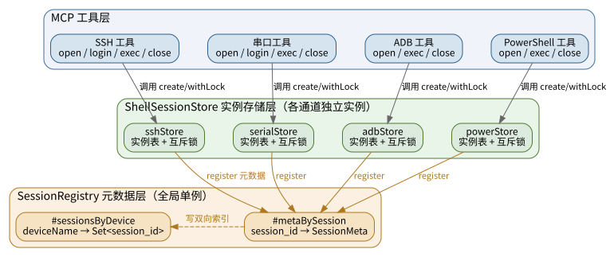
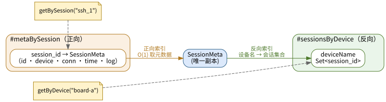
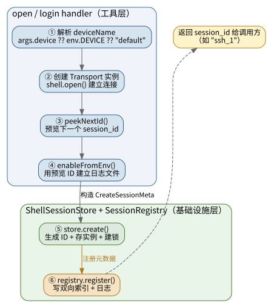
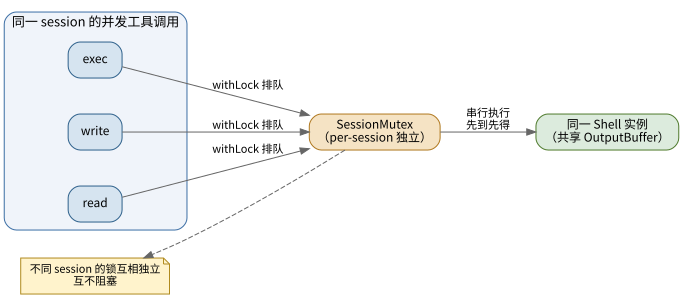

<!-- more -->

## 一、 概述

### 1. 背景

项目通过 MCP 服务器管理嵌入式 Linux 板卡，支持 SSH 、串口和 ADB 三种远程连接方式，另有本机 PowerShell 会话。真实会话逻辑中，每个连接通道都持有自己的会话表，早期各自为政，存在以下问题：

- **设备名丢失**：SSH / Serial 的 `open` 拿到 `device` 参数后仅用于解析连接配置，设备别名被丢弃
- **无双向查询**：无法按设备名查会话，也无法按 `session_id` 查所属设备
- **list 工具信息贫乏**：`ssh_shell_list` 仅返回 `ssh_1, ssh_2`，无设备名 / host / port
- **跨类型孤立**：四个通道的会话表互不感知，无统一入口

为解决上述问题，代码中将会话管理拆分为**实例存储层**与**元数据层**两个层次，统一了会话的创建、注册、查询、清理与并发控制。

### 2. 设计目标

- 支持 `设备名 → 所有会话` 的双向查询
- 支持 `session_id → 设备名 + 连接类型 + 连接详情` 查询
- 增强 list 工具输出，展示设备名与连接信息
- 新增 `session_info` 工具，提供跨类型统一查询入口
- 统一会话生命周期管理与 per-session 并发控制

## 二、 会话管理框架（双层结构）

### 1. 框架总览

会话管理采用**双层结构**：每个通道持有独立的实例存储 `ShellSessionStore`（管"会话连着谁"），全局只有一个元数据注册表 `SessionRegistry`（管"会话是什么"）。



完整的 graphviz 源文件见 [session-framework.dot](./MCP会话管理/session-framework.dot)，可用 `dot -Tsvg session-framework.dot -o img/session-framework.svg` 重新渲染。两层职责各司其职：

- **实例存储层 `ShellSessionStore`**：以 `session_id` 为键持有 `BaseShell` 子类的实例引用，负责 ID 生成、实例存取、per-session 互斥与批量清理。四个通道（SSH / Serial / ADB / PowerShell）各自实例化一个，互不干扰。
- **元数据层 `SessionRegistry`**：全局单例，只存轻量元数据（不含 Transport 引用），维护双向索引，为跨类型统一查询提供入口。

### 2. 实例存储层 ShellSessionStore

`ShellSessionStore` 是一个泛型类，定义于 `src/sdk/sessions/session-store.ts`，各通道用不同前缀实例化：

| 通道 | 实例名 | 前缀 | 生成的 ID 示例 |
|------|--------|------|---------------|
| SSH | `sshStore` | `ssh` | `ssh_1`、`ssh_2` |
| Serial | `serialStore` | `serial` | `serial_1` |
| ADB | `adbStore` | `adb` | `adb_1` |
| PowerShell | `powerStore` | `power` | `power_1` |

每个 store 内部维护三张表：

- **实例表** `Map<session_id, T>`：`session_id` 到具体 Shell 实例的映射
- **互斥锁表** `Map<session_id, SessionMutex>`：每个会话一把独立的异步互斥锁（见"并发控制"）
- **自增计数器**：生成唯一 `session_id`，计数按通道独立

`ShellSessionStore` 的核心职责如下：

【**create()**】生成 `session_id`、写入实例表、新建互斥锁，并把元数据注册到全局 `registry`。它只负责"登记"，不负责建立连接——连接由各通道 handler 在调用前用 `shell.open()` 完成。

【**peekNextId()**】预览下一个将分配的 `session_id`，但不递增计数器、不写实例表。供 handler 在 `create()` 之前先用该预览 ID 调用 `enableFromEnv()` 建立日志文件，拿到日志路径后再由 `create()` 一次性写入元数据（含 `logPath`）。

【**get() / getOrNotFound()**】按 `session_id` 查询实例；`getOrNotFound()` 在未命中时返回统一的 not-found MCP 响应，消除各 handler 重复的样板代码。

【**remove()**】从实例表与互斥锁表删除，并从 `registry` 注销。它只负责"删除登记"，不负责关闭连接——由 handler 先 `shell.close()` 再 `remove()`，职责分离。

【**disposeAll()**】进程退出时遍历所有会话逐一 `close`，并清空实例表与 `registry`。单个会话关闭失败不会中断其余清理。

### 3. 元数据层 SessionRegistry

`SessionRegistry` 是全局单例（`src/sdk/sessions/registry.ts`），只存储轻量元数据，不持有 Transport 引用，避免循环引用与 GC 问题。所有查询均为 O(1)。

#### 3.1 元数据模型 SessionMeta

```typescript
// src/sdk/sessions/registry.ts
interface SessionMeta {
  id: string;            // session_id，如 "ssh_1"
  type: SessionType;     // 连接类型：ssh | serial | adb | powershell
  deviceName: string;    // 设备别名，如 "board-a"；PowerShell 为 "local"
  connectionInfo: string; // 人可读的连接详情
  createdAt: string;     // ISO 时间戳，创建时刻
  logPath?: string;      // 该会话对应的日志文件路径；未启用日志时为 undefined
}
```

- `id`：由 store 的 `create()` 自动生成，格式为 `<prefix>_<counter>`
- `type`：区分连接类型，用于 list 工具按类型过滤
- `deviceName`：从 tool 调用参数或环境变量 `DEVICE` 解析；PowerShell 固定为 `"local"`
- `connectionInfo`：人可读的连接标识，不同通道格式不同（见"连接类型差异"）
- `createdAt`：ISO 8601 格式的创建时间，用于排序
- `logPath`：会话原始日志文件路径，串口 / SSH / ADB 服务端持续记录，含重启后的完整启动日志

#### 3.2 双向索引

```typescript
// src/sdk/sessions/registry.ts
class SessionRegistry {
  #metaBySession = new Map<string, SessionMeta>();    // session_id → SessionMeta
  #sessionsByDevice = new Map<string, Set<string>>(); // deviceName → Set<session_id>
}
```

`registry` 通过两个 `Map` 建立双向索引：



完整的 graphviz 源文件见 [registry-bidirectional.dot](./MCP会话管理/registry-bidirectional.dot)，可用 `dot -Tsvg registry-bidirectional.dot -o img/registry-bidirectional.svg` 重新渲染。

两个 `Map` 协同提供四种查询能力：

- `getBySession(id)`：按 `session_id` 取单条元数据，O(1)
- `getByDevice(name)`：按设备名取该设备所有会话，按创建时间降序
- `listByType(type)`：按连接类型过滤，用于各 list 工具
- `listAll()`：全部活跃会话，先按类型分组、组内按创建时间降序

`register()` 在写入元数据的同时维护双向索引（若设备集合为空则删除该设备条目），并记录日志。

### 4. 双层职责划分

实例存储层与元数据层的核心差异：

| 层次 | 存什么 | 键 | 回答的问题 |
|------|--------|-----|-----------|
| `ShellSessionStore` | `BaseShell` 实例引用 | `session_id` | 这个会话连着谁（连接对象） |
| `SessionRegistry` | 轻量 `SessionMeta` | `session_id` / `deviceName` | 这个会话是什么（身份与属性） |

- 实例存储层不持有注册表之外的全局状态，各通道独立；元数据层不持有实例引用，避免循环引用。
- `create()` 同时向两层登记：store 存实例、registry 存元数据；`remove()` 同理从两层注销，保持一致性。

## 三、 会话生命周期与原理

### 1. 打开与注册

以 `ssh_shell_open` 为例，一次会话打开的完整注册链路如下：



完整的 graphviz 源文件见 [session-open.dot](./MCP会话管理/session-open.dot)，可用 `dot -Tsvg session-open.dot -o img/session-open.svg` 重新渲染。

关键设计点：

- **先建连接、后注册**：`shell.open()` 成功后才调用 `create()`，连接失败时不会留下任何登记残留。
- **预览 ID 建日志**：`peekNextId()` 在 `create()` 之前拿到即将分配的 ID，用于 `enableFromEnv()` 建立日志文件，保证日志文件与会话 ID 对应；三者之间无 `await`，在同一微任务内完成，不存在并发抢占计数器的窗口。
- **注册即入索引**：`create()` 一次性完成"生成 ID + 存实例表 + 建互斥锁 + 注册元数据"，保证两层数据同时可见。

### 2. 关闭与注销

以 `ssh_shell_close` 为例，关闭流程：

1. `store.getOrNotFound(session_id)` 定位实例，未命中返回统一 not-found 响应
2. 在 `withLock` 保护内调用 `shell.close()` 关闭连接（见"并发控制"）
3. 关闭完成后 `store.remove(session_id)`：删实例表、删互斥锁、从 `registry` 注销

Serial 通道还会在 `remove()` 后清理 `portToSession` 的 COM 口映射，避免端口残留占用。

### 3. 登录失败清理

`ssh_shell_login` / `serial_shell_login` 在打开连接后立即注册会话，确保解锁 / 探测过程可被其他工具访问；一旦后续流程失败（解锁失败、状态异常、无匹配 handler 等），需回滚本次注册：

- **SSH**：各失败分支显式执行 `shell.close()` + `store.remove(session_id)` 清理
- **Serial**：通过 `cleanupNewSession` 辅助函数统一处理新建会话的清理（关闭连接 + 移除 Map + 注销 registry）；若为复用已有会话则不关闭，只清理本次注册

### 4. 进程退出批量清理

MCP Server 退出时，`src/mcp/server.ts` 的 `cleanupAllSessions` 依次调用各通道的 `disposeAll*` 包装函数：

```typescript
{ disposeAllSerialSessions },
{ disposeAllSshSessions },
{ disposeAllPowerShellSessions },
{ disposeAllAdbShellSessions },
```

每个 `disposeAll*` 内部委托 `store.disposeAll(logPrefix)`，遍历所有会话逐一关闭、清空实例表并从 `registry` 注销，避免进程退出后连接与端口残留。

## 四、 并发控制设计

### 1. 问题：共享缓冲区的并发污染

同一个会话对应一个 Shell 实例，内部共享一个 `OutputBuffer`。若多个工具调用并发地对同一会话执行 `exec` / `write` / `read`，会交错读写缓冲区、污染输出结果。因此必须保证**同一会话的操作串行执行**。

### 2. 方案：per-session 互斥锁

每个会话在 `create()` 时绑定一把独立的 `SessionMutex`（Promise 链实现，无外部依赖）。所有需要访问 Shell 的操作通过 `store.withLock(session_id, fn)` 包裹：



完整的 graphviz 源文件见 [session-mutex.dot](./MCP会话管理/session-mutex.dot)，可用 `dot -Tsvg session-mutex.dot -o img/session-mutex.svg` 重新渲染。

`withLock` 的执行语义：

- **锁空闲**：立即获得锁，执行 `fn`，结束后释放
- **锁被占用**：入队等待，当前持有者释放后唤醒队列头部，保证 FIFO 公平
- **会话不存在**：直接执行 `fn`，让内部的 `getOrNotFound` 返回 not-found 响应，不阻塞调用方

### 3. 跨会话独立性

不同会话的锁互相独立，**不会互相阻塞**。这意味着：

- 并发打开多个会话可以并行执行
- 一个会话的长时间命令不会拖累其他会话
- 锁粒度精确到单会话，避免全局锁导致的吞吐下降

SSH / Serial 的 `login` 流程也利用这一机制，在会话锁内串行完成"打开 → 探测 → 解锁 → 注册"，避免注册到 store 后并发操作污染探测过程。

## 五、 会话查询接口

### 1. session_info 工具

`session_info` 是跨连接类型的统一查询入口（`src/sdk/tools/basic/session_info.ts`），通过 `registry` 提供三种查询模式：

| 模式 | 参数 | 用途 |
|------|------|------|
| 按 session 查 | `session_id: "ssh_2"` | 返回该会话的 type / device / connectionInfo / createdAt / logPath |
| 按 device 查 | `device: "board-a"` | 返回 board-a 上所有 SSH / Serial / ADB 会话 |
| 全部列出 | 无参数 | 返回当前所有活跃会话，按类型分组 |

### 2. 查询模式

【**按 session 查**】

```json
{ "name": "session_info", "arguments": { "session_id": "ssh_2" } }
```

```text
[ssh_2]
Type:         ssh
Device:       board-a
Connection:   192.168.16.103:22
Created:      2026-06-09 15:45:30
Log:          /path/to/ssh_2.log
```

【**按 device 查**】

```json
{ "name": "session_info", "arguments": { "device": "board-a" } }
```

```text
Sessions for device 'board-a' (3):

  [ssh_1]
  Type:         ssh
  Device:       board-a
  Connection:   192.168.16.103:22
  Created:      2026-06-09 15:45:30
  Log:          /path/to/ssh_1.log

  [adb_2]
  Type:         adb
  Device:       board-a
  Connection:   43b1e5fe7b186666
  Created:      2026-06-09 15:46:15
  Log:          /path/to/adb_2.log

  [serial_3]
  Type:         serial
  Device:       board-a
  Connection:   COM4 @ 115200
  Created:      2026-06-09 15:47:00
  Log:          /path/to/serial_3.log
```

【**全部列出**】

```json
{ "name": "session_info", "arguments": {} }
```

```text
All active sessions (3):

  [ssh_1]
  Type:         ssh
  Device:       board-a
  Connection:   192.168.16.103:22
  ...
```

### 3. list 工具增强

各 list 工具由原先遍历本地 `sessions.keys()` 改为调用 `registry.listByType()`，输出格式统一增强，展示设备名与连接信息：

**`ssh_shell_list` 示例输出**：

```text
Active SSH sessions: 2

  [ssh_1]  board-a  192.168.16.103:22
  [ssh_2]  board-a  192.168.16.103:22
```

**`serial_list` 示例输出**：

```text
Active serial sessions: 1

  [serial_1]  board-b  COM3 @ 115200
```

**`adb_shell_list` 示例输出**：

```text
Active sessions: 1

  [adb_1]
  Device:     board-a
  SerialNo:   43b1e5fe7b186666
```

**`power_shell_list` 示例输出**：

```text
Active PowerShell sessions: 1

  [power_1]  local  E:\project
```

## 六、 各连接类型的差异

### 1. connectionInfo 格式

不同连接类型的 `connectionInfo` 采用不同的人可读格式：

| 类型 | 生成方式 | 示例 |
|------|---------|------|
| ssh | `` `${host}:${port ?? 22}` `` | `192.168.16.103:22` |
| serial | `` `${port} @ ${baudRate ?? 115200}` `` | `COM3 @ 115200` |
| adb | 真实 `serialNo` | `43b1e5fe7b186666` |
| powershell | 工作目录 | `E:\project` |

### 2. 通道特有逻辑

- **Serial 的 COM 口防重**：`portToSession` 映射 `COM 口 → session_id`，`serial_open` 先查该口是否已有活跃会话，避免同一串口被重复打开；`serial_close` 时同步清理该映射。该逻辑作为通道特有逻辑保留在 `serial/shell.ts`，不进入基类。
- **ADB 设备名解析**：`adb_shell_open` 连接成功后用真实 `serialNo` 按降级策略解析 `finalDeviceName`，让日志目录与会话表的 `deviceName` 反映真实连接的设备。
- **deviceName 固定值**：PowerShell 无远程设备概念，`deviceName` 固定为 `"local"`。

---

*本文档由 markdowncli 技能辅助生成*
