<!-- more -->

## 一、 版本背景与变革概述

### 1. 版本概况

2026 年 7 月 28 日，Model Context Protocol（MCP）发布了代号为 `2026-07-28` 的新版本规范。这是自 MCP 发布以来最大的一次协议重写，协议层双向不兼容（wire-incompatible），由首席维护者 David Soria Parra 与 Den Delimarsky 主导。

此次更新被官方和社区一致认为是 MCP 从"早期原型"迈向"企业级可扩展协议"的分水岭。其核心叙事是：MCP 从一个为本地单机优化的有状态协议，重写为面向云原生场景的无状态协议。

### 2. 核心变革概述

本次更新最根本的架构转变是协议从有状态走向无状态：

```
旧版本: 双向、有状态（需要握手 + 会话保持）
新版本: 请求/响应、无状态（自包含请求，任意实例可处理）
```

这一变革的驱动力来自开发者社区：有状态连接在云原生环境（负载均衡、自动扩缩容、Serverless）下极难部署，需要 sticky session 或共享存储。新版本使任何请求都能被轮询负载均衡器（round-robin）后的任意实例处理，无需共享存储。

为了真正理解这次改造的分量，必须先弄清楚"有状态是怎么来的、为什么、痛在哪"。

## 二、 有状态架构：设计与优势

### 1. 设计渊源与原始定位

MCP 早期设计借鉴了 Language Server Protocol（LSP）。LSP 是典型的有状态协议——IDE 与语言服务器之间是一个长期存活的 1:1 连接，服务器在内存中维护着打开的文件、符号索引、诊断状态等。MCP 把这套模型直接搬了过来：客户端与服务器先握手协商能力，建立会话，之后所有请求都在这条长期连接上往返。

这一选择由 MCP 当时的核心场景决定——本地集成：

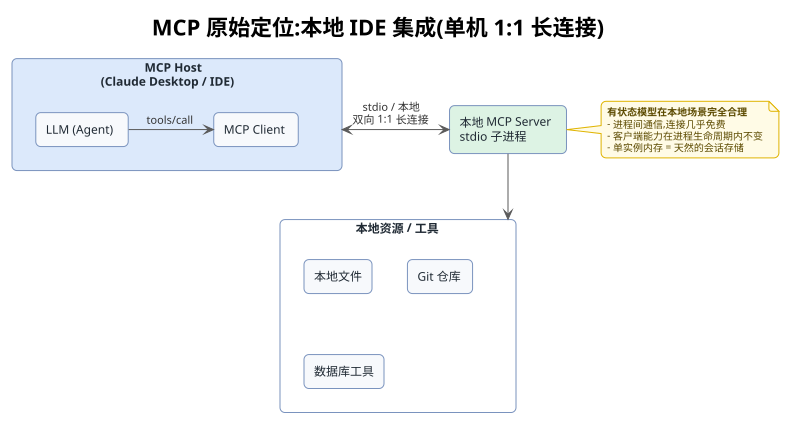

在这个场景下，有状态是完全合理的：本地进程间通信的连接几乎免费，客户端能力在进程生命周期内不变，单实例的内存就是天然的会话存储，本地 stdio 管道天然双向。有状态模型的每个设计选择，都精准匹配了本地单机场景的约束。

### 2. 会话交互流程

一次完整的 MCP 会话长这样：

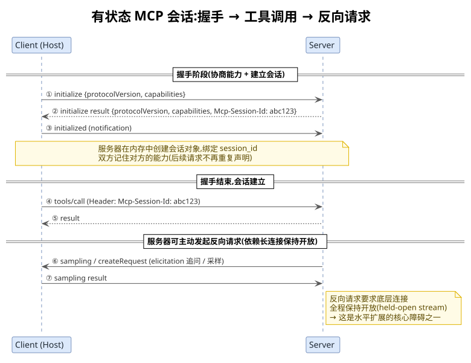

握手阶段（①②③）客户端与服务器互相声明协议版本与能力，服务器生成会话标识并返回。握手结束后，后续每一次请求（④）都要在 header 中携带会话标识，服务器据此找到内存中的会话对象。服务器还可以主动发起反向请求（⑥），要求客户端补全信息或采样。

### 3. 状态的三个组成部分

所谓的"状态"，具体包含三样东西。

#### 3.1 能力协商结果（Capabilities）

握手时双方互相声明"我能做什么"，并记住对方的能力：

```
Client 声明：我支持 roots、sampling、elicitation
Server 声明：我支持 tools、prompts、resources、logging

→ 服务器需要"记住"客户端支持 sampling，
  才敢在工具执行中途反向调用 sampling/createRequest
```

能力协商结果在握手后存入会话对象，后续请求不再重复声明，而是依赖服务器内存中保存的这份记录。

#### 3.2 会话标识（Mcp-Session-Id）

服务器在 `initialize` 时生成一个 session ID，后续每个请求都必须在 header 里带上它：

```
Mcp-Session-Id: abc123
```

服务器端在内存里维护一个映射表：

```
session_id  →  Session 对象 { client_caps, server_caps, version, ... }
abc123      →  { roots: ✓, sampling: ✓, ... }
def456      →  { roots: ✗, sampling: ✗, ... }
```

会话标识是把无状态的 HTTP 请求"粘合"到具体会话对象的唯一线索，也是负载均衡必须保持会话亲和的根因。

#### 3.3 双向长连接（Bidirectional Stream）

服务器可以主动向客户端发请求（sampling 采样、elicitation 追问），这要求底层连接必须保持开放（held-open stream）——服务器随时可能从这条管道塞东西回来。这条长连接在握手后一直存活，直到会话结束。

### 4. 核心优势

#### 4.1 请求精简，开销低

能力只协商一次，后续每个请求都很"瘦"：

```
// 有状态：握手后，工具调用请求很简洁
{ "method": "tools/call", "params": { "name": "search", ... } }

// 无状态（新版本）：每个请求都要自描述
{ "method": "tools/call",
  "_meta": { "version": "2026-07-28", "client_id": "...", "capabilities": {...} },
  "params": { ... } }
```

省去了重复携带版本号、能力声明、客户端身份的开销，在本地高频调用场景下传输效率更高。

#### 4.2 会话内可累积上下文

服务器可以在会话内记住"这个客户端订阅了哪些资源"、"上次工具调用的中间结果"，实现连续对话式的交互。这种会话内的状态累积，使得多步工具调用可以共享上下文，无需客户端每次重新传递全部前置信息。

#### 4.3 双向通信天然支持交互式工具

工具执行到一半，发现缺参数，服务器直接反向问客户端，客户端补上，工具继续，流程非常自然：

```
工具: deploy_app()
  ↓ 执行到一半，发现需要确认目标环境
服务器 → 客户端: elicitation "部署到 prod 还是 staging?"
客户端 → 服务器: "prod"
  ↓ 工具继续执行
返回: 部署成功
```

这种模式在有状态长连接下零额外设计成本，服务器的反向请求和客户端的响应走的是同一条管道。

#### 4.4 实现简单

单机 1:1 场景下，会话就是内存里的一个对象，几乎是"免费"获得的能力。服务器不需要管理分布式状态、不需要外部存储、不需要考虑并发一致性，实现复杂度极低。

## 三、 扩展性困境：有状态的七大痛点

### 1. 前置概念：水平扩展

在分析有状态协议的具体痛点之前，需要先理解一个核心概念——**水平扩展（Horizontal Scaling）**。它是理解后续所有痛点的钥匙，也是 MCP 走向无状态的根本动因。

当系统负载增长时，有两种扩展思路：

- **垂直扩展（Scale Up）**：把单台机器变强——升级 CPU、加内存。好比把一家小餐厅换成更大的店面。实现简单，但有物理天花板，且越往上成本呈指数级增长。
- **水平扩展（Scale Out）**：增加机器数量来分担负载。好比开多家一模一样的分店。理论上没有上限，成本随规模线性增长，是云原生、Kubernetes、Serverless 的核心价值。

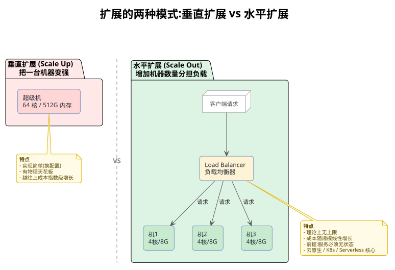

水平扩展有一个硬性前提：**每台机器必须能独立处理请求，不能依赖其他机器的状态**。因为负载均衡器要把请求随机分发给任意一台机器，任何一台拿到请求后都必须能凭请求自身的信息完成处理。如果某台机器说"我得问 A 机器要会话数据才能处理"，水平扩展的简单性就被破坏了。

| 维度 | 垂直扩展 | 水平扩展 |
|---|---|---|
| 做法 | 升级单机硬件 | 增加机器数量 |
| 上限 | 有物理天花板 | 理论上无上限 |
| 成本 | 越往上越贵（指数级） | 加普通机器（线性） |
| 状态要求 | 无要求 | 要求无状态 |
| 典型场景 | 数据库 | Web 服务、微服务、Serverless |

云原生时代的主旋律是**水平扩展 + 弹性伸缩**——根据流量自动加减机器。而要让一个系统享受这套红利，第一原则就是让它无状态。带着这个视角，再看有状态 MCP 在云端遇到的痛点，一切问题都指向同一个根源：有状态服务无法被真正水平扩展。

### 2. 负载均衡必须使用 Sticky Session

有状态时，同一个会话的所有请求必须落到同一个服务器实例：

```
                    ┌─ Instance A (持有 session abc123) ─┐
Load Balancer ────► │  ← 请求必须路由到这里！              │
   (必须 sticky)    ├─ Instance B (持有 session def456) ─┤
                    │                                     │
                    ├─ Instance C (空闲)                 │
                    │  ← 永远收不到 abc123 的请求         │
                    └─────────────────────────────────────┘
```

后果是流量分布不均，实例 C 闲死，实例 A 忙死。负载均衡器退化成"会话路由器"，失去了真正的负载均衡能力。更糟的是，sticky session 的实现依赖会话亲和算法（如基于 cookie 或 IP 哈希），这与无状态、可任意替换的云原生部署理念背道而驰。

### 3. 实例宕机导致会话丢失

```
Instance A 突然挂了 (OOM / 健康检查失败 / 部署重启)
     ↓
session abc123 永久消失
     ↓
客户端下一次请求带着 abc123 过来
     ↓
服务器：??? "我不认识这个会话"  →  报错
     ↓
客户端必须重新握手、重新协商、重建上下文
     ↓
正在进行的工具调用全部丢失
```

滚动部署、自动扩缩容、实例崩溃恢复——这些云原生的日常操作，都会导致用户可见的故障。会话状态存活于单实例内存中，没有任何持久化保障，实例的生命周期就是会话的生命周期。

### 4. 与 Serverless 模型根本性冲突

Serverless（AWS Lambda、Cloudflare Workers）的核心假设是：

- 请求短小独立
- 实例即起即灭
- 没有持久进程，更没有持久连接

而有状态 MCP 要求：

- 长连接保持（held-open stream）
- 进程内存里维护会话
- 双向通信通道

两者直接矛盾。想把 MCP 服务器跑在 Lambda 上，基本做不到——Serverless 函数的执行时间有上限，无法维持长连接，更无法在多次调用间共享内存状态。

### 5. 网关与中间件路由效率低下

传统有状态时，要路由一个请求，网关必须：

```
1. 读完整 HTTP body
2. JSON 解析
3. 找到 session_id 字段
4. 根据 session_id 路由
```

这违反了所有现代网关的设计哲学——它们擅长的是基于 header 的快速路由（如 `Authorization`、`Host`），而不是深度解析 body。结果是：要么放弃在网关层做智能路由，要么自己写定制中间件去解析 JSON body 提取 session_id，增加了网关的计算开销和维护成本。

### 6. 双向长连接资源消耗严重

服务器→客户端的反向请求（sampling/elicitation）要求连接全程保持开放：

```
工具执行可能要 30 秒、5 分钟...
整个期间，这条 TCP 连接被独占
     ↓
1000 个并发工具调用 = 1000 条常驻连接
     ↓
服务器连接数、内存、文件描述符全部成为瓶颈
```

而且这些连接大部分时间在等待用户输入，纯属资源浪费。每条空闲等待中的连接都占用着服务器的文件描述符、内存和一条 TCP 五元组，规模一大就把服务器压垮。

### 7. 水平扩展必须引入共享状态层

为了让多个实例都能处理同一会话，唯一办法是把会话状态外部化：

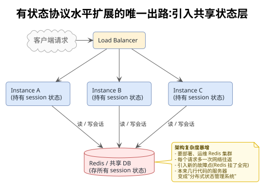

后果是架构复杂度暴增。要部署、运维 Redis 集群；每个请求多一次网络往返（读 Redis）；引入新的故障点（Redis 挂了全完）；本来 MCP 服务器可能就几行代码，现在变成了"分布式状态管理系统"。更隐蔽的代价是：读写共享存储的一致性问题、缓存失效策略、跨实例的会话迁移，每一个都是独立的工程难题。

### 8. 可靠性差，难以自愈

有状态系统的故障恢复天然困难：

- 会话状态丢失后，无法从请求本身重建（因为请求里没带足够信息）
- 无法做"幂等重试"——同一个请求发两次，可能落到不同状态
- 灾难恢复需要恢复会话存储，而不是简单地重启实例

无状态系统的优雅之处在于：任何实例都能处理任何请求，实例挂了换一个即可；有状态系统则必须小心翼翼地保护会话存储，否则一次故障就是一场会话雪崩。

## 四、 无状态改造:逐一化解痛点

前一章梳理了有状态协议在云原生场景下的七大痛点。`2026-07-28` 版本的无状态改造并非简单删减，而是对协议底层假设的全面重写——用一套新的机制，把旧痛点逐一化解，同时尽可能保留旧协议的能力。下面按"痛点 → 解法 → 收益"的结构展开。

### 1. 核心机制:请求自包含,废弃握手

这是所有变化的基石。新协议移除了 `initialize/initialized` 握手交换和 `Mcp-Session-Id` 头，让每个请求自己携带全部上下文信息。

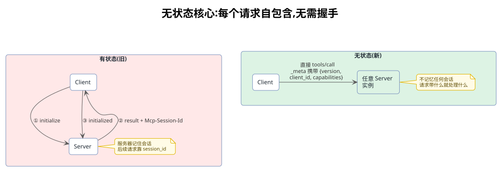

旧协议里，握手阶段双方协商好的"能力声明"存在服务器内存里，后续请求靠 `session_id` 去取。新协议把这份信息直接塞进每个请求的 `_meta` 字段：

- `version`：协议版本（之前在握手时确定）
- `client_id`：客户端身份（之前隐含在会话里）
- `capabilities`：能力声明（之前握手后存服务器内存）

【**收益**】服务器不再需要"记住"任何客户端。请求带什么，就处理什么。一个服务器进程重启、宕机、被替换，对客户端完全透明——因为本来就没有任何需要被记住的东西。

### 2. 负载均衡:从 Sticky Session 到真正均摊

有了"请求自包含"这个基础，旧痛点里最棘手的负载均衡问题迎刃而解。

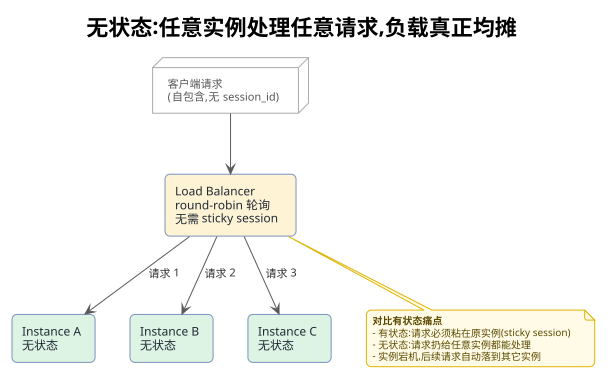

对比旧协议的 sticky session 困境：

| 场景 | 有状态(旧) | 无状态(新) |
|---|---|---|
| 请求路由 | 必须落到持有会话的那个实例 | 随便扔给任意实例 |
| 实例宕机 | 会话丢失，客户端必须重新握手 | 客户端无感知，下次请求落到别的实例 |
| 负载分布 | 不均(有的实例忙死，有的闲死) | round-robin 真正均摊 |
| 扩缩容 | 谨小慎微，怕影响存量会话 | 随时加减实例，流量自动重分布 |

这是水平扩展能力从"伪命题"变成"真能力"的关键一步。

### 3. 时序变化:无握手,每次请求独立

下面这张时序图展示了无状态协议下，一次完整的交互长什么样——没有握手阶段，请求直达任意实例，且不同请求可以落到不同实例。

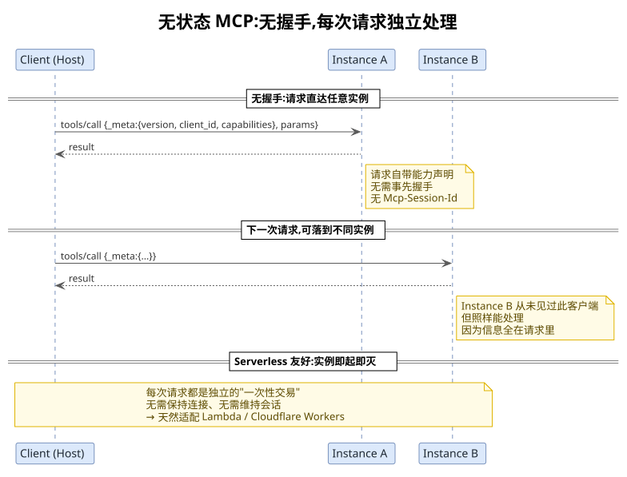

这直接化解了前面提到的两个痛点：

#### 3.1 化解"实例宕机即会话丢失"

有状态时，会话状态活在某个实例的内存里，实例挂了状态就没了。无状态下每个请求都自带全部信息，实例之间完全对等——A 实例挂了，下一次请求落到 B 实例，B 从请求的 `_meta` 里照样能读出所有需要的上下文。故障恢复从"灾难性会话雪崩"降级为"下一请求自动重试"。

#### 3.2 化解"与 Serverless 冲突"

Serverless 的核心假设是"请求短小独立、实例即起即灭"。有状态协议要求长连接和会话保持，与 Serverless 根本性矛盾。无状态协议下，每个请求都是独立的"一次性交易"——不保持连接、不维持会话，函数处理完就释放。这让 MCP 服务器可以原生跑在 AWS Lambda、Cloudflare Workers 上，享受按调用计费、自动伸缩的红利。

### 4. MRTR:无状态下的交互式工具

这是新协议里最巧妙的设计。旧协议里，工具执行到一半需要用户输入（elicitation）或模型采样（sampling），服务器通过长连接反向发请求，连接全程被占用。无状态协议没有长连接，那交互式工具怎么办？

答案是 **MRTR（Multi Round-Trip Requests，多轮往返请求）**——用"请求-返回-重试"的循环，取代"长连接反向请求"。

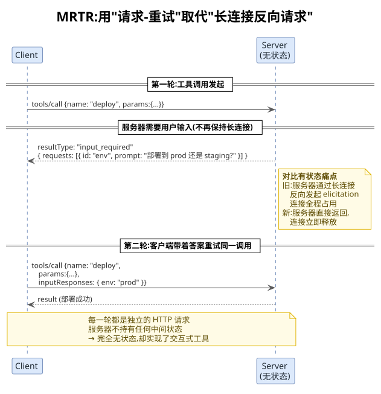

完整流程拆解：

#### 4.1 第一轮:工具发起调用

客户端像平常一样调用工具。服务器执行到一半发现需要额外输入。

#### 4.2 服务器返回 input_required(而非保持长连接)

服务器不挂起连接等待，而是**立即返回**一个特殊结果：

```
resultType: "input_required"
requests: [{ id: "env", prompt: "部署到 prod 还是 staging?" }]
```

此时 HTTP 连接已经关闭，服务器不持有任何中间状态。

#### 4.3 第二轮:客户端带答案重试同一调用

客户端收集到用户输入后，把答案附在原请求上重新发起调用：

```
tools/call {
  name: "deploy",
  params: {...},
  inputResponses: { env: "prod" }   ← 把答案附进来
}
```

服务器收到后，从 `inputResponses` 里取出答案，继续执行，返回最终结果。

【**收益**】

- **连接不再被独占**:每一轮都是独立 HTTP 请求，中间连接完全释放
- **天然无状态**:服务器不记任何中间状态，答案全在客户端持有的请求里
- **完美适配云原生**:交互式工具也能跑在无状态基础设施上
- **可靠性高**:某一轮失败，客户端重试即可，不会丢失会话上下文

这化解了旧痛点里"双向长连接资源消耗严重"和"Serverless 冲突"中关于交互能力的部分——无状态并不牺牲交互能力，只是换了一种实现方式。

### 5. Header 路由:网关零成本接入

旧协议下，网关要路由一个请求，必须解析 JSON body 提取 `session_id`，又慢又重。新协议强制要求 Streamable HTTP 请求携带 `Mcp-Method` 和 `Mcp-Name` 头，让网关只看 header 就能路由。

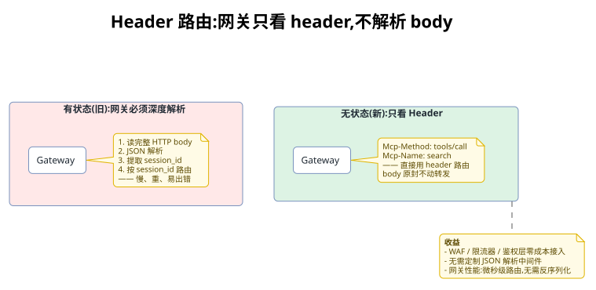

【**收益】**

- **WAF / 限流器 / 鉴权层零成本接入**:这些都是基于 header 工作的，现在天然兼容
- **无需定制 JSON 解析中间件**:网关直接转发 body，不必理解其内容
- **性能**:微秒级 header 路由，替代毫秒级 body 解析
- **可观测性**:网关层就能看到方法和工具名，便于监控和审计

### 6. 综合实战:崩溃恢复

前面的解法都是分项讲解。这一节用一个贯穿性场景——**Claude Code 连接 MCP Server，工具执行中 Server 崩溃**——来检验无状态改造的整体效果。这是最能体现两种协议差异的实战场景。

#### 6.1 前提:stdio 与 HTTP 的崩溃语义不同

先厘清一个前提：Claude Code 通常用 stdio 连接本地 MCP Server（spawn 一个子进程），所以"崩溃"基本等于 Server 子进程死亡。这种情况下，无论哪种协议，子进程挂了都得重启——这是传输层决定的。真正的差异体现在重启之后要走多少步恢复，以及在 HTTP 多实例场景下是否需要重启。

#### 6.2 有状态崩溃:会话随进程死亡

有状态下，握手建立的 session 和会话内累积的上下文都活在 Server 进程的内存里。进程一崩，这些全没了。Claude Code 不能简单地重试工具调用，因为绑定的 session 已经无效，必须走完整的恢复链路。

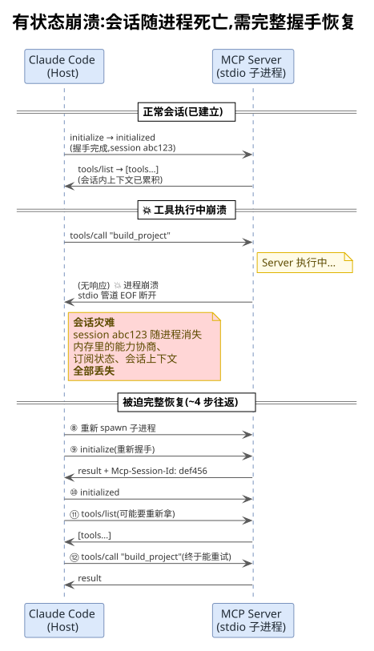

从图中可以看到，崩溃后的恢复涉及重新 spawn 子进程、重新握手、可能还要重新列举工具，最后才能重试原调用——约 4 步往返，用户可感知的延迟明显。更糟的是会话内上下文（如已登录状态、上次构建配置）**全部丢失**。

#### 6.3 无状态崩溃(stdio):省掉握手恢复

stdio 本地传输下，无状态的优势没有 HTTP 多实例那么戏剧性，因为子进程挂了还是要重启。但重启之后的恢复步骤大幅缩短：

| 恢复步骤 | 有状态 | 无状态 |
|---|---|---|
| 重新 spawn 进程 | 需要 | 需要（stdio 固有） |
| 重新握手 | **需要** | **不需要** |
| 重新 tools/list | **可能需要** | **不需要** |
| 重发 tools/call | 最后才能做 | 重 spawn 后直接做 |

恢复从约 4 步降到 2 步——重启进程后直接重发原请求即可，因为每个请求自带全部上下文。

#### 6.4 无状态崩溃(HTTP 多实例):几乎透明

这才是两种协议差异最悬殊的场景。Claude Code 通过 Streamable HTTP 连一个多实例部署的 MCP Server 时，崩溃的 Instance A 被负载均衡器摘除，重试请求自动路由到健康的 Instance B。

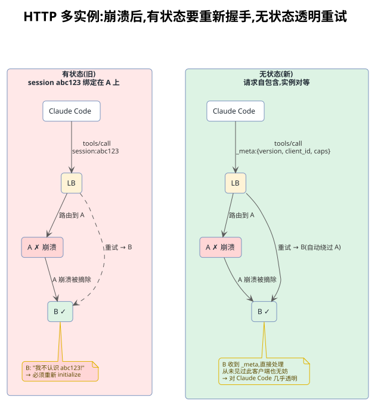

对 Claude Code 来说几乎是透明的——它甚至不需要知道 A 崩溃了。有状态时则不同：即便 LB 把请求转到健康的 B，B 也不认识 session abc123，客户端被迫走完整握手恢复。

#### 6.5 MRTR 交互中途崩溃:答案在客户端,不怕丢

最微妙的是 MRTR 交互场景。第一轮返回 `input_required` 后连接已关闭，此时 Instance A 即使崩溃也无所谓——因为答案存在客户端即将发出的第二轮请求里，不在任何服务器内存中。

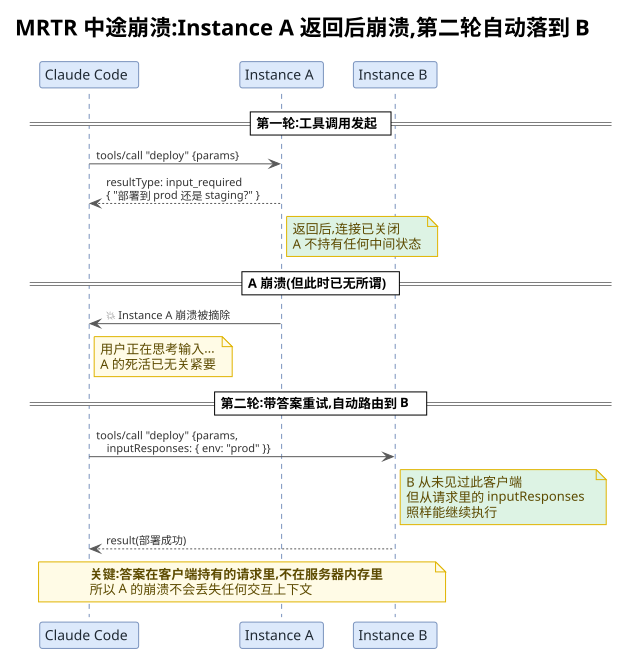

第二轮请求带着 `inputResponses` 被 LB 自动路由到 Instance B，B 从未见过此客户端，但照样能从头执行工具并完成交互。这彻底化解了"交互上下文随长连接丢失"的风险。

#### 6.6 绕不开的陷阱:副作用与幂等性

不管哪种协议，崩溃后的重试都有一个共同的工程陷阱：工具是否会产生重复副作用？比如 `deploy_to_prod` 在 Instance A 上已经执行到一半（二进制已推送），A 崩溃后重试到 B，可能造成重复部署。

这不是协议层能解决的，而是分布式系统的经典难题。但无状态协议让重试更频繁、更自动，因此**幂等性问题更容易暴露**。官方建议正是针对这点：

| 工具类型 | 崩溃重试风险 | 应对 |
|---|---|---|
| 只读工具（query/list） | 无副作用 | 直接重试 |
| 幂等工具（create-if-not-exists） | 低风险 | 直接重试 |
| 非幂等工具（转账、部署、发消息） | **高风险** | 需应用层**幂等键**（handle） |

工具生成一个幂等 handle（如 request_id），客户端重试时带上同一个 handle，服务端据此去重。这把"协议状态"降维成了"应用层数据"——状态管理责任从协议层转移到了工具实现，呼应了第 4.8 节讨论的代价。

#### 6.7 崩溃恢复差异对照

把三种部署场景下的恢复表现拉一张总表：

| 维度 | 有状态崩溃恢复 | 无状态(stdio) | 无状态(HTTP 多实例) |
|---|---|---|---|
| 重启/重连 | 必须 | 必须 | **不需要**（LB 自动换实例） |
| 重新握手 | 必须 | 不需要 | 不需要 |
| 重新列工具 | 可能需要 | 不需要 | 不需要 |
| 客户端感知 | 明显（延迟+可能报错） | 轻微（重启进程的延迟） | **几乎透明** |
| 会话上下文 | **全部丢失** | 无（本来就没有） | 无 |
| MRTR 中途崩溃 | 交互上下文丢失 | 答案在客户端,可重试 | 自动路由到新实例继续 |
| 恢复步骤数 | ~4 步 | ~2 步 | **0~1 步**（自动） |

一句话总结：有状态下，Server 崩溃是一场"会话灾难"；无状态下，崩溃退化为一次普通的"请求失败 → 重试"，在 HTTP 多实例部署下甚至对客户端几乎透明。唯一的硬约束是 stdio 传输：子进程挂了必须重启，但重启之后无状态省掉了所有"恢复会话"的负担。

### 7. 痛点化解全景对照

把七大痛点和对应的解法拉一张总表，可以看到无状态改造的系统性：

| 旧痛点 | 无状态解法 | 对应新机制 |
|---|---|---|
| 负载均衡要 sticky session | 请求自包含,任意实例可处理 | `_meta` 携带能力+身份 |
| 实例宕机会话丢失 | 实例对等,请求可重试 | 无握手,无 session_id |
| 与 Serverless 冲突 | 每请求独立,即起即灭 | 无状态请求模型 |
| 网关要解析 body | 只看 Header 路由 | `Mcp-Method` / `Mcp-Name` 头 |
| 长连接资源消耗 | 请求-返回-重试循环 | MRTR 多轮往返 |
| 水平扩展要共享状态层 | 不需要任何共享存储 | 协议本身无状态 |
| 故障难以自愈 | 下一请求自动落到健康实例 | 实例对等+请求自描述 |

### 8. 代价:并非没有成本

无状态改造化解了七大痛点，但也引入了新的取舍，需要客观看待：

#### 8.1 请求体积变大

每个请求都要在 `_meta` 里重复携带版本、身份、能力声明，不再有握手后"请求精简"的好处。在低延迟局域网里这点开销可忽略，但在极端高并发或窄带宽场景下是有代价的。

#### 8.2 跨调用状态需应用层自行管理

旧协议的"会话内累积上下文"没了。如果一个工具确实需要跨多次调用的状态（比如多步构建的中间产物），官方建议：工具自己生成一个 handle（句柄），由模型作为参数传回。把"协议状态"降维成"应用层数据"，状态管理责任从协议层转移到了应用层。

#### 8.3 兼容性断裂

这次改动是 wire-incompatible 的（协议层双向不兼容），旧客户端和新服务器无法直接通信。官方为此提供了 12 个月的废弃过渡期，但迁移成本对存量系统是实实在在的。

## 五、 本质矛盾与演进总结

### 1. 优势与痛点的本质对比

| 维度 | 有状态的优势 | 有状态的痛点 |
|---|---|---|
| 适用场景 | 本地 1:1、IDE、单机 | 云原生、多实例、Serverless |
| 请求效率 | 握手后请求精简 | 每请求要带状态依赖 |
| 扩展性 | 单机最优 | 水平扩展代价高 |
| 可靠性 | 会话内连续性好 | 实例故障即会话故障 |
| 交互能力 | 双向通信自然 | 吃连接资源 |
| 运维成本 | 实现简单 | 部署、扩缩容、网关都麻烦 |

### 2. 场景迁移带来的根本冲突

【**本质矛盾**】

MCP 的有状态设计是为"单机本地长连接"优化的，但生态把它推到了"云端大规模短连接"的场景，两个世界的假设完全相反。

这就是为什么 `2026-07-28` 版本要做这次伤筋动骨的重写。不是有状态设计错了，而是目标场景变了，协议的底层假设必须跟着变。无状态改造的本质，就是让协议的假设与云原生世界对齐：

```
有状态世界：连接是长期的、实例是单一的、状态在内存里
无状态世界：请求是独立的、实例是任意的、状态在请求里
```

这次演进揭示了协议设计的一条重要规律：没有绝对"好"的架构，只有匹配场景的架构。有状态模型在本地 IDE 场景下是优雅且高效的，但当生态把协议推向云端大规模部署时，它的每一项设计优势都反过来变成了扩展瓶颈。理解这段历史，才能理解新版本无状态改造中每一个决策的来由。

---
*本文档由 markdowncli 技能辅助生成*
