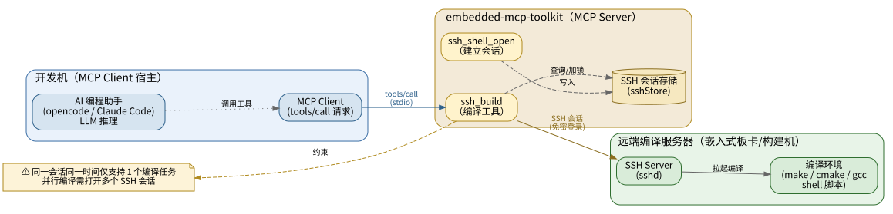
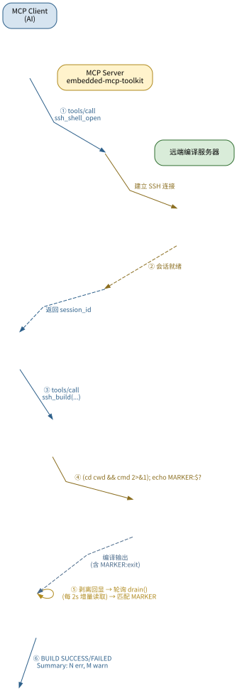

<!-- more -->

## 一、概述

`ssh_build` 是 embedded-mcp-toolkit 提供的**远程编译工具**，用于在嵌入式板卡或远端编译服务器上，通过 SSH 会话执行长时间编译命令（如 `make`、`cmake --build`、shell 脚本等），并返回**结构化编译结果**。

与 `ssh_shell_exec`（发送命令后固定延迟读取）不同，`ssh_build` 会持续轮询直到编译完成，自动分类采集错误、警告和常规信息，适合耗时可能超过数分钟的编译任务。编译完成后，AI 直接拿到一份「错误/警告/信息」已分类的结构化报告，无需自己拼凑日志、猜测是否结束。

## 二、部署场景与架构

### 1. 部署场景

`ssh_build` 处于一个典型的 **AI 驱动的远程编译部署拓扑**中：



- **开发机**：运行 AI 编程助手（opencode / Claude Code），作为 MCP Client 发起 `tools/call` 请求。
- **embedded-mcp-toolkit**：作为 MCP Server，通过 stdio 与 Client 通信。其中 `ssh_shell_open` 负责建立 SSH 会话并登记到 `sshStore`，`ssh_build` 负责在既有会话上执行编译。
- **远端编译服务器**：通过免密 SSH 登录的嵌入式板卡或构建机，其上运行 `sshd` 和编译环境（make / cmake / gcc / shell 脚本）。

`ssh_build` 位于 Server 侧，向上承接 MCP Client 的工具调用，向下通过 SSH 会话驱动远端编译。它**复用** `ssh_shell_open` 建立的会话，通过 `sshStore` 查询并按会话加锁，保证「同一会话同一时间仅一个编译任务」。

> ⚠️ 同一 SSH 会话同一时间仅支持**一个**编译任务。需要并行编译时，应通过 `ssh_shell_open` 打开多个会话，各分配一个 `ssh_build`。

### 2. 一次完整编译的调用流程



时序要点：

1. **建立会话**：AI 先调用 `ssh_shell_open` 建立 SSH 会话，拿到 `session_id`。
2. **发起编译**：AI 调用 `ssh_build(session_id, command)`。Server 构造远端命令（含完成标记），通过会话下发。
3. **轮询检测**：Server 每隔 `pollInterval`（默认 2s）从会话缓冲区增量读取输出，直到正则匹配到完成标记 `___MCP_BUILD_DONE___:<exitcode>`。
4. **分类返回**：剥离标记，按行分类 error / warning / info，组装结构化结果一次性返回给 AI。

## 三、设计决策：为何在 Server 端封装

编译工具的实现面临一个关键设计决策：**轮询和完成判断逻辑应该放在哪一端？**

### 1. 两种处理模式

#### 1.1 Client 端轮询模式（方案 A）

让 opencode 或 Claude Code 反复调用 `ssh_shell_write` → `ssh_shell_read`，由 LLM 在每次响应后自行判断编译是否完成。

```text
Client 端轮询模式（一次编译 = N 次工具调用）：
  tools/call ssh_shell_write("make -j8")
      → 响应: ok
  tools/call ssh_shell_read()          ← LLM 判断: 还没结束
      → 响应: "compiling foo.c..."
  tools/call ssh_shell_read()          ← LLM 判断: 还没结束
      → 响应: "compiling bar.c..."
  ...（重复 N 轮，每轮 LLM 消耗 token 做判断）
  tools/call ssh_shell_read()          ← LLM 判断: 看到提示符了，结束
      → 响应: "compilation done #"
```

#### 1.2 Server 端封装模式（方案 B）

由 MCP Server 内部轮询完成标记，一次 `tools/call` 返回完整结果。

```text
Server 端封装模式（一次编译 = 1 次工具调用）：
  tools/call ssh_build("make -j8")
      → Server 内部: 发送命令 → 轮询检测标记 → 分类 → 组装
      → 响应: "BUILD SUCCESS (exit 0) | 0 errors, 2 warnings | <完整日志>"
```

#### 1.3 对比总结

| 维度 | 方案 A：Client 端轮询 | 方案 B：Server 端封装 |
|------|----------------------|---------------------|
| 工具调用次数 | N 次（N ≈ 编译耗时 / 轮询间隔） | **1 次** |
| LLM 参与度 | 每轮都需推理判断是否结束 | **零干预**，直接拿到结果 |
| Token 消耗 | 每次轮询消耗 token，N 轮可观的累积成本 | **仅 1 次响应** |
| 误判风险 | LLM 可能把输出中的 `error` 当编译失败提前终止，或把 `BUILD` 字样当结束 | **无**，代码确定性判断 |
| 结束判断方式 | 靠 LLM 猜（提示符/输出停滞） | **完成标记**精确匹配 |
| 退出码获取 | LLM 需额外执行 `echo $?` | **内嵌在标记中**，一次获取 |
| 日志完整性 | LLM 需自行拼凑 N 轮读取结果 | **Server 自动拼接** |
| 错误/警告分类 | LLM 需自行分析 | **Server 自动分类** |

### 2. 选择 Server 端封装的原因

#### 2.1 MCP 协议是请求-响应模型

MCP `tools/call` 是单次请求-单次响应的模式，不支持流式长连接。Client 端轮询意味着每次 `ssh_shell_read` 都是一次独立的 `tools/call`，每次都需要完整的请求-响应往返。

#### 2.2 Token 消耗与上下文膨胀

这是 Client 端轮询最致命的问题。LLM API 按请求的输入+输出 token 计费，而**每次 `tools/call` 请求都需携带完整对话历史**，因此单轮请求 token 数随轮次递增，总消耗呈 **O(N²)** 增长。

> **定量估算**（一次 5 分钟编译，2 秒轮询间隔，N=150 轮，每轮新增约 1,000 tokens 历史）：
>
> ```text
> 方案 A（Client 端轮询，150 次 read）：
>   每轮请求都需重新发送 系统+工具定义+全部历史+当前消息：
>   第 1 轮:  输入 ≈  4,000 tokens（无历史）
>   第 2 轮:  输入 ≈  5,000 tokens（含 1 轮历史）
>   ...
>   第 i 轮:  输入 ≈  4,000 + 1,000×(i-1)
>   总消耗 ≈ Σ[4,000 + 1,000×(i-1)] + 300×150
>          ≈ 11,820,000 tokens
>
> 方案 B（ssh_build，1 次调用）：
>   请求: ~4,000 tokens + 响应: ~8,000 tokens
>   单次合计 ≈ 12,000 tokens
>
> Token 消耗比: 11,820,000 / 12,000 ≈ 985 倍
> ```

更重要的是，Client 端轮询会导致**上下文窗口膨胀**。每次请求必须携带完整历史，上下文随轮次线性增长（约 `1,000 × N` tokens）。当 N 达到约 200 轮（约 200K token 上限）时，请求直接失败。而方案 B 上下文恒定在 ~11K tokens。

#### 2.3 拉长轮询间隔能解决吗？

把轮询间隔拉长确实能减少调用次数，但引入新问题：

- **不知道什么时候开始查**：LLM 无法预知编译耗时。增量编译只需 3 秒，却得干等 5 分钟才第一次读；设短了又回到频繁调用。
- **仍需完成标记**：5 分钟读一次，如何判断"编译完了"还是"还在跑只是没输出"？最终还是需要一个标记。标记在 Server 端已构造好，却要传给 Client 让 LLM 做正则匹配——纯属多此一举。

拉长间隔只是把"低效方案"变得"不那么低效"，永远不如 Server 端直接检测。

#### 2.4 误判风险

- LLM 可能把编译输出中的 `"error: file not found"` 理解为"编译出错了"，提前终止轮询。
- LLM 可能看到 `"BUILD"` 字样或提示符就误认为结束。
- 无完成标记时，LLM 只能靠"提示符出现了"或"输出不变化了"来猜测——这些方式都不可靠。

#### 2.5 LLM 不适合确定性循环检测

判断"日志里有没有出现 `___MCP_BUILD_DONE___`"是一个确定性正则匹配任务，用代码完成是**毫秒级、零 token** 的；让 LLM 来做，完全是用错了工具。

#### 2.6 语义原子性

`ssh_build` 将"发送命令 + 轮询等待 + 检测完成 + 分类输出"封装为一个原子操作。如果拆分给 Client 轮询，则"编译"这个原子操作被切割为 `ssh_shell_write` + N 个 `ssh_shell_read`，语义碎片化，AI 需要自行拼凑完整日志、判断成功与否、手动分类错误和警告。

#### 2.7 外部验证：Claude Code Bash 工具的同构设计

Claude Code 的 `Bash` 工具同样需要在远端执行命令并判断完成，其方案同样是**在命令末尾注入标记**：

```text
<命令>; echo __claude_code_bash_done__:$?
```

这从侧面印证：**Server 端完成标记方案是当前主流 AI 工具的共识选择**。

## 四、完成判断方案对比

确定了在 Server 端处理后，下一个问题是：**Server 内部如何判断编译已经完成？**

### 1. 候选方案

| 方案 | 可行性 | 问题 |
|------|--------|------|
| 检测 shell 提示符（`#`/`$`） | ❌ | 提示符格式多变（`#`/`$`/`>`/自定义），且可能出现在编译输出中（如 make 回显 shell 变量），不可靠 |
| 检测输出停滞（安静期） | ❌ | 编译过程（尤其是链接阶段）可能有数分钟无输出，无法区分"还在编译"和"已结束"；需设置超长且不可预测的安静期阈值 |
| 检测产物是否生成 | ❌ | `ssh_build` 是通用工具，不知道产物名称和路径；文件可能在编译中途就已创建（如 Makefile 规则提前 `touch` 产物），产生假阳性 |
| 检测编译脚本结束消息 | ❌ | 不同构建系统打印不同文本，无统一模式；部分脚本静默退出，不打印任何结束消息；无法可靠提取退出码 |
| **完成标记** | ✅ | 唯一字符串 `___MCP_BUILD_DONE___` 不外显于编译日志，零误判；内嵌 `$?` 一次获取退出码；不依赖 shell 状态、构建系统类型或编译时长 |

### 2. 完成标记方案原理

将编译命令包装为：

```shell
# 无工作目录时：
<用户命令> 2>&1; echo "___MCP_BUILD_DONE___:$?"

# 有工作目录时：
(cd <cwd> && <用户命令> 2>&1); echo "___MCP_BUILD_DONE___:$?"
```

- `;` 是 Shell 顺序执行操作符，`echo` 必须等用户命令执行完毕后才会执行，因此**标记出现在输出中即意味着编译已结束**。
- `2>&1` 将标准错误合并到标准输出，确保所有日志在同一流中。
- `$?` 是上一条命令的退出码（0 = 成功，非 0 = 失败）。
- 有 `cwd` 时用 `()` 子 shell 包裹 `cd`，避免污染父 shell；`cd` 失败时子 shell 跳过编译、退出码为 `cd` 的非零值，`echo` 仍会输出标记（退出码非 0）。

> 用子 shell `()` + `&&` 的原因：
> - `()` 创建子 shell，`cd` 只影响子 shell 工作目录，不污染父 shell
> - `&&` 短路：`cd` 失败则跳过编译，直接以 `cd` 的非零码结束
> - `;` 无条件连接：无论子 shell 成败，`echo` 始终执行

Server 发送命令后进入轮询循环（默认每 2 秒一次），从 SSH 会话缓冲区增量读取输出，用正则 `/___MCP_BUILD_DONE___:(\d+)/` 匹配标记。匹配到即为编译结束，标记之前的所有内容即为完整编译日志。

### 3. 完成标记的优势

- **确定性**：标记严格等于命令结束的那一刻，无歧义。
- **通用性**：适用于任意 shell 命令，无需预先知道构建系统类型、脚本格式或产物名称。
- **退出码内嵌**：`$?` 随标记一并返回，一次正则匹配同时得到"是否结束"和"成功/失败"。
- **零误判**：标记字符串足够唯一，不会在常规编译输出中出现。

## 五、核心机制

### 1. 完成标记检测

命令构造逻辑位于 `buildRemoteCommand()`：

- 将用户命令的标准输出与标准错误合并（`2>&1`）。
- 命令执行完毕后，`echo` 输出唯一标记字符串 `___MCP_BUILD_DONE___` 及其退出码 `$?`。
- 指定工作目录时，用 `(cd <cwd> && <cmd>)` 子 shell 包裹，`cd` 失败则跳过编译，退出码为非零值。

标记构造完成后，首先剥离 PTY 回显（见 2 节），然后进入轮询循环检测标记。用正则 `/___MCP_BUILD_DONE___:(\d+)/` 匹配，匹配到后提取退出码，标记之前的内容即为完整日志。

### 2. PTY 回显剥离

#### 2.1 问题现象

测试中发现 `ssh_build` 发送编译命令后仅 2 秒就返回 `BUILD FAILED (exit 1)`，仅收集到 39 字节输出，而远端构建脚本（`./build.sh`）实际仍在正常执行。服务端日志片段如下：

```text
[17:59:19] [INFO] [ssh_build] command=./build.sh alpha -a -c
[17:59:19] [OSC]sumu@virtual-machine:~$ cd ~/workspace/Alpha/kernel || { echo "___MCP_BUILD_DONE___:1"; exit 1; }; ./build.sh alpha -a -c 2>&1; echo "___MCP_BUILD_DONE___:$?"
[17:59:19] [INFO] 检查主机编译器...
[17:59:19] [SUCCESS] ✓ gcc-9 已找到
[17:59:19] [INFO] 开始清理构建环境...
[17:59:20]   CLEAN   .
[17:59:21] [INFO] [ssh_build] completed exitCode=1 outputLength=39
```

构建实际在执行（gcc-9 检查、clean 操作都在正常打印），但处理器在第一次轮询时就误判构建完成并提前返回。

#### 2.2 根本原因

PTY 会将用户输入的命令**原样回显**。处理器在轮询前会先对缓冲区做正则匹配，若回显的命令行里恰好包含 `___MCP_BUILD_DONE___:<数字>` 模式，就会在真实编译开始前被误判为「已完成」。

历史上，命令构造曾用 `cd <cwd> || { echo "___MCP_BUILD_DONE___:1"; exit 1; }` 的形式处理工作目录——其中 `cd` 失败分支的字面量 `:1` 会被正则 `___MCP_BUILD_DONE___:(\d+)` 立即命中：

```text
远端命令（早期 `||` 形式）：
  cd <cwd> || { echo "___MCP_BUILD_DONE___:1"; exit 1; }; <cmd> 2>&1; echo "___MCP_BUILD_DONE___:$?"

PTY 回显（发送命令后收到的第一行数据，以 \n 结尾）：
  cd ~/workspace/... || { echo "___MCP_BUILD_DONE___:1"; exit 1; }; ./build.sh ... 2>&1; echo "___MCP_BUILD_DONE___:$?"\n
                                                                        ^^^^ 字面量 :1 被正则误匹配
```

虽然 `$?` 在回显中是字面量、不匹配 `\d+`，但 `cd` 失败分支的 `:1` 本身就是数字，`match()` 在回显行立即命中，退出码被误读为 1，标记之前的所有构建输出被截断丢弃。

> 当前源码已改为子 shell 形式 `(cd <cwd> && <cmd>); echo "MARKER:$?"`，不再有 `:1` 字面量。但 PTY 回显剥离仍是必要的防御——回显行包含整条命令原文，若 `cwd` 或命令本身含 `MARKER:<数字>` 片段同样会误触发，因此无论命令构造如何演进都需在检测前剥离回显。

#### 2.3 方案演变

| 版本 | 方案 | 状态 |
|------|------|------|
| A | 改变命令构造：`:1` 改为 `$((1))`（shell 算术展开在回显中保持字面量） | ❌ 否决——补丁而非根治，其他含数字 marker 的代码片段同样会误触发 |
| B | **回显剥离**（最终方案）：独立循环等待 `\n`，直接截断丢弃整行 | ✅ 采纳——回显即命令原文本身，无需正则 |

#### 2.4 最终实现

```typescript
// 步骤 4：剥离 PTY 回显
// 回显是发送命令后收到的第一行数据（以 \n 结尾），独立循环等待 \n 后直接截断
let allOutput: string = "";
let echoBuffer: string = "";
let echoRetries = 10;
while (echoRetries > 0) {
  echoRetries--;
  await new Promise(r => setTimeout(r, 200));
  echoBuffer += shell.drain();
  const nlIdx = echoBuffer.indexOf("\n");
  if (nlIdx !== -1) {
    allOutput = echoBuffer.substring(nlIdx + 1);
    break;
  }
}

// 步骤 5：轮询检测完成标记
const deadline = Date.now() + timeoutMs;
let exitCode = null;
const markerRegex = new RegExp("___MCP_BUILD_DONE___:(\\d+)");

while (Date.now() < deadline) {
  await new Promise(r => setTimeout(r, pollInterval));
  allOutput += shell.drain();
  const match = allOutput.match(markerRegex);
  if (match) {
    exitCode = parseInt(match[1], 10);
    allOutput = allOutput.substring(0, allOutput.search(markerRegex)).trimEnd();
    break;
  }
}
```

核心设计：

- `\n` 之前的所有内容 = PTY 回显（包含命令原文），整行丢弃。
- `\n` 之后的内容 = 真实构建输出（包含构建日志以及 `echo "___MCP_BUILD_DONE___:1"` 执行后的 marker），保留到 `allOutput`。
- `echoRetries` 防止死循环：10 次 × 200ms = 2 秒超时，正常回显在第一次 200ms 内即可到达。
- `write(cmd, 0)` 配合 `drain()` 不重置 overflow：构建期间缓冲区满时从头部覆盖旧数据，保留最新输出，确保末尾的完成标记不被丢弃。
- 无需正则剥离：回显行就是命令本身，直接 `substring(nlIdx + 1)` 截断即可。

### 3. 输出分类

标记检测成功后，编译日志按行分类为三类：

| 类别 | 匹配规则（正则，大小写不敏感） |
|------|----------|
| error | `\berror\b[:\s]`、`\bfatal\b[:\s]`、`undefined reference`、`No rule to make`、`make[...]: ***`、`cannot find`、`collect2: error`、`ld returned`、`\bfailed\b[:\s]`、`no such file or directory` |
| warning | `\bwarning\b[:\s]`、`\bwarn\b[:\s]`、`\bdeprecated\b`、`-W[a-z]+` |
| info | 未命中以上规则的其余行 |

分类逻辑优先匹配 error（更严重），其次 warning，其余归入 info。参数 `classify` 设为 `false` 时跳过分类，直接返回原始日志（取尾部 50 行）。

### 4. 结果组装

分类完成后按以下格式输出结构化结果：

```text
[session: <session_id>] BUILD SUCCESS (exit code: 0)
Summary: 0 error(s), 2 warning(s), 145 info line(s)

=== ERRORS (0) ===
(none)

=== WARNINGS (2) ===
[W1] src/foo.c:12:5: warning: implicit declaration of function 'bar'
[W2] src/baz.c:8:10: warning: unused variable 'x'
```

> 分类模式下仅输出 ERRORS 和 WARNINGS 两个区块（跳过完整构建日志，体量巨大，多数场景 errors + warnings 足以分析问题）。需要完整日志时，将 `classify` 设为 `false`，返回原始输出的尾部 50 行。

## 六、参数说明

| 参数 | 类型 | 必填 | 默认值 | 说明 |
|------|------|------|--------|------|
| `session_id` | string | 是 | — | 由 `ssh_shell_open` 或 `ssh_shell_login` 返回的会话 ID |
| `command` | string | 是 | — | 远端编译命令，如 `make -j8`、`./build.sh` |
| `cwd` | string | 否 | 无 | 远端工作目录，切换到该目录后执行命令 |
| `timeoutMs` | number | 否 | 600000（10 分钟） | 最大等待时间（毫秒） |
| `pollInterval` | number | 否 | 2000（2 秒） | 轮询间隔（毫秒） |
| `classify` | boolean | 否 | true | 是否对输出进行 error/warning/info 分类 |

## 七、使用示例

### 1. 基本用法

```json
{
  "name": "ssh_build",
  "arguments": {
    "session_id": "ssh_1",
    "command": "make -j8"
  }
}
```

### 2. 指定工作目录和更长的等待时间

```json
{
  "name": "ssh_build",
  "arguments": {
    "session_id": "ssh_1",
    "command": "./build.sh",
    "cwd": "/home/root/project",
    "timeoutMs": 1200000
  }
}
```

### 3. 关闭分类（获取纯文本输出）

```json
{
  "name": "ssh_build",
  "arguments": {
    "session_id": "ssh_1",
    "command": "make -j4",
    "classify": false
  }
}
```

## 八、超时注意事项

`ssh_build` 面临**两层超时**：

1. **Server 端 `timeoutMs`**：默认 10 分钟，控制轮询等待上限。编译耗时超过此值则返回超时错误及已收集的部分输出。
2. **Client 端 MCP 超时**：取决于使用的 MCP Client。
   - opencode：默认 60 秒，需在 `opencode.json` 中配置 `mcp.<server>.timeout` 增大。
   - Claude Code：默认约 28 小时（`MCP_TOOL_TIMEOUT`），几乎不会触发。

两层超时独立：即使 Server 端 `timeoutMs` 设为 60 分钟，若 Client 端 MCP 超时为 60 秒，编译也将在 60 秒后被 Client 掐断。详细原理见 `docs/MCP工具超时机制.md`。

## 九、注意事项

- 每个 SSH 会话同一时间仅支持**一个**编译任务。需要并行编译时，应通过 `ssh_shell_open` 打开多个会话，各分配一个 `ssh_build`。
- 编译命令通过 PTY 执行，输出包含 ANSI 转义序列（颜色码等），可能影响分类匹配。
- 退出码仅反映编译命令的结果（0 或成功，`cwd` 切换失败时返回 1），不包括网络异常等通信层面的错误。

> **参考资料**
> - [Token、输入输出与缓存——AI开发计费全解](https://blog.csdn.net/2301_76428778/article/details/160745565)
> - [Claude Code 上下文管理机制深度解析](https://blog.cyeam.com/ai/2026/06/03/claude-code-context-management)

---
*本文档由 markdowncli 技能辅助生成*
