<!-- more -->

## 一、 概述

### 1. 项目简介

`embedded-mcp-toolkit` 是一个基于 MCP（Model Context Protocol）协议的嵌入式板卡远程管理工具。它通过 SSH 连接到远程开发板，向 AI 编程助手（如 OpenCode）暴露一组管理工具，使 AI 可以直接对板卡执行命令、读写文件、查看系统状态等，无需手动 SSH 登录。

>MCP协议官网：[https://modelcontextprotocol.io](https://modelcontextprotocol.io/docs/getting-started/intro)

### 2. 架构说明

```text
┌─────────────────────────────────────────────────┐
│                  你的终端                        │
│  ┌───────────────────────────────────────────┐   │
│  │              OpenCode AI                  │   │
│  │    (用户通过自然语言对话驱动 AI)              │   │
│  └──────────────┬────────────────────────────┘   │
│                 │ MCP 协议 (stdio)                │
│  ┌──────────────▼────────────────────────────┐   │
│  │       embedded-mcp-toolkit                │   │
│  │    (Node.js MCP Server)                   │   │
│  │    工具: exec / read_file / write_file /   │   │
│  │          list_dir / dmesg / system_info / │   │
│  │          upload_file                      │   │
│  └──────────────┬────────────────────────────┘   │
│                 │ SSH 协议 (TCP/22)              │
│  ┌──────────────▼────────────────────────────┐   │
│  │         远程板卡                           │   │
│  │     Linux / aarch64                       │   │
│  │     IP: <板卡 IP>                          │   │
│  └───────────────────────────────────────────┘   │
└─────────────────────────────────────────────────┘
```

### 3. 工作原理

- OpenCode 启动时自动加载 MCP Server 配置
- MCP Server 通过 SSH 协议与远程板卡建立持久化连接
- 用户在 OpenCode 中以自然语言描述需求
- AI 自动选择合适的 MCP 工具并传入参数
- MCP Server 将请求翻译为 SSH 命令或 SFTP 操作，返回结果给 AI

## 二、 前置条件

### 1. 环境要求

- **Node.js** >= 18（用于运行 MCP Server）
- **OpenCode** >= 1.15（用于 AI 交互界面）
- **目标板卡** 已通电并接入网络
- **本机与板卡网络互通**（可通过 ping 验证）
- **SSH 服务** 在板卡上已启动（默认已开启）

### 2. 网络连通性验证

在终端中执行以下命令，确认板卡在线：

```bash
ping -c 4 192.168.16.103
```

预期输出类似：

```text
PING 192.168.16.103 (192.168.16.103) 56(84) bytes of data.
64 字节，来自 192.168.16.103: icmp_seq=1 ttl=64 时间=0.954 毫秒
64 字节，来自 192.168.16.103: icmp_seq=2 ttl=64 时间=1.01 毫秒
64 字节，来自 192.168.16.103: icmp_seq=3 ttl=64 时间=0.928 毫秒
64 字节，来自 192.168.16.103: icmp_seq=4 ttl=64 时间=0.962 毫秒
```

如果 ping 不通，请检查板卡电源和网络连接。

### 3. SSH 手动登录验证

确认 SSH 服务可用：

```bash
ssh root@192.168.16.103
```

密码为 `root`。登录成功后应看到类似输出：

```text
Linux <板卡主机名> <内核版本> #1 SMP <日期> aarch64 GNU/Linux
```

### 4. 配置 SSH 免密登录（可选但推荐）

每次输入密码比较繁琐，建议配置 SSH 密钥认证：

```bash
# 生成 SSH 密钥（如果已有则跳过）
ssh-keygen -t ed25519 -f ~/.ssh/id_ed25519 -N ""

# 拷贝公钥到板卡
ssh-copy-id -o StrictHostKeyChecking=no root@192.168.16.103

# 验证免密登录
ssh root@192.168.16.103 "hostname"
```

配置免密后，将 `opencode.jsonc` 中的 `BOARD_PASSWORD` 替换为 `BOARD_PRIVATE_KEY`：

```jsonc
"environment": {
  "BOARD_HOST": "192.168.16.103",
  "BOARD_USERNAME": "root",
  "BOARD_PRIVATE_KEY": "~/.ssh/id_ed25519"
}
```

### 5. 默认连接配置

MCP Server 通过环境变量配置连接参数，默认值如下：

| 环境变量 | 默认值 | 说明 |
|----------|--------|------|
| `BOARD_HOST` | `192.168.16.103` | 板卡 IP 地址 |
| `BOARD_PORT` | `22` | SSH 端口 |
| `BOARD_USERNAME` | `root` | SSH 登录用户名 |
| `BOARD_PASSWORD` | `root` | SSH 登录密码 |
| `BOARD_PRIVATE_KEY` | （可选） | SSH 密钥路径 |

## 三、 启动与连接

### 1. 进入项目目录

```bash
cd <项目目录>
```

### 2. 安装依赖（首次）

如果尚未安装依赖，执行：

```bash
npm install
```

该命令会安装 `@modelcontextprotocol/sdk`、`ssh2`、`zod` 等依赖包。

### 3. 启动 OpenCode

```bash
opencode
```

OpenCode 启动时，会自动读取当前目录下的 `opencode.jsonc` 配置文件，加载其中的 MCP Server。启动后可看到 MCP Server 连接状态。

**关于 opencode.jsonc 的加载规则：**

- OpenCode 会在当前工作目录自动查找 `opencode.jsonc` 或 `opencode.json`
- 如果不在项目目录下启动，可以设置全局配置：`~/.config/opencode/opencode.jsonc`
- 也可以手动指定配置文件：`opencode --config /path/to/opencode.jsonc`

### 4. 验证连接状态

在 OpenCode TUI 中，MCP Server 连接成功后界面右下角或状态栏会显示已连接指示。

也可以在终端中另开一个窗口，进入项目目录后执行以下命令查看 MCP Server 状态：

```bash
opencode mcp list
```

如果看到类似以下输出，说明连接成功：

```text
┌  MCP Servers
│
●  ✓ embedded-board connected
│      node <项目目录>/index.js
│
└  1 server(s)
```

【**注意**】如果需要查看 MCP 状态，请在终端中使用 `opencode mcp list` 命令。

### 5. 验证工具可用性

在 OpenCode 中输入：

```text
use the embedded-board tools to check if the board is reachable
```

AI 应能调用 `exec` 工具执行命令并返回结果。

## 四、 可用工具列表

MCP Server 注册了以下 7 个工具：

| 工具名 | 功能说明 | 对应底层操作 |
|--------|----------|-------------|
| `exec` | 在板卡上执行任意 shell 命令 | SSH exec |
| `read_file` | 读取板卡上的文件内容 | SFTP read |
| `write_file` | 向板卡上的文件写入内容 | SFTP write |
| `list_dir` | 列出板卡上的目录内容 | SFTP readdir |
| `dmesg` | 获取板卡内核环形缓冲区日志 | SSH `dmesg` |
| `system_info` | 获取板卡系统信息 | SSH 多命令组合 |
| `upload_file` | 上传本地文件到板卡 | 本地 read + SFTP write |

### 1. exec 工具参数

| 参数 | 类型 | 必填 | 说明 | 默认值 |
|------|------|------|------|--------|
| `command` | string | 是 | 要执行的 shell 命令 | - |
| `timeout` | number | 否 | 命令超时时间（秒） | 30 |

返回内容：stdout、stderr、exit code

### 2. read_file 工具参数

| 参数 | 类型 | 必填 | 说明 |
|------|------|------|------|
| `path` | string | 是 | 板卡上的文件绝对路径 |

### 3. write_file 工具参数

| 参数 | 类型 | 必填 | 说明 |
|------|------|------|------|
| `path` | string | 是 | 板卡上的文件绝对路径 |
| `content` | string | 是 | 要写入的文件内容 |

### 4. list_dir 工具参数

| 参数 | 类型 | 必填 | 说明 |
|------|------|------|------|
| `path` | string | 是 | 板卡上的目录绝对路径 |

### 5. dmesg 工具参数

| 参数 | 类型 | 必填 | 说明 |
|------|------|------|------|
| `lines` | number | 否 | 显示最近 N 行日志，不填则显示全部 |

### 6. system_info 工具参数

无参数。返回内容包含：

- Hostname（主机名）
- Kernel 版本
- Uptime（运行时间）
- Memory 使用情况（free -h）
- CPU 信息
- Disk 使用情况（df -h /）

### 7. upload_file 工具参数

| 参数 | 类型 | 必填 | 说明 |
|------|------|------|------|
| `local_path` | string | 是 | 本机文件绝对路径 |
| `remote_path` | string | 是 | 板卡目标路径 |

## 五、 使用方法

在 OpenCode 中，直接向 AI 描述需求即可，AI 会自动调用对应的 `embedded-board` 工具来操作板卡。

### 1. 验证 mcp 服务

```shell
opencode mcp list
```


### 2. 执行命令

AI 会自动调用 `exec` 工具在板卡上执行对应的 shell 命令并返回结果。

#### 2.1 查询 IP

在对话中直接提问即可触发：

```text
帮我查一下板卡当前的 IP 地址
```

AI 会调用 `exec` 执行 `ip addr`，返回类似结果：

```text
2: eth0: <BROADCAST,MULTICAST,UP,LOWER_UP> mtu 1500 qdisc pfifo_fast state UP qlen 1000
    inet 192.168.16.103/24 brd 192.168.16.255 scope global eth0
```

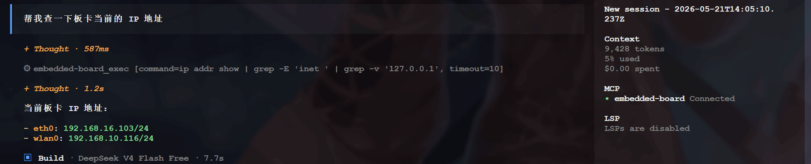

板端实际 IP：

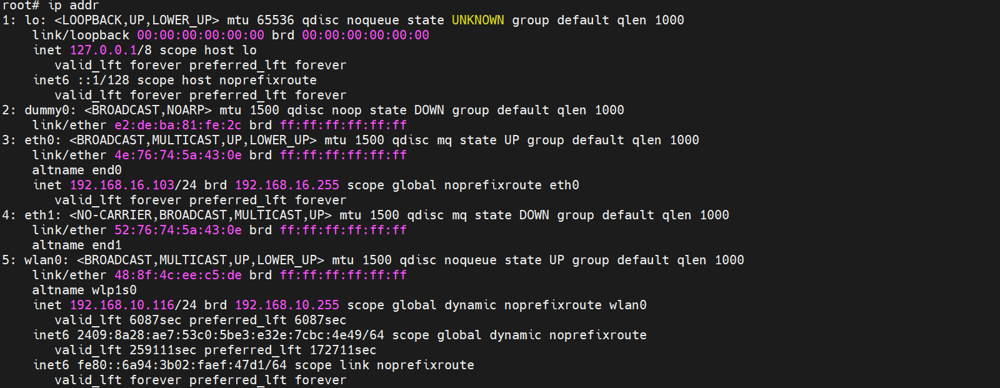

#### 2.2 查询系统信息

```shell
查看板卡上 /etc/os-release 的内容
```

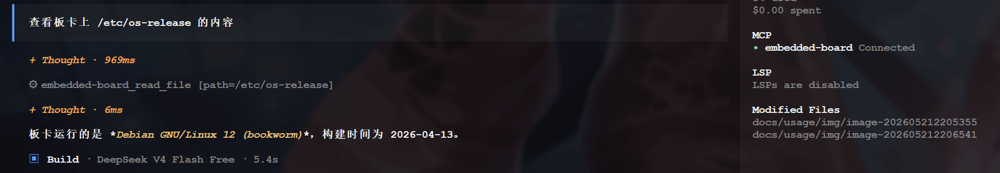

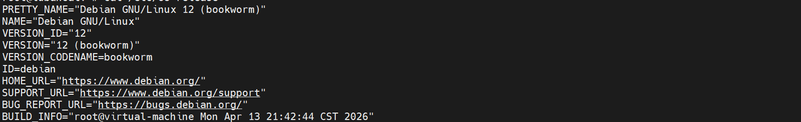

#### 2.3 列出进程

```text
板卡上运行了哪些进程，列出来
```

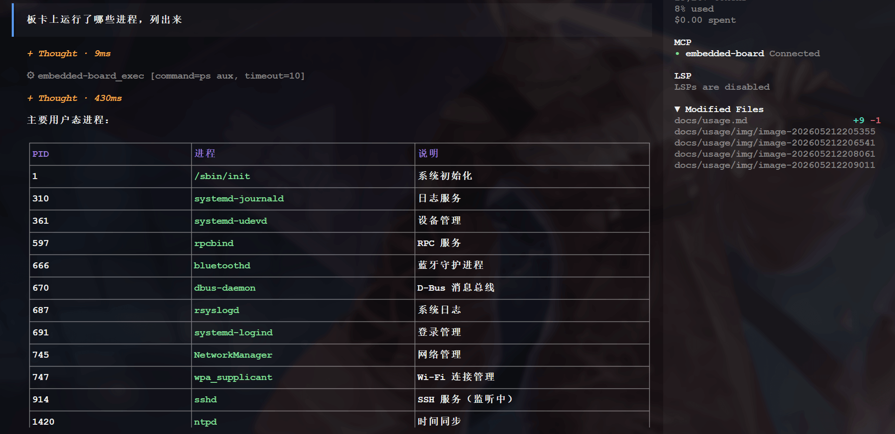

#### 2.4 磁盘分区

```text
查看板卡的磁盘分区情况（lsblk）
```

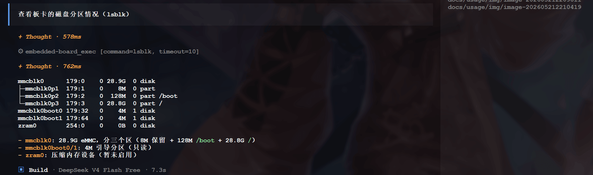

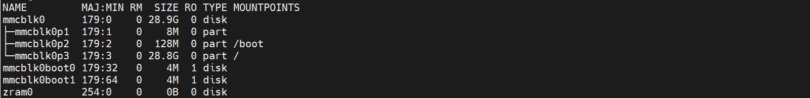

#### 2.5 检查进程是否运行

```text
检查板卡上某个服务是否在运行：systemctl status sshd
```


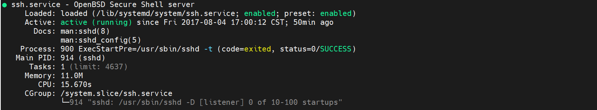

#### 2.5 查看 dmesg

```text
查找板卡dmesg中关于蓝牙的日志
```

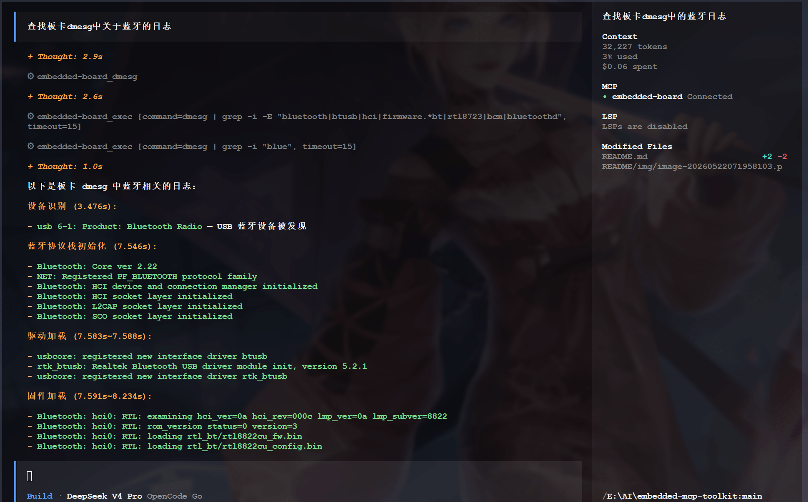


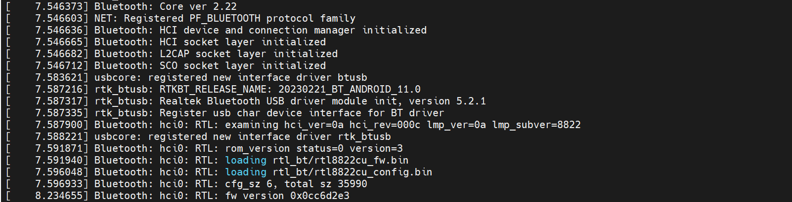

### 3. 查看系统状态

#### 3.1 系统信息

```text
板卡的系统信息是什么
```

AI 调用 `system_info`，返回完整的系统信息：

```text
=== Hostname ===
<板卡主机名>
=== Kernel ===
Linux <板卡主机名> <内核版本> #1 SMP <日期> aarch64 GNU/Linux
=== Uptime ===
  <当前时间> up <运行时长>,  1 user,  load average: 0.00, 0.00, 0.00
=== Memory ===
               total        used        free      shared  buff/cache   available
Mem:           <总量>       <已用>       <空闲>     <共享>     <缓存>      <可用>
Swap:          <总量>       <已用>       <空闲>
=== Disk ===
Filesystem      Size  Used Avail Use% Mounted on
<设备>   <大小>  <已用> <可用> <使用率> /
```

#### 3.2 内存使用

```text
板卡的内存使用情况
```

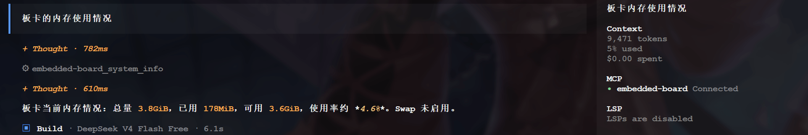

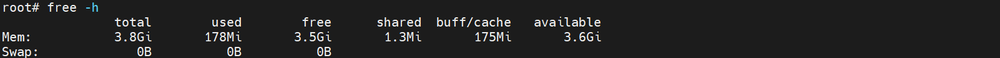

#### 3.3 其他示例

```text
板卡已经运行了多久
```


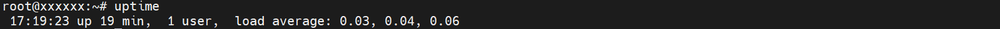

### 4. 文件操作

#### 4.1 读取文件

AI 调用 `read_file`，返回 `/etc/fstab` 文件内容。

```text
读取板卡上 /etc/fstab 的内容
```

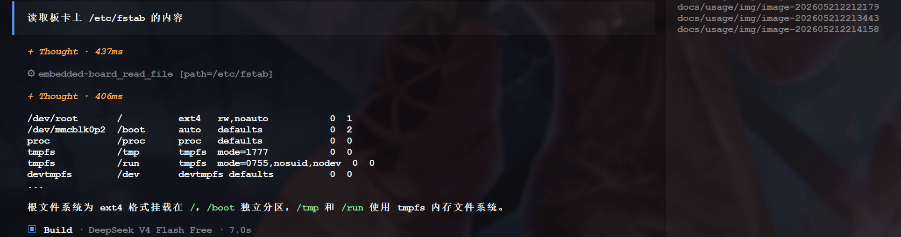

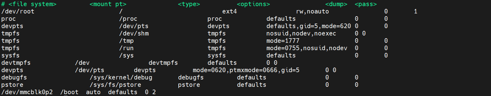

#### 4.2 创建文件

AI 调用 `write_file` 创建文件。

```text
在板卡上 /root 目录下创建一个 test.txt，内容为 "hello world"
```


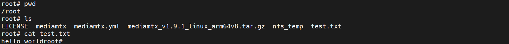

#### 4.3 查看目录

AI 调用 `list_dir`，返回类似结果：

```text
看看板卡 /root 目录下有什么
```

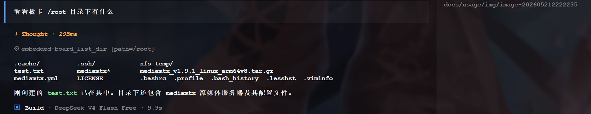

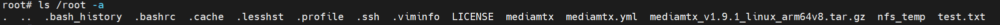

#### 4.4 上传文件

```text
把本机的 ./opencode_mcp.txt 上传到板卡的 /root/opencode_mcp.txt
```

AI 调用 `upload_file` 完成上传，主要是通过 SSH (SCP/SFTP) 协议传输，配置中板卡的 IP 为 192.168.16.103，端口 22，使用 root 用户密码认证，底层通过 SSH 的文件传输能力（如 SCP/SFTP）将文件从本机复制到板卡 /root/ 目录下。

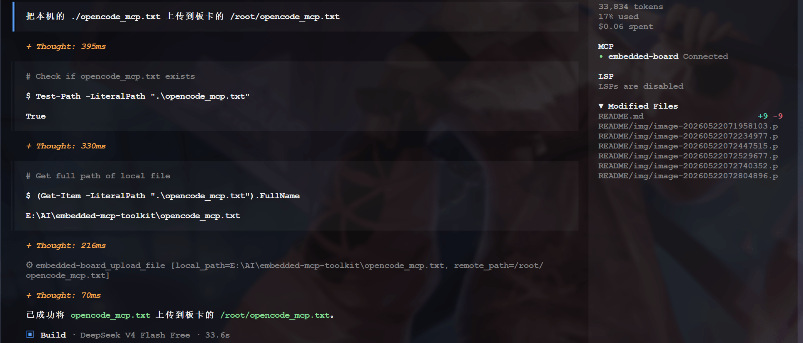

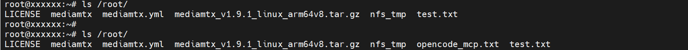

### 5. 编译与调试场景

#### 5.1 查看已加载驱动

```shell
查看板卡当前加载的内核模块
```

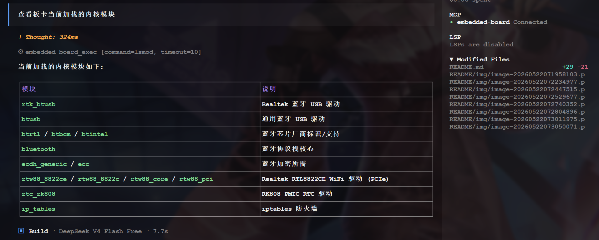

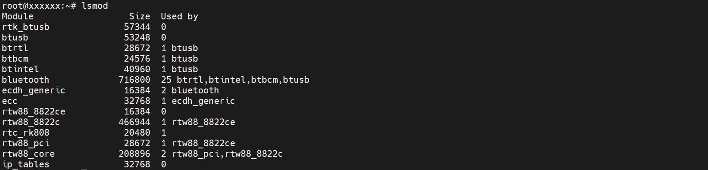

#### 5.2 其他示例

嵌入式开发常见场景：

```text
在板卡上编译 /root/test.c 并运行
```

```text
查看板卡上 /var/log/syslog 的最后 50 行
```

```text
抓取板卡的 CPU 温度
```

### 6. 手动指定工具

如果需要强制 AI 使用特定工具，可以在 prompt 中明确提及工具名：

```text
use the embedded-board exec tool to run: lsblk
```

```text
use the embedded-board dmesg tool to show kernel messages
```

### 7. 自然语言与工具组合

AI 会自动判断使用哪个工具，也可以组合多个工具完成复杂任务：

```text
帮我做两件事：
1. 检查 /root 目录下有哪些文件
2. 查看最近的内核日志
```

AI 会依次调用 `list_dir`、`dmesg` 两个工具并汇总结果。

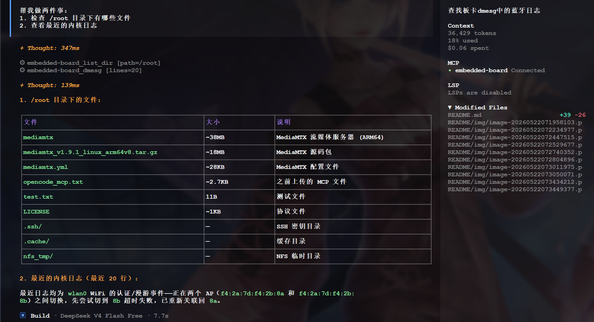

## 六、 自定义配置

### 1. 修改板卡连接参数

编辑 `opencode.jsonc` 中的 `environment` 字段：

```jsonc
"environment": {
  "BOARD_HOST": "192.168.1.100",
  "BOARD_PORT": "2222",
  "BOARD_USERNAME": "admin",
  "BOARD_PASSWORD": "admin123"
}
```

### 2. 使用 SSH 密钥认证

```jsonc
"environment": {
  "BOARD_HOST": "192.168.16.103",
  "BOARD_USERNAME": "root",
  "BOARD_PRIVATE_KEY": "~/.ssh/id_ed25519"
}
```

### 3. 添加多块板卡

在 `opencode.jsonc` 中注册多个 MCP Server：

```jsonc
{
  "$schema": "https://opencode.ai/config.json",
  "mcp": {
    "board-a": {
      "type": "local",
      "command": ["./index.js"],
      "enabled": true,
      "environment": {
        "BOARD_HOST": "192.168.16.103",
        "BOARD_USERNAME": "root",
        "BOARD_PASSWORD": "root"
      }
    },
    "board-b": {
      "type": "local",
      "command": ["./index.js"],
      "enabled": true,
      "environment": {
        "BOARD_HOST": "192.168.16.104",
        "BOARD_USERNAME": "root",
        "BOARD_PASSWORD": "root"
      }
    }
  }
}
```

## 七、 独立运行（不依赖 OpenCode）

MCP Server 也可以独立运行，通过标准输入输出与任何 MCP 客户端通信：

```bash
node index.js
```

然后通过 JSON-RPC 协议发送请求：

```bash
# 列出工具
echo '{"jsonrpc":"2.0","id":1,"method":"tools/list","params":{}}' | node index.js

# 执行命令
echo '{"jsonrpc":"2.0","id":2,"method":"tools/call","params":{"name":"exec","arguments":{"command":"hostname"}}}' | node index.js
```

## 八、 常见场景速查表

| 需求 | 参考命令 | 对应工具 |
|------|----------|---------|
| 查 IP 地址 | `ip addr` | exec |
| 查系统版本 | `cat /etc/os-release` | exec |
| 查 CPU 信息 | `cat /proc/cpuinfo` | exec |
| 查内存 | `free -h` | exec / system_info |
| 看磁盘 | `df -h` | exec / system_info |
| 看日志 | `dmesg` | dmesg |
| 查进程 | `ps aux` | exec |
| 查服务状态 | `systemctl status <服务名>` | exec |
| 读配置文件 | `cat /etc/<文件名>` | read_file |
| 修改配置 |  | write_file |
| 上传固件/脚本 |  | upload_file |
| 查看内核模块 | `lsmod` | exec |
| 重启板卡 | `reboot` | exec |
| 查看网络连接 | `netstat -tlnp` | exec |

## 九、 故障排查

### 1. MCP Server 连接失败

OpenCode 启动后如果 `embedded-board` 显示断开：

- **确认板卡在线**：在终端执行 `ping 192.168.16.103`
- **检查配置文件**：确认 `opencode.jsonc` 中的 IP、端口、用户名、密码正确
- **手动测试 SSH**：`ssh root@192.168.16.103` 输入密码 root，确认能登录
- **检查 OpenCode 版本**：`opencode --version` 应 >= 1.15
- **检查 Node.js 版本**：`node --version` 应 >= 18
- **检查依赖**：在项目目录下执行 `npm install` 重新安装依赖

### 2. 工具调用超时或报错

如果 AI 调用工具时返回错误：

- **检查网络稳定性**：长 ping 观察是否有丢包
- **确认板卡资源**：`df -h` 检查磁盘空间，`free -h` 检查内存
- **查看 SSH 日志**：在板卡上执行 `journalctl -u sshd -n 20`
- **在 OpenCode 中执行** `/mcp debug embedded-board` 查看详细日志
- **单独测试工具**：参考 "独立运行" 章节，直接发 JSON-RPC 请求排查

### 3. SSH 连接被拒绝

- **确认 SSH 服务已启动**：`systemctl status sshd`
- **检查 SSH 端口**：板卡上 `ss -tlnp | grep :22` 确认监听
- **检查防火墙**：`iptables -L -n` 查看是否有规则阻止 22 端口
- **检查 SSH 配置**：`cat /etc/ssh/sshd_config | grep PermitRootLogin` 确认允许 root 登录

### 4. 文件上传失败

- **确认本地文件存在**：`ls -la <local_path>`
- **确认目标目录存在**：通过 `exec` 工具执行 `ls -la <remote_dir>`
- **检查磁盘空间**：`df -h` 确认板卡有足够空间
- **检查路径权限**：目标路径应对 root 用户可写

## 十、 安全注意事项

- **密码认证**：默认使用 root 密码认证，建议在生产环境切换为 SSH 密钥认证
- **网络隔离**：建议在隔离的局域网中使用，避免将板卡暴露在公网
- **命令执行**：AI 会执行 shell 命令，注意不要输入危险命令
- **凭据管理**：密码存储在 `opencode.jsonc` 中，请勿提交到版本控制系统

---

*本文档由 markdowncli 技能辅助生成*
