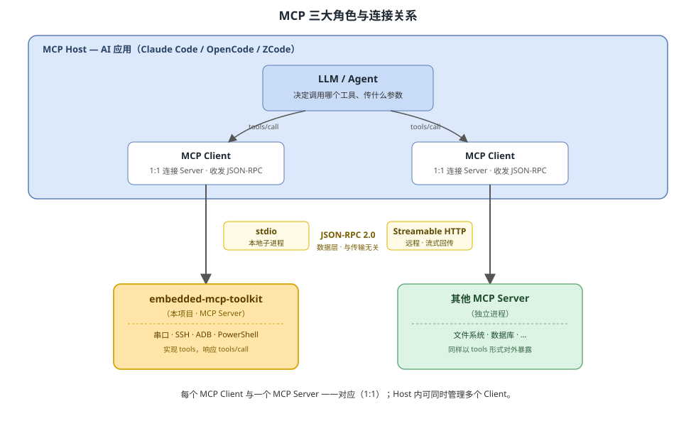
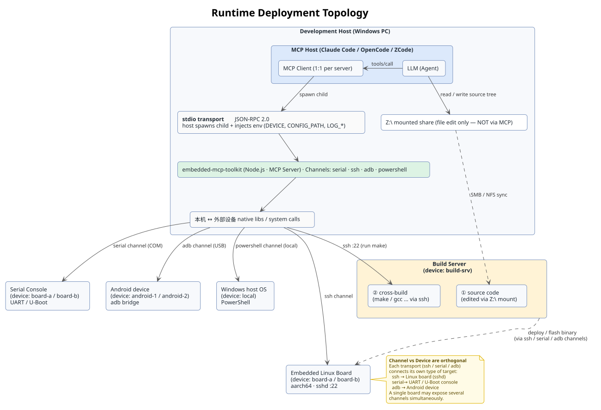
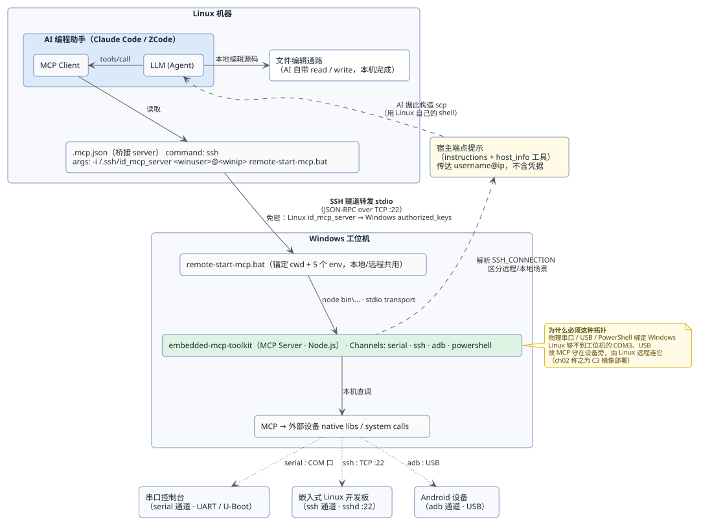

<!-- more -->

## 一、LLM怎么拿到日志？

LLM（即 AI 编程助手本身）要拿到设备上的信息，最朴素的方式就是直接调用本机的命令行工具，经不同通道把命令送到目标设备、再把输出读回来。下面以查看内存的 `free` 命令为例，分别在 Android 设备（adb 通道）、嵌入式开发板（串口通道、SSH 通道）上各执行一次，展示三种"拿日志"的路径。

### 1. 通过 ADB 查看 Android 设备内存

#### 1.1 原理

`adb` 是个独立程序（本机 `adb.exe`），后台常驻的 adb server 经 USB 与设备上的 adbd 通信。PowerShell 执行 `adb shell free` 时，spawn 出一个 adb **子进程**——adb 把命令经 USB 送到设备执行、把结果写回自己的标准输出，PowerShell 作为父进程从管道里读回。本质是"读子进程 stdout"，并非操作设备文件。

#### 1.2 实例

```bash
adb shell free
```

```text
		total        used        free      shared     buffers
Mem:       4080013312  2167304192  1912709120     5390336    15937536
-/+ buffers/cache:     2151366656  1928646656
Swap:      2040000512    60030976  1979969536
```

设备总内存约 3.80 GB，扣除 buffer/cache 后可用约 1.79 GB，另有约 1.90 GB Swap（已用 57 MB）。这是三种通道里最省心的：一条命令、一次响应。

### 2. 通过串口查看嵌入式设备内存

#### 2.1 原理

与 adb 不同，串口是 PowerShell **直接操作设备**、不经子进程。底层走 Win32 API：`CreateFile` 打开 `\\.\COM3` 设备句柄 → `WriteFile` 写命令字节 → `ReadFile` 读响应字节 → `CloseHandle`，.NET 的 `SerialPort` 只是这套 API 的托管封装。Windows 没有 Linux 那样的 `/dev` 设备文件树，设备活在命名空间里，统一抽象是"内核对象句柄"而非"文件"。串口又非请求-响应，需自己发命令、等一段时间再读缓冲。

#### 2.2 实例

```powershell
$port = New-Object System.IO.Ports.SerialPort COM3,115200,None,8,one
$port.Open()
$port.WriteLine("free")
Start-Sleep -Milliseconds 800
$port.ReadExisting()
$port.Close()
```

```text
free
              total        used        free      shared  buff/cache   available
Mem:         506864       94152      293068        4304      119644      324012
Swap:             0           0           0
root@ATK-IMX6U:~#
```

注意输出里混进了两类"噪声"：首行的 `free` 是命令回显，末尾的 `root@ATK-IMX6U:~#` 是 shell 提示符——真正的内存数据夹在中间。板子总内存约 495 MB（506864 KB），可用约 316 MB（available 324012），无 Swap。这条路径能拿到结果，但每用一次都得手工处理回显与截断判断（详见二、1.1 节）。

### 3. 通过 SSH 查看嵌入式设备内存

#### 3.1 原理

与 adb 同源——spawn 一个 `ssh.exe` **子进程**，ssh 经 TCP :22 与设备 sshd 建立加密连接，把命令送过去执行、结果写回标准输出，PowerShell 从管道读回。多出来的是加密与主机密钥协商：板子 sshd 只支持 `ssh-rsa`，而较新 OpenSSH 默认禁用它，需显式放开；首次连接再跳过主机密钥确认。

#### 3.2 实例

```bash
ssh -o HostKeyAlgorithms=+ssh-rsa -o PubkeyAcceptedKeyTypes=+ssh-rsa \
    -o StrictHostKeyChecking=no -o ConnectTimeout=8 root@192.168.16.105 free
```

```text
              total        used        free      shared  buff/cache   available
Mem:         506864       94308      292920        4304      119636      323892
Swap:             0           0           0
```

输出与串口的结果几乎一致（仅几十 KB 的正常抖动），印证二者访问的是同一块板子。

## 二、 项目背景

用 AI 编程助手（如 Claude Code）辅助嵌入式调试时，"AI 够不着板子"其实不是问题——上一章已经演示过，AI 自己用 PowerShell 直调 `adb shell free`、`ssh root@board free`，一次性命令一次响应，日志拿得到，"人在板子和 AI 之间复制粘贴"的税也随之消失。真正的问题不在"一次性读取"，而在嵌入式调试绕不开的那条通道——**串口**，以及一切"连续、有状态、跨轮"的交互。

### 1. 困境分析

#### 1.1 串口：没有"请求-响应"的裸字节流（核心困境）

串口是嵌入式调试最常见的入口——U-Boot 引导、内核启动、无 SSH 的早期设备都只认串口。但它有一个 SSH / ADB 都没有的结构性问题：它根本**不是"请求-响应"模型**。SSH 可以 `ssh host "cmd1 && cmd2"` 链式执行，串口连"链式"这个概念都不存在——它只是裸字节流。

先看实测。PowerShell 用 .NET 的 `System.IO.Ports.SerialPort` 几行代码就能打开 COM 口、读写字节，`Open` → `WriteLine("ls")` → `ReadExisting()`，输出确实拿得到：

```powershell
$port = New-Object System.IO.Ports.SerialPort COM3,115200,None,8,one
$port.Open()
$port.WriteLine("ls")
Start-Sleep -Milliseconds 1500
$port.ReadExisting()   # 确实读到了文件列表
$port.Close()
```

```
ls                                              ← 命令回显(噪声)
[0m[01;34mdriver[0m  [01;34mkeys[0m  ...        ← ANSI 颜色码(噪声)
root@ATK:~#                                     ← 提示符(命令结束信号)
```

问题在于——SSH 的 `ssh root@board "ls"` 是干净的一次调用、一次返回；串口拿到的却是一段**需要重加工的半成品**。

（1）**没有结束信号（信息缺失，核心问题）**：`ReadExisting()` 只是把缓冲里当前的字节倒出来，**不会告诉你"这条命令的输出结束了没"**。这次 `ls` 短、1500ms 够用，一次读全了；换个慢命令（编译、`ls -R` 大目录），读到的就是截断的半截，而文本本身毫无破绽——"是全部还是半截"这个信息根本不在输出里，AI 再聪明也推不出来。唯一的"结束"线索是末尾那个 `root@ATK:~#` 提示符回来了——但识别它，得持续轮询加模式匹配，写成一个状态机。当然，也可以在每条命令尾巴上拼一个哨兵标记（如 `; echo __DONE__$?`）来判定完成——但请注意：拼哨兵、滤回显里的哨兵、剥掉输出里的哨兵行、处理命令自身恰好打印了同样字符串的边界情况……这套逻辑写下来，就已经走在实现本 MCP 终端模拟器的路上了。这正是"直调能做到，但做着做着就成了重新造它"的缩影。

（2）**输出只在发生的瞬间存在（时序问题）**：内核启动日志、U-Boot 自举信息只在 boot 那一刻刷一次，必须在事件发生时**已经持有端口**才能看到；事后开端口补读，缓冲里什么都没有。更麻烦的是，不少板子的 USB 转串口在端口打开/关闭时 DTR 电平跳变会直接**复位设备**——"每次用的时候临时开一下端口"这个策略本身就不安全。

（3）**每轮重写一遍（成本问题）**：就算 AI 会写这套逻辑——开端口、发命令、循环读、正则判结束、清洗——它也**每一轮都得从头写一遍、重新猜超时**。猜短了截断，猜长了浪费一整轮对话；而且每次生成的脚本带随机性，行为不可复现。不是做不到，是每轮都白干一次。

（4）**混着噪声（次要问题）**：命令回显、ANSI 颜色码对 AI 是干扰。这一条 AI 确实能自己处理（脑内过滤即可），但噪声先进入上下文占 token，过滤结果也带随机性——能处理，不等于零成本。

#### 1.2 临时进程架构：跨轮状态活不过一轮

SSH / ADB 通道有干净的请求-响应模型，单轮内 AI 也懂得链式执行（`ssh board "cd /tmp && ls"`、heredoc 脚本），所以"工作目录、环境变量跨命令丢失"本身**不是**真问题——只要整个操作序列在发起前就能确定，一次性命令完全够用。真问题出在：**Host 每轮让 AI 跑的 PowerShell 都是一个临时进程**，用完即弃，而调试的典型节奏不是"一次想清楚"，是**观察-决策循环**——看输出、决定下一步、再看、再决定。每一次"看"都是一个新 turn、一个新连接，于是：

（1）**上下文前缀每轮重建**：每条命令都得重新背上完整的环境重建前缀，`cd /work/build && source env-setup.sh && bitbake xxx` 这类命令在交叉编译场景里每轮都要原样重发。不是做不到，是 AI 漏一个 `source` 就拿到完全不同的环境，错得还很隐蔽。

（2）**交互式程序无链式模型**：U-Boot 命令行、`menuconfig`、`gdb`、烧写工具的确认提示——这些不是"命令序列"而是"对话"，需要发一句、看响应、再发下一句。`ssh host "cmd"` 连 PTY 都没有，AI 无法与之往返交互。

（3）**长耗时操作的中间态观测**：`reboot` 之后盯启动日志、烧写固件时看进度——"发起"与"观测"之间隔着不确定的等待，无法写成一条链式命令，必须有一个持续在线的读者。

注意这个病根同样作用于串口：PowerShell 这次 `Open` 的 `SerialPort` 对象跑完就被回收。叠加 1.1 的字节流问题，串口成了两条困境的交汇点——这也是它成为核心困境的原因。

#### 1.3 常驻命令：另一种"不知道何时结束"

与 1.1 的"没有结束信号"同源的还有一类问题：`logcat`、`top`、`ping`、`tail -f` 这类**常驻命令永不返回提示符**。AI 用一次性命令的方式调它们，等多久算"采够了"、读到的是不是完整快照，全凭猜。而调试里"盯一段 logcat""采样一次 top"恰恰是高频需求——这又是一个输出里不存在、AI 推不出来的信息。

#### 1.4 跨机场景：AI 跑在 Linux，物理设备插在 Windows

前面三条困境假设 AI 客户端和物理设备在同一台 Windows 机器上。但团队里更常见的形态是：**代码和 AI 编程助手在 Linux 编译服务器上，而串口线、USB-ADB 只插在 Windows 工位机上**。这时困境从"协议层"升级为"物理层"：

（1）**物理通道够不着**：Linux 的 shell 没有任何路径访问 Windows 工位机的 COM 口和 USB 调试口——不是难写，是根本没有那条线缆。SSH 通道倒是 Linux 可以直连（`ssh board`），但串口和 ADB 这两条嵌入式最关键的通道被物理隔离了。

（2）**必须有个进程守在设备旁**：既然 Linux 够不到，唯一的解法就是让一个进程常驻在握着物理设备的 Windows 上，Linux 侧的 AI 远程连过来用——这个"守在设备旁的常驻进程"恰好就是 MCP Server 的最自然形态（stdio 经 SSH 隧道延长到跨机，详见四、3 节）。

（3）**跨机衍生出新的信息缺口**：AI 在 Linux 编译出固件后要经 Windows 中转再进设备，但 Windows 的 `username@ip` 是 MCP 宿主侧属性，Linux 无从得知——这需要 Server 主动告知（`host_info` / `instructions`）。这类问题在单机场景根本不存在，是跨机拓扑独有的。

注意这个场景下**编辑源码、跑编译仍然不需要 MCP**（Linux 本机即可），MCP 要桥接的只是串口/USB 这两条 Linux 够不着的物理通道。

### 2. 解决思路：一个常驻的会话守护进程

把上面几条困境拎到一起看，它们指向同一个结构性事实：**Host 跑的 PowerShell 是每轮一个的临时进程**，而串口的字节流、交互式环境、时序敏感的观测，都要求有一个持续在线的读者一直握着通道。解法也就清楚了——把"连设备、跑命令"这件事从临时进程里挪出来，交给一个**常驻的守护进程**：

```
AI 编程助手  ←→  MCP Server(常驻)  ←→  ssh / serial  ←→  目标板
                    │
                    └─ 一个长期活着的进程：连接、端口、会话状态都握在它手里
```

各困境与解法一一对应：

| 困境 | MCP Server 的解法 |
|------|-------------------|
| 串口没有"请求-响应" | Server 内部实现终端模拟器：滤回显、剥 ANSI、轮询加提示符检测判断命令结束，**写一次**一劳永逸——AI 只管调 `serial_exec("ls")`，直接拿到干净的一次性输出 |
| 输出只在发生的瞬间存在 | 串口端口由常驻进程持续持有，boot 日志、异步打印随时可读；端口不反复开关，也避开 DTR 复位风险 |
| 跨轮上下文重建 | SSH 长连接、串口持续持有端口，工作目录、登录态、环境变量、后台进程跨几十轮调用保持不变，观察-决策循环直接在既有上下文里跑 |
| 交互式程序无法往返 | 交互式 shell 会话 + write / read / send_ctrl 原语，AI 可以"发一句、看响应、再发下一句" |
| 常驻命令不知何时结束 | exec 内置"提示符检测 + 双超时"机制：常驻命令默认短超时采样，到时自动发 Ctrl+C 收回提示符，返回中性的采样结果而非报错 |
| AI 在 Linux、设备在 Windows（跨机够不着） | Server 留在 Windows 握着物理串口/USB，Linux 侧 AI 经 SSH 隧道把 stdio 延长到跨机；`host_info` / `instructions` 主动向 AI 告知宿主端点 |

【**领域流程固化（附加价值）**】

在会话常驻之上，项目还把一些**特定设备、特定厂商**的调试流程固化成了单个工具：带 PSH 安全启动的设备，`serial_shell_login` / `ssh_shell_login` 把 challenge → 动态口令 → 解锁整套流程收进一次调用；`serial_enter_uboot` 固化进入 U-Boot 的打断与识别；`serial_upload` / `serial_download` 固化 ZMODEM 传输。这类能力不普适（不是所有设备都有 PSH），但对命中的场景是真省事——每轮让 AI 重新推导领域流程，既慢又易错。

【**诚实的边界**】

对于**一次性读取**（`adb install`、`ssh host "uname -a"`、扫端口、本地脚本），PowerShell 直调完全够用，MCP 在这里几乎不增加价值，不必为用而用；SSH 通道上"单轮内能链式写完"的操作同理。MCP 真正不可替代的锚点是**串口**——协议层面必须有常驻进程持有端口；其次是**交互式、跨轮、时序敏感**的交互。这些 PowerShell-per-call 架构上做不到，因为它根本活不过一轮。反过来说：如果用 PowerShell 自己维护长会话、处理 PTY 缓冲、识别提示符——本质上就是在重新实现这个 MCP。

整个调试过程从"人复制粘贴、状态留不下来"变成"AI 直接对话板子、会话持久常驻"。这正是 MCP 协议的应用场景，也是 `embedded-mcp-toolkit` 存在的意义。

### 3. 怎么选：什么场景用 MCP，什么场景用 PowerShell

Claude Code / ZCode / OpenCode 已经能直接通过 PowerShell 调 `adb`、`ssh`、串口命令了，这个 MCP 还有意义吗？把前两节的分析收敛成一句话：对一次性命令（`adb install`、`ssh host "uname -a"`、扫端口、本地脚本）没有意义，PowerShell 直调更直接；它的价值锚点是**串口**——协议层面必须有常驻持有者，加上**交互式往返**、**跨轮会话**、**常驻命令采样**这几类直调很难做到的交互，以及面向特定设备的领域流程固化。

能力维度的分界：

| 能力 | PowerShell 直调 | 本 MCP | 说明 |
|------|:---:|:---:|------|
| 串口流切片 | ❌ | ✅ | 串口无请求-响应模型，提示符检测 + 超时熔断把"连续流"切成"LLM 的离散返回"，直调每轮都要重写状态机 |
| 端口持续持有（boot 日志捕获） | ❌ | ✅ | 输出只在发生瞬间存在，且反复开关端口可能触发 DTR 复位 |
| 持久会话（多串口/SSH 并发） | ❌ | ✅ | session 持久化，跨多次工具调用保持连接、PTY、登录态、工作目录 |
| 交互式往返（U-Boot / gdb / menuconfig） | ❌ | ✅ | write / read / send_ctrl 原语支撑"发一句、看一句" |
| 常驻命令取采样（logcat/top） | ❌ | ✅ | exec 自动检测提示符，超时发 Ctrl+C，`[timed-out: ...]` 是中性采样而非报错 |
| PSH 一键解锁登录 | ❌ | ✅ | 领域流程固化，仅对带 PSH 的特定设备有意义 |

日常场景怎么选：

| 场景 | 推荐 | 理由 |
|------|------|------|
| `adb install`、`adb push`、`ssh host "一次性命令"` | PowerShell 直调 | 无状态，MCP 多此一举 |
| 扫端口、看网卡、跑本地脚本 | PowerShell 直调 | Host 本身就有 shell 能力 |
| 串口交互、U-Boot、boot 日志捕获 | **MCP 工具** | 串口必须有常驻持有者，直调架构上做不到 |
| SSH 多轮调试（观察-决策循环） | **MCP 工具** | 长连接保持上下文，免去每轮重建环境前缀 |
| `logcat` / `top` 取采样 | **MCP 的 exec** | 解决"LLM 不知道命令何时结束"的真问题 |
| AI 在 Linux 服务器，设备在 Windows 工位机 | **MCP 工具** | Linux 物理够不到 Windows 的串口/USB，必须经 SSH 隧道桥接 |
| PSH 设备登录（若设备带此流程） | **MCP 工具** | 领域流程固化，一次调用完成解锁 |

## 三、 MCP 协议

### 1. 什么是 MCP

MCP（Model Context Protocol，模型上下文协议）是一种**开放标准协议**，用于规范 AI 应用与外部数据源、工具之间的连接方式。它解决的核心问题是：让 LLM（大语言模型）能够以统一、标准化的方式调用外部能力，而不必为每个工具单独编写集成代码。

可以把 MCP 类比为"AI 界的 USB 协议"——只要某个工具遵循 MCP 标准，任何支持 MCP 的 AI 应用都能即插即用地使用它，无需为每个工具单独适配。

> MCP 协议官网：[https://modelcontextprotocol.io](https://modelcontextprotocol.io/docs/getting-started/intro)

### 2. 三大核心角色

MCP 采用客户端-服务端（client-server）架构，涉及三个核心角色：**MCP Host**、**MCP Client**、**MCP Server**。Host 作为 AI 应用，为每个要连接的 Server 创建一个专属的 Client，Client 与 Server 之间维持 **1:1** 的专属连接；一个 Host 内部通常同时管理多个 Client。



完整的 graphviz 源文件见 [mcp-architecture.dot](./项目简介/mcp-architecture.dot)，可用 `dot -Tsvg mcp-architecture.dot -o img/mcp-architecture.svg` 重新渲染。

三个角色的职责对照如下：

<table>
  <thead>
    <tr>
      <th width=150px align="center">角色</th>
      <th align="center">定位</th>
      <th align="center">核心职责</th>
      <th align="center">在本项目中的体现</th>
    </tr>
  </thead>
  <tbody>
    <tr>
      <td align="center"><strong>MCP Host</strong><br>（宿主应用）</td>
      <td>AI 应用，用户交互入口</td>
      <td>- 承载 LLM（Agent）<br>- 管理生命周期（创建 / 回收 Client）<br>- 由 LLM 决策调用哪个工具、传什么参数<br>- 把工具结果回灌给 LLM</td>
      <td>Claude Code / OpenCode / ZCode 等 AI 编程助手</td>
    </tr>
    <tr>
      <td align="center"><strong>MCP Client</strong><br>（客户端）</td>
      <td>Host 内部组件，连接一个 Server 的桥梁</td>
      <td>- 与单个 Server 保持 1:1 连接<br>- 收发 JSON-RPC 报文、完成协议握手<br>- 对 Host 屏蔽底层传输细节</td>
      <td>Host 每配置一个 Server 即创建一个 Client，多个 Client 并存</td>
    </tr>
    <tr>
      <td align="center"><strong>MCP Server</strong><br>（服务端）</td>
      <td>独立进程，对外提供能力</td>
      <td>- 以 tools / resources / prompts 等原语暴露能力，响应 <code>tools/list</code>、<code>tools/call</code> 等请求；内部封装业务逻辑（连设备、跑命令、读写文件）<br>- 不感知 Host / LLM 的存在，任何 Host 都能接入</td>
      <td><code>embedded-mcp-toolkit</code>（本项目），把串口、SSH、ADB、PowerShell 等能力封装为 MCP 工具</td>
    </tr>
  </tbody>
</table>
简单说：**Host 想用工具 → 让 Client 去连 Server → Server 干活并把结果交回**。三者各司其职，构成一次完整的工具调用链路。

### 3. 两层架构

MCP 在协议设计上分为内外两层，这是理解其通信方式的关键：

<table>
  <thead>
    <tr>
      <th align="center">层</th>
      <th align="center">职责</th>
      <th align="center">内容</th>
    </tr>
  </thead>
  <tbody>
    <tr>
      <td align="center"><strong>数据层（Data Layer）</strong></td>
      <td>内层，定义"消息长什么样、什么含义"</td>
      <td>JSON-RPC 2.0 报文、生命周期管理、核心 primitives（tools / resources / prompts）</td>
    </tr>
    <tr>
      <td align="center"><strong>传输层（Transport Layer）</strong></td>
      <td>外层，定义"字节怎么搬"</td>
      <td>连接建立、消息帧封装、鉴权（stdio / Streamable HTTP）</td>
    </tr>
  </tbody>
</table>
两层解耦：**同一个 JSON-RPC 2.0 报文，可以跑在任意一种传输方式上**。数据层只管语义，传输层只管搬字节。

### 4. 连接方式（传输层）

传输层支持两种机制：

#### 4.1 stdio（标准输入输出）

- 适用于**本地子进程**场景，是本项目使用的传输方式
- Host 以子进程方式 spawn 出 Server，Server 的标准输入 / 输出即作为双向通信通道
- 特点：零网络开销、性能最优、天然隔离；典型用法是一个 stdio Server 服务单个 Client（如本机调试工具）

#### 4.2 Streamable HTTP（可流式 HTTP）

- 适用于 Server 部署在远程、需对外暴露的场景
- Client 通过 HTTP POST 发送请求，Server 可将响应**流式**回传（单连接内多消息往返，天然支持长任务进度推送）
- 支持标准 HTTP 鉴权（Bearer Token、API Key、自定义 Header，官方推荐 OAuth）
- 典型用法是一个远程 Server 同时服务多个 Client

> 旧的 "HTTP + SSE" 传输方式已被弃用，由 Streamable HTTP 取代。MCP 目前只保留两种官方传输机制：**stdio** 和 **Streamable HTTP**。

### 5. 数据传输格式与通信方式（数据层）

#### 5.1 JSON-RPC 2.0

数据层基于 **JSON-RPC 2.0**，所有请求、响应、通知都是 JSON 文本。一条典型的 `tools/call` 请求报文结构如下：

```json
{
  "jsonrpc": "2.0",
  "id": 1,
  "method": "tools/call",
  "params": {
    "name": "ssh_shell_exec",
    "arguments": { "command": "uname -a" }
  }
}
```

- `jsonrpc`：协议版本，固定为 `"2.0"`
- `id`：请求标识，用于请求-响应配对（通知类消息不带 `id`）
- `method`：要调用的方法名
- `params`：方法参数

#### 5.2 生命周期管理

MCP 是**有状态协议**，连接建立后需要先经过生命周期管理完成握手：

（1）Client 发送 `initialize` 请求，声明自己支持的协议版本与能力（capabilities）

（2）Server 响应，返回自己支持的协议版本与能力

（3）双方协商一致后，Client 发送 `notifications/initialized` 通知，进入正常操作阶段

（4）任一方可发起关闭，终止连接

【**能力协商**】握手的核心是**能力协商（capability negotiation）**——双方各自声明支持哪些 primitive（tools / resources / prompts）及附加特性（如 `listChanged`），通信中只使用双方都支持的能力，避免调用不存在的功能。

#### 5.3 核心 primitives（原语）

primitives 是 MCP 最核心的概念，定义 Client 与 Server 之间能互相提供什么。MCP 定义了三类 **Server 侧原语**：

<table>
  <thead>
    <tr>
      <th>原语</th>
      <th>作用</th>
      <th>相关方法</th>
      <th>本项目用法</th>
    </tr>
  </thead>
  <tbody>
    <tr>
      <td><strong>tools</strong></td>
      <td>可执行函数，AI 可调用以执行动作</td>
      <td><code>tools/list</code>、<code>tools/call</code></td>
      <td>✅ 全部能力以 tools 形式暴露（串口 / SSH / ADB / PowerShell）</td>
    </tr>
    <tr>
      <td><strong>resources</strong></td>
      <td>数据源，向 AI 提供上下文信息</td>
      <td><code>resources/list</code>、<code>resources/read</code></td>
      <td>❌ 未使用</td>
    </tr>
    <tr>
      <td><strong>prompts</strong></td>
      <td>可复用交互模板</td>
      <td><code>prompts/list</code>、<code>prompts/get</code></td>
      <td>❌ 未使用</td>
    </tr>
  </tbody>
</table>

每个原语都遵循"先 list 发现、再 get / call 使用"的模式，且列表是**动态**的——Server 可在能力变化时推送 `notifications/*` 通知 Client 刷新。

此外协议还定义了 **Client 侧原语**（sampling 让 Server 借用 Host 的 LLM、elicitation 让 Server 向用户追问、logging 让 Server 输出日志），以及横切的通知 / 进度追踪等工具能力。

#### 5.4 一次工具调用的完整流程

以用户对 AI 说"查看板卡 IP"为例，端到端链路如下：

（1）Host 启动时读取 `.mcp.json`，为 `embedded-mcp-toolkit` 创建一个 Client，并以 stdio 方式 spawn 出 Server 子进程

（2）Client 与 Server 完成 `initialize` 握手并协商能力，随后调用 `tools/list` 拿到全部工具清单

（3）用户输入自然语言需求，LLM（Agent）结合工具描述，决定调用 `ssh_shell_exec` 并生成参数

（4）Host 通过 Client 向 Server 发送 `tools/call`（JSON-RPC 报文，经 stdio 传递）

（5）Server 收到请求，执行对应业务逻辑（经 SSH 连接板卡、运行命令），将结果封装为响应返回

（6）Client 把结果交回 Host，Host 再喂给 LLM，LLM 据此生成最终的自然语言回答呈现给用户

【**注意**】

Server 发送的推送通知（如 `notifications/message`）由 Client 接收后止于 Host，**不会**转发给 Agent（LLM）。因此需要 Agent 感知的事件，应通过工具返回值（pull 模式）传递。

### 6. 本项目在 MCP 中的位置

`embedded-mcp-toolkit` 扮演的是 **MCP Server** 角色。它不依赖任何特定的 Host——任何遵循 MCP 协议的 AI 应用（Claude Code、OpenCode、ZCode 等）只要按协议启动它、调用它的工具，就能获得对嵌入式板卡的远程管理能力。

后续章节将围绕"如何安装配置这个 Server""它提供了哪些工具""如何使用"展开。

## 四、 部署形态与运行时架构

项目实际部署时，AI 客户端（Claude Code / ZCode）和 MCP Server **并不一定跑在同一台机器**——这取决于谁更靠近那台连着物理串口、USB 的 Windows 工位机。但无论怎么部署，二者之间总有一条 stdio 通道（本地子进程直连，或经 SSH 隧道延长到跨机），MCP Server 提供的工具、配置文件、运行时行为完全相同。本章先总览两种用法，再分别展开各自的运行时细节。

### 1. 部署形态总览

项目支持两种部署用法，差别只在"AI 客户端在哪、MCP Server 在哪、二者如何连"：

| 维度 | 用法一 本地同机 | 用法二 跨机远程 |
|------|----------------|----------------|
| AI 客户端位置 | Windows 工位机 | Linux 机器 |
| MCP Server 位置 | 同一台 Windows | Windows 工位机（握着物理设备） |
| 二者连接方式 | stdio 子进程直连，零网络 | SSH 隧道转发 stdio，跨 TCP :22 |
| `.mcp.json` 的 `command` | `node` | `ssh` |
| 物理串口 / USB / PowerShell | MCP 本机直调 | 经反向 SSH 由 Windows MCP 直调 |
| 文件编辑通路 | 本机（`Z:\` 挂载同步到编译服务器） | AI 在 Linux 本机（自带 read/write） |
| 跨机文件搬运 | 不需要 | 需要（AI 在 Linux 跑 `scp` 拉 Windows 文件） |
| 宿主端点提示 | 不注入（本地无需 scp） | 注入（`instructions` + `host_info`） |
| 免密配置 | 不需要 | `sshd-config` + `remote-mcp-config` 预先打通 |
| 适用场景 | 开发者自己调试、单人单机 | AI 跑在 Linux 编译机、物理设备连在 Windows 工位机 |

【**选择依据**】关键看一点：**物理串口 / USB 设备插在哪台机器上**。插在你正在用的 Windows 上 → 用法一，最省事；插在另一台 Windows 工位机上、而你的 AI 跑在 Linux → 用法二，让 MCP 守在设备旁、AI 远程连过来。两种用法下 MCP Server 的工具、配置、行为完全一致，只是连接介质的差别。

下面两节分别展开两种用法的运行时细节。用法一是最常见形态，本章的通用机制（数据通路、关键边界、通道与设备对应、编译服务器、部署闭环）都围绕它讲透；用法二只讲与用法一不同的部分。

### 2. 本地同机（用法一）

最常见的形态。开发者的 Windows 工位机上既装 AI 编程助手，又装 `embedded-mcp-toolkit`，`.mcp.json` 直接以 `node` 子进程方式拉起本机的 MCP Server，stdio 直连，零网络。Windows 工位机上运行的 MCP Host 通过 stdio 启动 `embedded-mcp-toolkit` 子进程，再由后者经不同通道连接到各类外部设备；同时编译服务器承担"源码仓库"与"编译机"两个角色。



完整的 graphviz 源文件见 [usage1-local.dot](./项目简介/usage1-local.dot)，可用 `dot -Tsvg usage1-local.dot -o img/usage1-local.svg` 重新渲染。拓扑要点概述如下：

- 开发机（Windows PC）上运行 MCP Host，内含 LLM/Agent 与 MCP Client
- Agent 编辑源码时直接读写挂载目录 `Z:\`，文件经 SMB / NFS 同步到编译服务器（绕过 MCP）
- Agent 操作设备时通过 `tools/call`，由 MCP Server 经四种通道连接各自的目标设备
- 编译服务器既存源码、又跑编译，产物最终经通道部署到目标板卡

#### 2.1 启动方式与配置

`.mcp.json`（项目根或用户全局）里写 `command: node`，本地直接启动。配置示例（根目录 [`.mcp.json`](../.mcp.json)）：

```json
{
  "mcpServers": {
    "embedded-board": {
      "command": "node",
      "args": ["./bin/embedded-mcp-toolkit-cli.js"],
      "env": {
        "DEVICE": "board-b",
        "BOARD_CONFIG_PATH": "./.embedded/configs/config.yaml"
      }
    }
  }
}
```

#### 2.2 两条并行的数据通路

Agent（LLM）有两条独立的对外通路，分别对应"编辑代码"和"操作设备"两类工作：

- **源码编辑通路（绕过 MCP）**：Agent 直接读写 `Z:\` 挂载目录，文件经 SMB / NFS 实时同步到编译服务器。这条通路走的是 Host 进程的原生文件系统能力，**不经过 MCP Server**，只跨本机与外部设备这层
- **设备操作通路（经 MCP）**：Agent 通过 `tools/call` 让 MCP Server 经串口、SSH、ADB、PowerShell 等通道操作目标设备。这条通路跨过 stdio transport（子进程通信）和本机与外部设备两层

#### 2.3 关键边界

架构图中用虚线标识了两条分界，便于排障时分清"问题出在哪一域"：

- **stdio transport（本地子进程通信）**：划分 MCP Host 与 MCP Server 子进程，对应 MCP 官方的 stdio 传输机制。`.mcp.json` 的环境变量只注入到子进程、Server 的推送通知止于 Host 不转发给 Agent 等行为，都源于 Host 以子进程方式 spawn 出 Server 这层关系
- **本机 ↔ 外部设备**：划分本机进程与外部物理设备。线以上是 node 原生库在本机内核内运行（看本机日志、改配置），线以下是数据真正离开本机走 TCP / COM / USB 等物理通道（查物理连接、设备状态）

#### 2.4 通道与设备的对应关系

MCP Server 提供四种通道，**每种通道连接各自类型的目标设备**，一一对应（这条对应关系两种用法通用，跨机远程时同样由 Windows 上的 MCP 直连）：

| 通道 | 连接的目标设备 | 物理介质 |
|------|---------------|----------|
| **ssh** | 嵌入式 Linux 开发板（sshd :22）、编译服务器 | TCP :22 |
| **serial** | 串口控制台（UART / U-Boot） | COM 口 |
| **adb** | Android 设备（adb 调试桥） | USB |
| **powershell** | Windows 本机 | 本地进程 |

【**通道与设备正交**】"通道（怎么连）"与"设备（连谁）"是两个正交维度：

- **通道** = 怎么连——代码中对应 4 个 BaseShell 子类
- **设备** = 连谁——配置中对应 `devices/*.yaml` 里的 key

同一种通道可连接多台同类设备（例如 SSH 通道既能连编译服务器跑编译，也能连板卡跑 shell，通过 `device` 参数切换目标）；同一台板卡也可同时暴露多种通道（SSH + 串口 + adb）。

#### 2.5 编译服务器的双角色

编译服务器同时承担两个职责，对应两条不同的入边（这条"双角色"是用法一特有的：AI 在 Windows 通过 `Z:\` 挂载读写源码，编译服务器既存源码、又跑编译；用法二里 AI 本就在编译服务器所在的 Linux 上，源码在本地，无 `Z:\` 挂载）：

- **① 源码仓库**：被 `Z:\` 挂载读写——Agent 编辑的源码经文件同步落到这里（绕过 MCP 的文件编辑通路）
- **② 编译机**：经 MCP Server 的 SSH 通道执行编译命令（`make` / `gcc` 等）——此处编译服务器作为 `config.yaml` 中的一个 device，由 `ssh_shell_exec` 调用（经 MCP 的设备操作通路）

#### 2.6 编译产物的部署闭环

编译服务器产出的二进制（固件、可执行文件），最终仍通过 SSH / 串口 / ADB 通道部署或烧写到目标板卡，形成"编辑源码 → 编译 → 部署到设备"的完整闭环。

### 3. 跨机远程（用法二）

团队里 AI 编程助手习惯跑在 Linux（编译服务器、容器、远程开发机），但物理串口、USB-ADB 这些设备**只插在 Windows 工位机上**——Linux 够不着。于是让 MCP Server 留在 Windows 握着物理设备，Linux 上的 AI 客户端经 **SSH 桥接**远程启动它：AI 客户端的 `.mcp.json` 不再写 `node`，而是写一条 `ssh` 命令，由这条 SSH 把 stdio 隧道转发到 Windows 上的 MCP Server。



完整的 graphviz 源文件见 [usage2-remote.dot](./项目简介/usage2-remote.dot)，可用 `dot -Tsvg usage2-remote.dot -o img/usage2-remote.svg` 重新渲染。要点：Linux 机器（AI 客户端 + 文件编辑）与 Windows 工位机（MCP Server + 物理设备）经 SSH 隧道连接，宿主端点提示通过 `instructions` 字段和 `host_info` 工具传达给 AI 客户端。

整条链路的实质是：**Linux 上的 Client 把 JSON-RPC 报文写进本地 ssh 的 stdin，ssh 经 TCP :22 把字节送到 Windows，Windows 上 `remote-start-mcp.bat` 拉起的 node 进程从自己的 stdin 读到，再把响应沿原路写回**。stdio 本是子进程通信，SSH 隧道把它"延长"到了跨机——Host 视角下它仍是一个普通 stdio Server。

#### 3.1 为什么必须是这种拓扑

物理串口（COM 口）、USB-ADB、Windows PowerShell、本机端口扫描这些工具，**绑定的是 MCP 宿主机的物理设备和操作系统**，只能由跑在 Windows 上的进程直接调用。Linux 上的 AI 客户端够不到 Windows 工位机的 COM3 和 USB，所以 MCP Server 不能搬到 Linux——必须留在 Windows，反过来由 Linux 远程连它。ch02 的方案探索把这种形态称为"C3 镜像部署"。

反过来，AI 编辑源码、跑编译这些事 Linux 本机就能干（用 AI 客户端自带的 read/write/shell），不必绕道 Windows。所以这条拓扑里：**设备交互走反向 SSH 到 Windows MCP，文件编辑留在 Linux 本地**。

#### 3.2 跨机带来的新需求：宿主端点

用法一里 AI 客户端和 MCP 在同一台机器，文件本就在本地，无需搬运。用法二里 AI 在 Linux 编译出 `ko`、固件后，要把产物搬到 Windows 中转、再经串口 ZMODEM 推进设备——搬运靠 AI 自己执行 `scp`。但 `scp` 需要目标端点（Windows 的 `username@ip`），而这正是 **MCP 宿主机的属性，AI 客户端所在的 Linux 无从得知**。

为此，项目在远程 SSH 启动时向 AI 客户端传达"宿主端点"（仅含 username + IPv4，不暴露任何凭据），通过两条出口：

- **`instructions` 字段（主通道）**：MCP 协议握手时注入一段"执行框架"说明——MCP 在 Windows、AI 客户端在 Linux、跨机传输用 AI 自己的 Linux shell 跑 `scp`（给出正确方向的命令骨架，含免密私钥 `-i ~/.ssh/id_mcp_server`）、勿用 `power_shell` 工具做跨机传输
- **`host_info` 工具（兜底通道）**：无参查询工具，返回同样的端点与使用指引，供 `instructions` 未被客户端采纳时调用

MCP 通过启动时是否存在 `SSH_CONNECTION` 环境变量区分两种场景：存在即"远程 SSH 启动"（注入端点提示），不存在即"本地启动"（零改变，不注入）。

【**编译路由指引**】上述两条通道（`instructions` + `host_info`）除传达 scp 文件传输指引外，在方式二下还会传达**编译路由指引**——建议 AI 用本机 `cmdsift` 编译、勿用 `ssh_build`（`ssh_build` 在方式二下会让流量 Linux → Windows MCP → Linux 绕一圈）。与指引配套的是注册策略：方式二下 `ssh_build` **默认不注册**（AI 已在 Linux 编译机上，本机编译即可，工具不出现即从源头杜绝绕行，`SSH_BUILD_TOOLS=1` 可强制开启）；若被强制注册后仍遭调用，会在返回结果前缀追加软拦截提示，但照常执行、不改变退出码与分类结果，作为兜底通路。方式一（本地启动）下 `ssh_build` 正常注册（`SSH_BUILD_TOOLS=0` 可强制关闭），三层（instructions / host_info / ssh_build）均不触发编译路由，行为零改变。

#### 3.3 一次性打通免密的两条对偶命令

用法二需要在 Linux 与 Windows 之间预先配好免密 SSH（同一把专用密钥 `id_mcp_server`）。项目提供两个对偶的 CLI 命令一键完成，二者方向相反、职责互补：

| 命令 | 跑在哪 | 角色 | 职责 |
|------|--------|------|------|
| `sshd-config` | Windows | Windows 当 SSH server | 装 Windows OpenSSH Server、登录 Linux 生成密钥对、配 Windows sshd / authorized_keys、生成 Linux 端 `.mcp.json` 模板 |
| `remote-mcp-config` | Windows | Windows 当 SSH 客户端 | 从 Windows SSH/SFTP 登录 Linux，把桥接 server 写入 Linux 的 Claude / ZCode / opencode 配置文件 |

二者跑完后，Linux 端的配置（Claude 全局 `~/.claude.json`、Claude 项目 `.mcp.json`、ZCode 项目 `.zcode/config.json`、opencode 全局 `~/.config/opencode/opencode.json`、opencode 项目 `.opencode/opencode.json` 五类落点之一）里会出现如下桥接 server 定义——`command` 是 `ssh`，`args` 是一条连到 Windows 并启动 `remote-start-mcp.bat` 的完整命令：

```json
{
  "mcpServers": {
    "embedded-board": {
      "command": "ssh",
      "args": [
        "-i", "~/.ssh/id_mcp_server",
        "<winuser>@<winip>",
        "<项目根>/remote-start-mcp.bat"
      ]
    }
  }
}
```

`remote-start-mcp.bat` 是本地与远程**共用**的同一个 launcher：它把工作目录锚定到项目根、设好 5 个环境变量（与本地 `.mcp.json` 的 env 块保持一致），最后 `node bin\embedded-mcp-toolkit-cli.js` 以 stdio transport 启动。无论本地双击还是被 Linux 的 ssh 拉起，跑出来的是同一个进程、同一份配置。

---

*本文档由 markdowncli 技能辅助生成*
