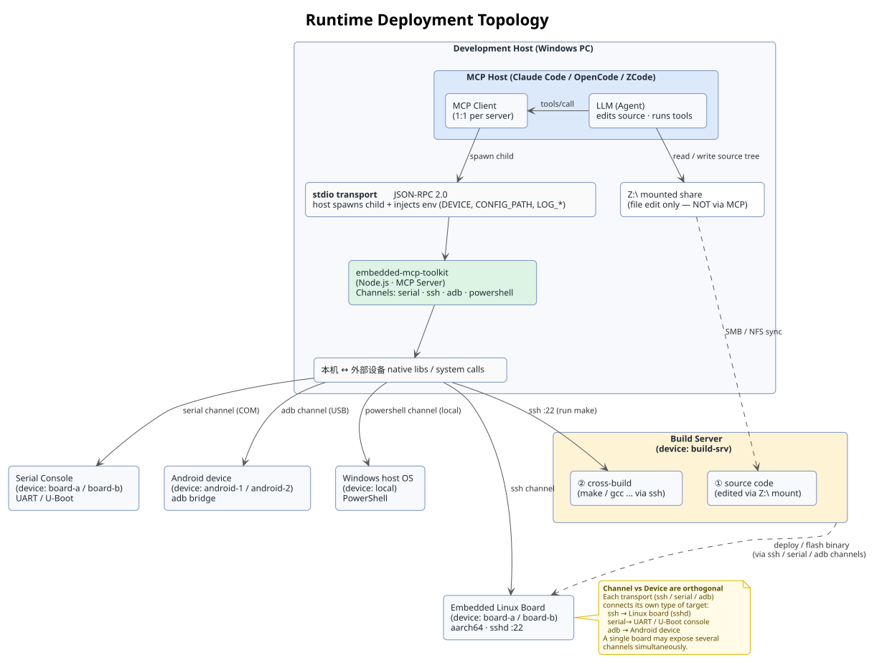

<!-- more -->

## 一、 项目背景

用 AI 编程助手（如 Claude Code）辅助嵌入式调试时，会遇到两个绕不开的困境。它们不是"稍微麻烦"，而是**直接卡死 AI 与板子之间的协作**——这正是 `embedded-mcp-toolkit` 要解决的问题。

### 1. 困境分析

#### 1.1 复制粘贴税

最直观的困境。典型调试工作流是这样的：

（1）板子卡住了，`ssh` 上去敲 `dmesg | tail -50`

（2）复制输出

（3）切到 Claude Code 窗口

（4）粘贴 + 提问"帮我看一下这个 oops"

（5）Claude 说"再给我看一下 `/sys/class/iio/iio:device0/` 下面的内容"

（6）切回 ssh，`ls /sys/class/iio/iio:device0/`

（7）复制、粘贴……

如此反复十几次。一次调试下来，复制粘贴三五十次是常事，有人称之为**"复制粘贴税"**。

"复制粘贴税"带来的不只是麻烦，更致命的是**上下文丢失**：粘贴时容易粘错、漏行，Claude 看到的不是板子的真实状态，而是经过人手"过滤"后的版本，AI 的判断建立在失真的输入上，调试效率反而被拖累。

#### 1.2 会话状态丢失

有人会说："让 Claude 自己用 PowerShell 调 `ssh` 不就行了？"——但 `ssh host "cmd"` 是**一次性连接**，跑完就断：

```
ssh root@board "cd /tmp"      ← 这次进了 /tmp
ssh root@board "ls"           ← 又回到 ~，/tmp 白进了
ssh root@board "export FOO=1" ← 环境变量也丢了
```

工作目录、环境变量、登录态、后台进程……**每条命令都从零开始**。AI 想在同一个上下文里连续操作（比如"进到某个目录、改个配置、重启服务、再看日志"），PowerShell 直调根本串不起来。

这是"复制粘贴税"的孪生兄弟：前者是**数据搬不进来**，后者是**状态留不下来**。

### 2. 解决思路：让 AI 与板子直连

上面两个困境指向同一个解法——**给 AI 和板子之间架一条直通线**，让 AI 自己去看、去读、去操作板子，不再依赖人来搬运数据、也不受一次性命令的限制：

```
AI 编程助手  ←→  MCP Server  ←→  ssh / serial  ←→  目标板
```

- 针对**复制粘贴税**：Claude 想看 `dmesg` 自己去看，想读 sysfs 自己去读，省掉所有搬运
- 针对**会话状态丢失**：MCP Server 维持长连接会话，工作目录、登录态、环境变量跨多次调用保持不变

整个调试过程从"人复制粘贴、状态留不下来"变成"AI 直接对话板子、会话持久"。这正是 MCP 协议的应用场景，也是 `embedded-mcp-toolkit` 存在的意义。

## 二、 MCP 协议

### 1. 什么是 MCP

MCP（Model Context Protocol，模型上下文协议）是一种**开放标准协议**，用于规范 AI 应用与外部数据源、工具之间的连接方式。它解决的核心问题是：让 LLM（大语言模型）能够以统一、标准化的方式调用外部能力，而不必为每个工具单独编写集成代码。

可以把 MCP 类比为"AI 界的 USB 协议"——只要某个工具遵循 MCP 标准，任何支持 MCP 的 AI 应用都能即插即用地使用它，无需为每个工具单独适配。

> MCP 协议官网：[https://modelcontextprotocol.io](https://modelcontextprotocol.io/docs/getting-started/intro)

### 2. 三大核心角色

MCP 采用客户端-服务端（client-server）架构，涉及三个核心角色：**MCP Host**、**MCP Client**、**MCP Server**。Host 作为 AI 应用，为每个要连接的 Server 创建一个专属的 Client，Client 与 Server 之间维持 **1:1** 的专属连接；一个 Host 内部通常同时管理多个 Client。


三个角色的职责对照如下：

<table>
  <thead>
    <tr>
      <th width=150px align="center">角色</th>
      <th align="center">定位</th>
      <th align="center">核心职责</th>
      <th align="center">在本项目中的体现</th>
    </tr>
  </thead>
  <tbody>
    <tr>
      <td align="center"><strong>MCP Host</strong><br>（宿主应用）</td>
      <td>AI 应用，用户交互入口</td>
      <td>- 承载 LLM（Agent）<br>- 管理生命周期（创建 / 回收 Client）<br>- 由 LLM 决策调用哪个工具、传什么参数<br>- 把工具结果回灌给 LLM</td>
      <td>Claude Code / OpenCode / ZCode 等 AI 编程助手</td>
    </tr>
    <tr>
      <td align="center"><strong>MCP Client</strong><br>（客户端）</td>
      <td>Host 内部组件，连接一个 Server 的桥梁</td>
      <td>- 与单个 Server 保持 1:1 连接<br>- 收发 JSON-RPC 报文、完成协议握手<br>- 对 Host 屏蔽底层传输细节</td>
      <td>Host 每配置一个 Server 即创建一个 Client，多个 Client 并存</td>
    </tr>
    <tr>
      <td align="center"><strong>MCP Server</strong><br>（服务端）</td>
      <td>独立进程，对外提供能力</td>
      <td>- 以 tools / resources / prompts 等原语暴露能力，响应 <code>tools/list</code>、<code>tools/call</code> 等请求；内部封装业务逻辑（连设备、跑命令、读写文件）<br>- 不感知 Host / LLM 的存在，任何 Host 都能接入</td>
      <td><code>embedded-mcp-toolkit</code>（本项目），把串口、SSH、ADB、PowerShell 等能力封装为 MCP 工具</td>
    </tr>
  </tbody>
</table>
简单说：**Host 想用工具 → 让 Client 去连 Server → Server 干活并把结果交回**。三者各司其职，构成一次完整的工具调用链路。

### 3. 两层架构

MCP 在协议设计上分为内外两层，这是理解其通信方式的关键：

<table>
  <thead>
    <tr>
      <th align="center">层</th>
      <th align="center">职责</th>
      <th align="center">内容</th>
    </tr>
  </thead>
  <tbody>
    <tr>
      <td align="center"><strong>数据层（Data Layer）</strong></td>
      <td>内层，定义"消息长什么样、什么含义"</td>
      <td>JSON-RPC 2.0 报文、生命周期管理、核心 primitives（tools / resources / prompts）</td>
    </tr>
    <tr>
      <td align="center"><strong>传输层（Transport Layer）</strong></td>
      <td>外层，定义"字节怎么搬"</td>
      <td>连接建立、消息帧封装、鉴权（stdio / Streamable HTTP）</td>
    </tr>
  </tbody>
</table>
两层解耦：**同一个 JSON-RPC 2.0 报文，可以跑在任意一种传输方式上**。数据层只管语义，传输层只管搬字节。

### 4. 连接方式（传输层）

传输层支持两种机制：

#### 4.1 stdio（标准输入输出）

- 适用于**本地子进程**场景，是本项目使用的传输方式
- Host 以子进程方式 spawn 出 Server，Server 的标准输入 / 输出即作为双向通信通道
- 特点：零网络开销、性能最优、天然隔离；典型用法是一个 stdio Server 服务单个 Client（如本机调试工具）

#### 4.2 Streamable HTTP（可流式 HTTP）

- 适用于 Server 部署在远程、需对外暴露的场景
- Client 通过 HTTP POST 发送请求，Server 可将响应**流式**回传（单连接内多消息往返，天然支持长任务进度推送）
- 支持标准 HTTP 鉴权（Bearer Token、API Key、自定义 Header，官方推荐 OAuth）
- 典型用法是一个远程 Server 同时服务多个 Client

> 旧的 "HTTP + SSE" 传输方式已被弃用，由 Streamable HTTP 取代。MCP 目前只保留两种官方传输机制：**stdio** 和 **Streamable HTTP**。

### 5. 数据传输格式与通信方式（数据层）

#### 5.1 JSON-RPC 2.0

数据层基于 **JSON-RPC 2.0**，所有请求、响应、通知都是 JSON 文本。一条典型的 `tools/call` 请求报文结构如下：

```json
{
  "jsonrpc": "2.0",
  "id": 1,
  "method": "tools/call",
  "params": {
    "name": "ssh_shell_exec",
    "arguments": { "command": "uname -a" }
  }
}
```

- `jsonrpc`：协议版本，固定为 `"2.0"`
- `id`：请求标识，用于请求-响应配对（通知类消息不带 `id`）
- `method`：要调用的方法名
- `params`：方法参数

#### 5.2 生命周期管理

MCP 是**有状态协议**，连接建立后需要先经过生命周期管理完成握手：

（1）Client 发送 `initialize` 请求，声明自己支持的协议版本与能力（capabilities）

（2）Server 响应，返回自己支持的协议版本与能力

（3）双方协商一致后，Client 发送 `notifications/initialized` 通知，进入正常操作阶段

（4）任一方可发起关闭，终止连接

【**能力协商**】握手的核心是**能力协商（capability negotiation）**——双方各自声明支持哪些 primitive（tools / resources / prompts）及附加特性（如 `listChanged`），通信中只使用双方都支持的能力，避免调用不存在的功能。

#### 5.3 核心 primitives（原语）

primitives 是 MCP 最核心的概念，定义 Client 与 Server 之间能互相提供什么。MCP 定义了三类 **Server 侧原语**：

<table>
  <thead>
    <tr>
      <th>原语</th>
      <th>作用</th>
      <th>相关方法</th>
      <th>本项目用法</th>
    </tr>
  </thead>
  <tbody>
    <tr>
      <td><strong>tools</strong></td>
      <td>可执行函数，AI 可调用以执行动作</td>
      <td><code>tools/list</code>、<code>tools/call</code></td>
      <td>✅ 全部能力以 tools 形式暴露（串口 / SSH / ADB / PowerShell）</td>
    </tr>
    <tr>
      <td><strong>resources</strong></td>
      <td>数据源，向 AI 提供上下文信息</td>
      <td><code>resources/list</code>、<code>resources/read</code></td>
      <td>❌ 未使用</td>
    </tr>
    <tr>
      <td><strong>prompts</strong></td>
      <td>可复用交互模板</td>
      <td><code>prompts/list</code>、<code>prompts/get</code></td>
      <td>❌ 未使用</td>
    </tr>
  </tbody>
</table>

每个原语都遵循"先 list 发现、再 get / call 使用"的模式，且列表是**动态**的——Server 可在能力变化时推送 `notifications/*` 通知 Client 刷新。

此外协议还定义了 **Client 侧原语**（sampling 让 Server 借用 Host 的 LLM、elicitation 让 Server 向用户追问、logging 让 Server 输出日志），以及横切的通知 / 进度追踪等工具能力。

#### 5.4 一次工具调用的完整流程

以用户对 AI 说"查看板卡 IP"为例，端到端链路如下：

（1）Host 启动时读取 `.mcp.json`，为 `embedded-mcp-toolkit` 创建一个 Client，并以 stdio 方式 spawn 出 Server 子进程

（2）Client 与 Server 完成 `initialize` 握手并协商能力，随后调用 `tools/list` 拿到全部工具清单

（3）用户输入自然语言需求，LLM（Agent）结合工具描述，决定调用 `ssh_shell_exec` 并生成参数

（4）Host 通过 Client 向 Server 发送 `tools/call`（JSON-RPC 报文，经 stdio 传递）

（5）Server 收到请求，执行对应业务逻辑（经 SSH 连接板卡、运行命令），将结果封装为响应返回

（6）Client 把结果交回 Host，Host 再喂给 LLM，LLM 据此生成最终的自然语言回答呈现给用户

【**注意**】

Server 发送的推送通知（如 `notifications/message`）由 Client 接收后止于 Host，**不会**转发给 Agent（LLM）。因此需要 Agent 感知的事件，应通过工具返回值（pull 模式）传递。

### 6. 本项目在 MCP 中的位置

`embedded-mcp-toolkit` 扮演的是 **MCP Server** 角色。它不依赖任何特定的 Host——任何遵循 MCP 协议的 AI 应用（Claude Code、OpenCode、ZCode 等）只要按协议启动它、调用它的工具，就能获得对嵌入式板卡的远程管理能力。

后续章节将围绕"如何安装配置这个 Server""它提供了哪些工具""如何使用"展开。

## 三、 项目运行时架构

### 1. 整体拓扑

项目在实际部署中的运行时拓扑如下：开发机上运行的 MCP Host（AI 编程助手）通过 stdio 启动 `embedded-mcp-toolkit` 子进程，再由后者经不同通道连接到各类外部设备；同时编译服务器承担"源码仓库"与"编译机"两个角色。



完整的 PlantUML 源文件见 [项目架构.puml](./项目简介/项目架构.puml)，可用 VS Code PlantUML 插件、`plantuml` 命令行或 [PlantUML 在线编辑器](https://www.plantuml.com/plantuml/uml/) 渲染查看。拓扑要点概述如下：

- 开发机（Windows PC）上运行 MCP Host，内含 LLM/Agent 与 MCP Client
- Agent 编辑源码时直接读写挂载目录 `Z:\`，文件经 SMB / NFS 同步到编译服务器（绕过 MCP）
- Agent 操作设备时通过 `tools/call`，由 MCP Server 经四种通道连接各自的目标设备
- 编译服务器既存源码、又跑编译，产物最终经通道部署到目标板卡

### 2. 两条并行的数据通路

Agent（LLM）有两条独立的对外通路，分别对应"编辑代码"和"操作设备"两类工作：

- **源码编辑通路（绕过 MCP）**：Agent 直接读写 `Z:\` 挂载目录，文件经 SMB / NFS 实时同步到编译服务器。这条通路走的是 Host 进程的原生文件系统能力，**不经过 MCP Server**，只跨本机与外部设备这层
- **设备操作通路（经 MCP）**：Agent 通过 `tools/call` 让 MCP Server 经串口、SSH、ADB、PowerShell 等通道操作目标设备。这条通路跨过 stdio transport（子进程通信）和本机与外部设备两层

### 3. 关键边界

架构图中用虚线标识了两条分界，便于排障时分清"问题出在哪一域"：

- **stdio transport（本地子进程通信）**：划分 MCP Host 与 MCP Server 子进程，对应 MCP 官方的 stdio 传输机制。`.mcp.json` 的环境变量只注入到子进程、Server 的推送通知止于 Host 不转发给 Agent 等行为，都源于 Host 以子进程方式 spawn 出 Server 这层关系
- **本机 ↔ 外部设备**：划分本机进程与外部物理设备。线以上是 node 原生库在本机内核内运行（看本机日志、改配置），线以下是数据真正离开本机走 TCP / COM / USB 等物理通道（查物理连接、设备状态）

### 4. 通道与设备的对应关系

MCP Server 提供四种通道，**每种通道连接各自类型的目标设备**，一一对应：

| 通道 | 连接的目标设备 | 物理介质 |
|------|---------------|----------|
| **ssh** | 嵌入式 Linux 开发板（sshd :22）、编译服务器 | TCP :22 |
| **serial** | 串口控制台（UART / U-Boot） | COM 口 |
| **adb** | Android 设备（adb 调试桥） | USB |
| **powershell** | Windows 本机 | 本地进程 |

【**通道与设备正交**】"通道（怎么连）"与"设备（连谁）"是两个正交维度：

- **通道** = 怎么连——代码中对应 4 个 BaseShell 子类
- **设备** = 连谁——配置中对应 `devices/*.yaml` 里的 key

同一种通道可连接多台同类设备（例如 SSH 通道既能连编译服务器跑编译，也能连板卡跑 shell，通过 `device` 参数切换目标）；同一台板卡也可同时暴露多种通道（SSH + 串口 + adb）。

### 5. 编译服务器的双角色

编译服务器同时承担两个职责，对应两条不同的入边：

- **① 源码仓库**：被 `Z:\` 挂载读写——Agent 编辑的源码经文件同步落到这里（绕过 MCP 的文件编辑通路）
- **② 编译机**：经 MCP Server 的 SSH 通道执行编译命令（`make` / `gcc` 等）——此处编译服务器作为 `config.yaml` 中的一个 device，由 `ssh_shell_exec` 调用（经 MCP 的设备操作通路）

### 6. 编译产物的部署闭环

编译服务器产出的二进制（固件、可执行文件），最终仍通过 SSH / 串口 / ADB 通道部署或烧写到目标板卡，形成"编辑源码 → 编译 → 部署到设备"的完整闭环。

---

*本文档由 markdowncli 技能辅助生成*
